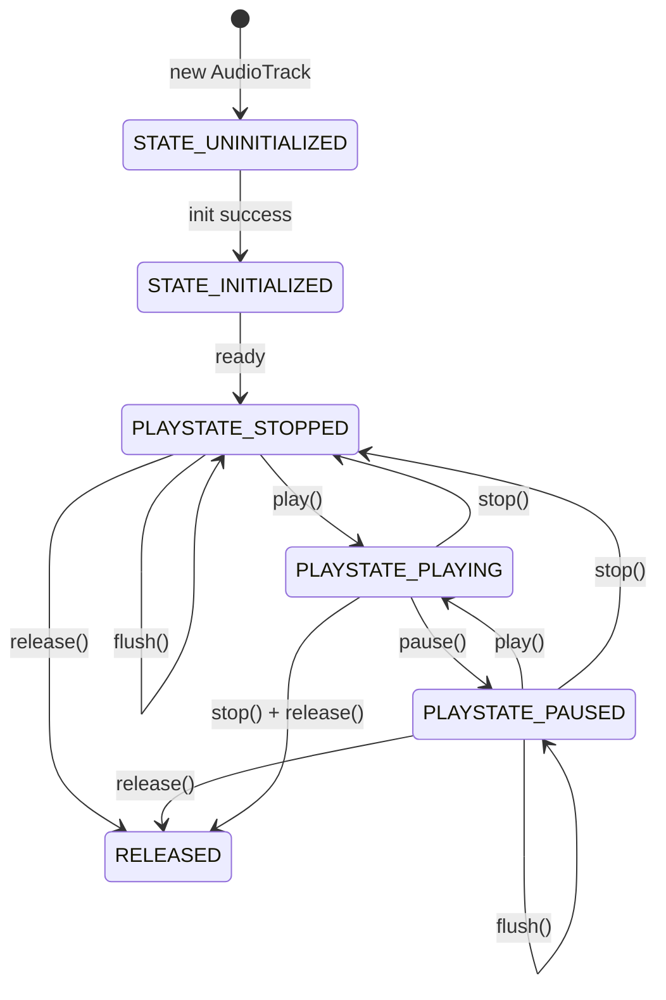

## 导读

- 本文按“定位与参数 -> 生命周期 -> 写入机制 -> API 观测 -> 故障恢复”组织，适合作为 AudioTrack 实战手册。
- 如果只看落地，建议优先阅读 `1.2`、`2.3`、`3.3`、`5.1~5.4`。

## 一、AudioTrack 定位与创建参数

### 1.1 AudioTrack 是什么（定位）

#### 1.1.1 基础定义

- `AudioTrack` 是 Android 侧 PCM 播放的核心接口，播放器把解码后的数据持续写入它。
- 它把应用层数据交给系统音频服务，再由系统完成混音、路由与设备输出。
- 对播放器来说，`AudioTrack` 是发声链路的最后一跳，不是可选能力。

#### 1.1.2 在音频栈中的位置


- 应用层直接可控的是 `AudioTrack` 写入与状态；系统层负责策略、混音和硬件交互。

#### 1.1.3 在播放器中的核心职责

- 承接解码后的 PCM 数据并按节拍写入。
- 维持缓冲稳定，尽量避免缓冲不足导致卡顿和破音。
- 输出可观测状态（播放状态、写入结果、进度信息）用于同步与排障。

#### 1.1.4 本文参考边界

- `Project.md` 仅用于定位项目中的 AudioTrack 使用点。
- 正文主线聚焦通用分析方法，不以项目源码走读为主。

### 1.2 创建参数（从可播到可稳播）

```java
// https://cs.android.com/android/platform/superproject/+/android-latest-release:frameworks/base/media/java/android/media/AudioTrack.java

public AudioTrack(int streamType, int sampleRateInHz, int channelConfig, int audioFormat,
            int bufferSizeInBytes, int mode)

public AudioTrack(int streamType, int sampleRateInHz, int channelConfig, int audioFormat,
            int bufferSizeInBytes, int mode, int sessionId)

public AudioTrack(AudioAttributes attributes, AudioFormat format, int bufferSizeInBytes,
            int mode, int sessionId)

AudioTrack track = new AudioTrack.Builder()
        .setAudioAttributes(attributes)
        .setAudioFormat(format)
        .setBufferSizeInBytes(bufferSizeInBytes)
        .setTransferMode(AudioTrack.MODE_STREAM)
        .setSessionId(AudioManager.AUDIO_SESSION_ID_GENERATE)
        .build();


```

#### 参数三要素与构造映射（先看）

| PCM 核心参数 | AudioTrack 对应参数 | 常见值 | 说明 |
| --- | --- | --- | --- |
| 采样率 | `sampleRateInHz` | `44100` / `48000` / `96000` | 每秒采样次数 |
| 位深 | `audioFormat` | `ENCODING_PCM_16BIT` / `ENCODING_PCM_FLOAT` | 每个采样点的数据精度 |
| 声道数/布局 | `channelConfig` / `channelMask` | `CHANNEL_OUT_MONO` / `CHANNEL_OUT_STEREO` / `CHANNEL_OUT_5POINT1` | 决定通道数量和空间布局 |

- 这三个参数需要成组匹配；只改其中一个，常见结果是重采样、下混或异常静音。


#### 1.2.1 `sampleRateInHz`

- `sampleRateInHz` 常见取值如下，优先与源音频和设备主采样率对齐。

| 常见值(Hz) | 典型来源/场景 | 建议 |
| --- | --- | --- |
| `8000` | 窄带语音 | 仅语音链路使用，不建议音乐播放 |
| `16000` | 宽带语音 | 语音通话/语音消息常见 |
| `44100` | 音乐内容（CD 系） | 音乐场景常见，兼容性高 |
| `48000` | 视频/直播/系统主采样率 | Android 设备主流推荐值 |
| `96000` | Hi-Res 场景 | 仅在设备和链路都支持时启用 |

- 与设备工作采样率不一致时，系统可能触发重采样并引入额外开销。

#### 1.2.2 `channelConfig` / `channelMask`

- 定义声道布局，旧构造常用 `channelConfig`，Builder 常用 `channelMask`。
- `nChannel` 表示声道数量，`channelMask` 表示声道布局掩码，两者不是同一个概念。

| 概念 | 典型值 | 表达内容 | 常见误区 |
| --- | --- | --- | --- |
| 声道数（`nChannel`） | `1` / `2` / `6` | 有多少路音频通道 | 只看数量，不看布局位置 |
| 声道布局（`channelMask`） | `CHANNEL_OUT_STEREO` / `CHANNEL_OUT_5POINT1` | 每个通道对应的物理位置 | 仅按声道数创建，忽略布局映射 |

- 同样是 `2` 声道，语义也可能不同（立体声或双单声道）；跨模块传递时要明确布局与映射关系。

| 常见取值 | 声道数 | 典型场景 | 备注 |
| --- | --- | --- | --- |
| `CHANNEL_OUT_MONO` | `1` | 语音、低带宽输出 | 资源占用低 |
| `CHANNEL_OUT_STEREO` | `2` | 音乐、视频默认输出 | 最常用，优先选项 |
| `CHANNEL_OUT_5POINT1` | `6` | 外接设备/家庭影院 | 需设备真实支持 |
| `CHANNEL_OUT_7POINT1_SURROUND` | `8` | 高声道设备输出 | 兼容性要求高 |

- 与输入 PCM 声道不匹配时，可能出现声道错位、下混异常或静音。

#### 1.2.3 `audioFormat`

- `audioFormat`（或 `AudioFormat.setEncoding(...)`）描述写入 AudioTrack 的数据编码类型。
- 在 PCM 场景下，它主要体现位深和数值类型；在直通场景下，它也可表示压缩编码类型。

| 常见取值 | 每采样字节 | 典型场景 | 兼容性 |
| --- | --- | --- | --- |
| `ENCODING_PCM_8BIT` | `1` | 历史兼容场景 | 现代播放器较少使用 |
| `ENCODING_PCM_16BIT`(默认) | `2` | 音乐/视频主流场景 | 兼容性最高，推荐默认 |
| `ENCODING_PCM_FLOAT` | `4` | 高动态处理链路 | 精度高但带宽和算力成本更高 |
| `ENCODING_PCM_24BIT_PACKED` | `3` | 高保真输出 | 机型支持差异较大 |
| `ENCODING_PCM_32BIT` | `4` | 专业处理链路 | 需确认端到端支持 |

- 非 PCM 编码通常用于直通/离载播放，是否可用由设备能力决定。

| 编码类别 | 常见取值 | 含义 | 说明 |
| --- | --- | --- | --- |
| PCM 编码 | `ENCODING_PCM_16BIT` / `ENCODING_PCM_FLOAT` | 应用写入原始 PCM 数据 | 常规播放器最常见 |
| 压缩编码 | `ENCODING_AC3` / `ENCODING_E_AC3` / `ENCODING_DTS` / `ENCODING_IEC61937` | 向设备直通压缩比特流 | 依赖 HDMI/外设与系统支持 |

- 选择格式时同时看三件事：设备支持、上游解码输出、CPU/带宽成本。

##### PCM_FLOAT 异常回退场景

- 如果 `ENCODING_PCM_FLOAT` 播放出现杂音或无声，建议优先回退到 `ENCODING_PCM_16BIT` 保证可播。

| 异常现象 | 快速检查点 | 处理动作 |
| --- | --- | --- |
| 有杂音/爆音 | 样本值是否超出 `[-1.0, 1.0]` | 先做夹紧（clamp），再观察 |
| 完全无声 | 数据是否含 `NaN/Inf`、声道是否交错布局 | 修正数据后重试 |
| 初始化或写入异常 | `STATE_UNINITIALIZED` / `write` 连续异常返回 | 直接降级到 `PCM_16BIT` |

| 降级流程 | 说明 |
| --- | --- |
| `stop -> flush -> release` | 彻底清理旧的 float 播放实例 |
| `recreate AudioTrack (PCM_16BIT)` | 使用同一组采样率和声道重新创建 |
| `float -> short` 转换 | 样本先 clamp 到 `[-1.0, 1.0]`，再乘 `32767` |

- 实践建议：将该回退做成自动策略，并按机型记录黑名单，后续默认走 `PCM_16BIT`。

#### 1.2.4 `bufferSizeInBytes`

- 这个参数没有固定枚举值，通常按 `getMinBufferSize(...)` 的倍数调优。
- 缓冲大小可先用 PCM 数据量公式估算：`bytes = sampleRateInHz x (bitDepth / 8) x channels x durationSec`。
- 示例：`48kHz/16bit/立体声` 每秒约 `192000 bytes`，则 `40ms` 约 `7680 bytes`。

| 取值策略 | 经验值 | 适用场景 | 风险 |
| --- | --- | --- | --- |
| 最小值 | `minBuffer` | 延迟优先实验 | 最易出现缓冲不足与卡顿 |
| 稳定优先 | `2 x minBuffer` | 大多数音乐播放 | 常用平衡点 |
| 抖动兜底 | `4 x minBuffer` | 低端机/复杂解码链路 | 时延上升明显 |
| 强兜底 | `>4 x minBuffer` | 极端卡顿规避 | 交互延迟偏大 |

| 目标缓冲时长 | 示例值（`48kHz/立体声/16bit`） | 体验特征 |
| --- | --- | --- |
| `20ms` | `3840 bytes` | 低延迟，风险高 |
| `40ms` | `7680 bytes` | 常见平衡 |
| `80ms` | `15360 bytes` | 稳定性更好 |
| `120ms` | `23040 bytes` | 更稳但拖尾明显 |

- 延迟应按分层模型看，不只盯 `bufferSizeInBytes`。

| 延迟分层 | 典型范围 | 说明 |
| --- | --- | --- |
| App Buffer | `20~50ms` | 上层缓存与写入节拍 |
| AudioTrack Buffer | 与 `bufferSizeInBytes` 相关 | 可通过 `minBuffer` 倍数调优 |
| AudioFlinger | `~20ms` | 系统混音与调度 |
| Audio HAL/设备 | `10~50ms` | 硬件与驱动链路 |

- 经验上总延迟常在 `80~200ms` 区间，`2 x minBuffer` 往往是体验与稳定性的平衡点。
- `bufferSizeInBytes` 必须大于等于 `minBuffer`，生产环境建议从 `2 x minBuffer` 起步。

#### 1.2.5 `AudioAttributes`

- 构造 `AudioAttributes` 时重点是 `usage` 和 `contentType`。

| 字段 | 常见取值 | 典型场景 | 影响 |
| --- | --- | --- | --- |
| `usage` | `USAGE_MEDIA` | 音乐、播客、视频 | 媒体播放默认选择 |
| `usage` | `USAGE_GAME` | 游戏音效/背景音 | 更贴近游戏策略 |
| `usage` | `USAGE_VOICE_COMMUNICATION` | 通话/实时语音 | 走语音通信策略 |
| `usage` | `USAGE_ALARM` | 闹钟提醒 | 受系统提醒策略影响 |
| `contentType` | `CONTENT_TYPE_MUSIC` | 音乐内容 | 音色策略更偏音乐 |
| `contentType` | `CONTENT_TYPE_SPEECH` | 人声内容 | 语音内容标识更明确 |
| `contentType` | `CONTENT_TYPE_MOVIE` | 影视内容 | 适配视频类内容策略 |
| `contentType` | `CONTENT_TYPE_SONIFICATION` | 提示音 | 系统提示类声音 |

- `flags` 是对播放行为的附加提示，默认 `0` 即可；只有明确场景再设置。

| `flags` 常见值 | 含义 | 典型场景 | 注意点 |
| --- | --- | --- | --- |
| `FLAG_HW_AV_SYNC` | 请求硬件级音画同步 | 视频播放、隧道播放 | 需设备/解码链路支持 |
| `FLAG_SCO` | 倾向走蓝牙 SCO 语音链路 | 通话/对讲类语音 | 音质与带宽受限 |
| `FLAG_AUDIBILITY_ENFORCED` | 强制可听策略 | 系统级提示音 | 多数三方应用不建议使用 |
| `FLAG_BEACON` | 声音 beacon 提示策略 | 特定辅助提示场景 | 使用场景较少 |

- 音乐播放器默认组合可优先使用：`USAGE_MEDIA + CONTENT_TYPE_MUSIC`。
- 普通音乐播放一般不需要额外 `flags`，保持默认值更稳妥。

#### 1.2.6 `streamType`（旧接口参数）

- 你说得对，旧版构造函数里确实有 `streamType`，用于描述声音类型和音量组。

| 常见取值 | 典型场景 | 备注 |
| --- | --- | --- |
| `STREAM_MUSIC` | 音乐、视频、播客 | 最常用，播放器默认选项 |
| `STREAM_RING` | 来电铃声 | 走铃声音量组 |
| `STREAM_ALARM` | 闹钟提醒 | 走闹钟音量组 |
| `STREAM_NOTIFICATION` | 通知提示 | 走通知音量组 |
| `STREAM_VOICE_CALL` | 通话语音 | 走通话链路策略 |
| `STREAM_SYSTEM` | 系统提示音 | 系统级提示场景 |

| 版本建议 | 推荐做法 |
| --- | --- |
| 旧代码/兼容场景 | 可继续使用 `streamType` |
| Android 5.0+ 新实现 | 优先使用 `AudioAttributes`（`usage + contentType`） |

- 可把 `streamType` 视为旧模型，`AudioAttributes` 视为新模型；新项目优先后者。

#### 1.2.7 `mode`（`MODE_STREAM` / `MODE_STATIC`）

| 取值 | 含义 | 典型场景 | 约束 |
| --- | --- | --- | --- |
| `MODE_STREAM` | 流式写入，边解码边播放 | 音乐、播客、直播、长音频 | 需持续写入和调度线程 |
| `MODE_STATIC` | 一次装载后播放 | 短音效、提示音 | 不适合长音频，内存占用集中 |

- 播放器主链路默认使用 `MODE_STREAM`，除非是短音效才考虑 `MODE_STATIC`。

#### 1.2.8 `sessionId`（Builder/构造参数）

- `sessionId` 用于标识音频会话，常用于把 `AudioEffect`（如均衡器、低音增强、可视化）绑定到指定播放链路。

| 常见取值 | 含义 | 典型场景 |
| --- | --- | --- |
| `AudioManager.AUDIO_SESSION_ID_GENERATE` | 让系统分配新的会话 ID | 普通音乐播放默认选择 |
| `已有 sessionId`（`>0`） | 复用已有会话 | 多实例共享同一组音效或统一控制 |

- 不需要共享音效链路时，优先使用 `AUDIO_SESSION_ID_GENERATE`，避免手动管理会话冲突。

| 多个 AudioTrack 使用同一 `sessionId` 的影响 | 现象 |
| --- | --- |
| 音效共享 | 调整一个 Track 的 EQ/低音，另一个也会被影响 |
| 参数互相覆盖 | 多处同时改音效参数，听感会忽强忽弱 |
| 生命周期互相牵连 | 一方重建或释放后，另一方可能出现效果失效 |

- 结论：除非你明确要共享同一套音效，否则每个 AudioTrack 用独立 `sessionId` 更稳。

##### 线上问题实例

线上有用户反馈歌曲在播放过程中，上一首歌正常播放结束到下一首歌后出现了播放无声问题。初步排查问题就是两个AudioTrack对象使用了同一个 sessionid，导致淡入淡出效果触发时，针对AudioTrack设置音量时系统处理异常，导致播放无声。

根本解决方案：**每次创建AudioTrack时都要生成新的sessionId**。


#### 1.2.9 常见音频格式与参数搭配

- 这里的 `sampleRateInHz` 和 `channelConfig` 指的是**解码后写入 AudioTrack 的 PCM 参数**，不是封装格式本身。

| 常见源格式 | 常见采样率 | 常见声道 | `channelConfig` 常用值 | 实践建议 |
| --- | --- | --- | --- | --- |
| MP3 | `44100` / `48000` | `2` | `CHANNEL_OUT_STEREO` | 音乐播放默认可按源参数直出 |
| AAC-LC | `44100` / `48000` | `2` | `CHANNEL_OUT_STEREO` | 与 MP3 类似，优先立体声 |
| HE-AAC | `44100` / `48000` | `2` | `CHANNEL_OUT_STEREO` | 低码率常见，注意重采样成本 |
| FLAC | `44100` / `48000` / `96000` | `2` | `CHANNEL_OUT_STEREO` | 高采样率需先确认设备支持 |
| WAV(PCM) | `8000~96000` | `1` / `2` | `CHANNEL_OUT_MONO` / `CHANNEL_OUT_STEREO` | 按文件头参数直接配置最稳 |
| Opus | `48000`(常见) | `1` / `2` | `CHANNEL_OUT_MONO` / `CHANNEL_OUT_STEREO` | 实时语音常见单声道 |
| AMR-NB | `8000` | `1` | `CHANNEL_OUT_MONO` | 语音场景专用，不建议音乐 |
| AMR-WB | `16000` | `1` | `CHANNEL_OUT_MONO` | 宽带语音常见配置 |

| 播放类型 | 推荐 `sampleRateInHz` | 推荐 `channelConfig` |
| --- | --- | --- |
| 音乐/视频通用播放 | `44100` 或 `48000` | `CHANNEL_OUT_STEREO` |
| 实时语音/通话 | `16000` 或 `48000` | `CHANNEL_OUT_MONO` |
| 低带宽语音兼容 | `8000` | `CHANNEL_OUT_MONO` |

- 如果源是多声道但设备/链路不稳定，优先下混到立体声，先保证可播和稳定性。

## 二、播放状态与生命周期管理

### 2.1 播放模式选择

| 模式 | 数据供给方式 | 典型场景 | 优势 | 注意点 |
| --- | --- | --- | --- | --- |
| `MODE_STREAM` | 边解码边 `write(...)` | 音乐、播客、直播、长音频 | 灵活、可持续播放 | 依赖写线程节拍和缓冲策略 |
| `MODE_STATIC` | 一次写入后播放 | 短音效、提示音 | 控制简单，触发快 | 不适合长音频，内存占用集中 |

- 播放器主链路建议默认 `MODE_STREAM`，只有短音频才优先 `MODE_STATIC`。

### 2.2 生命周期状态拆解

| 维度 | 典型状态 | 说明 |
| --- | --- | --- |
| 初始化状态 | `STATE_UNINITIALIZED` / `STATE_INITIALIZED` | 反映对象是否可用 |
| 播放状态 | `PLAYSTATE_STOPPED` / `PLAYSTATE_PAUSED` / `PLAYSTATE_PLAYING` | 反映当前播放行为 |
| 资源状态 | `release` 后不可再用 | 释放后必须重建实例 |

- 生命周期上要区分“对象可用性”和“播放状态”，两者是不同维度。

### 2.3 核心控制 API 行为

| API | 对播放的影响 | 对缓冲的影响 | 常见使用时机 |
| --- | --- | --- | --- |
| `play()` | 开始/恢复播放 | 不清空缓冲 | 首播、暂停后恢复 |
| `pause()` | 暂停播放 | 保留缓冲数据 | 临时中断、可快速恢复 |
| `stop()` | 停止播放 | 已写入数据不再继续消费 | 切歌、主动停止 |
| `flush()` | 不直接触发播放 | 清空待播缓冲 | 切源、跳播、丢弃旧数据 |
| `release()` | 销毁实例 | 底层资源完全释放 | 退出播放、彻底重建 |

- `pause` 和 `stop` 的核心差异是“是否保留当前播放上下文”；`flush` 负责清理待播数据。

### 2.4 执行 API 与播放状态流程图



- `flush()` 主要用于清空待播缓冲，常配合 `pause/stop` 使用。
- 对 `MODE_STREAM` 长音频来说，`play -> write loop -> pause/stop -> release` 是主流程。

### 2.5 生命周期管理建议

- 业务状态和 AudioTrack 状态要同源更新，避免 UI 显示播放中但底层已停。
- 路由切换（蓝牙/耳机）后，先确认参数是否变化，再决定 `flush` 还是重建。
- 任何 `release()` 之后都不要复用旧实例，统一走重建流程更安全。

### 2.6 API 合法性与推荐调用矩阵

| 当前状态 | `play()` | `write(...)` | `pause()` | `stop()` | `flush()` | `release()` |
| --- | --- | --- | --- | --- | --- | --- |
| `STATE_UNINITIALIZED` | 不可用 | 不可用 | 不可用 | 不可用 | 不可用 | 可调用但无实际意义 |
| `STATE_INITIALIZED + PLAYSTATE_STOPPED` | 推荐 | 可调用（`MODE_STREAM` 可预填缓冲） | 不建议 | 可调用（通常无必要） | 可调用 | 推荐 |
| `PLAYSTATE_PLAYING` | 可重复调用（幂等） | 推荐 | 推荐 | 推荐 | 不建议直接调用 | 建议先 `stop()` 再调用 |
| `PLAYSTATE_PAUSED` | 推荐（恢复播放） | 可调用（继续填充缓冲） | 可重复调用（幂等） | 推荐 | 推荐 | 推荐 |
| `RELEASED` | 不可用 | 不可用 | 不可用 | 不可用 | 不可用 | 已释放 |

- 这张表强调的是“工程推荐顺序”，不是所有机型上的绝对 API 限制。

### 2.7 `pause` / `stop` / `flush` 场景决策表

| 业务场景 | 推荐操作 | 原因 |
| --- | --- | --- |
| 短暂中断（来电、音频焦点短丢失） | `pause()` | 保留当前上下文，恢复快 |
| 用户手动暂停 | `pause()` | 保留缓冲，继续播放时更平滑 |
| 切歌（旧数据必须丢弃） | `stop() + flush()` | 立即终止旧流并清理待播缓存 |
| Seek 到新位置 | `pause()/stop() + flush()` 后再 `play()` | 避免旧位置残留数据混入新位置 |
| 退出播放页或销毁播放器 | `stop() + release()` | 彻底释放底层资源 |

- 判断口诀：只想“暂时停”用 `pause`，要“切断旧流”用 `stop`，要“丢掉旧缓冲”加 `flush`。

## 三、写入机制与渲染节拍

### 3.1 `write(...)` 常见接口

| 接口形态 | 数据类型 | 长度单位 | 典型场景 |
| --- | --- | --- | --- |
| `write(byte[] ...)` | `byte` | 字节 | 16bit PCM 常见写法 |
| `write(short[] ...)` | `short` | 采样点（short） | 已按 short 组织的 PCM 数据 |
| `write(float[] ...)` | `float` | 采样点（float） | 浮点链路（`ENCODING_PCM_FLOAT`） |
| `write(ByteBuffer, size, mode)` | `ByteBuffer` | 字节 | NDK/JNI 桥接与零拷贝场景 |

- 原则：`write` 数据格式要和 `AudioTrack` 的 `encoding + channel + sampleRate` 完整匹配。

### 3.2 阻塞与非阻塞写入

| 模式 | 含义 | 优点 | 风险 | 建议 |
| --- | --- | --- | --- | --- |
| `WRITE_BLOCKING` | 未写满前会等待 | 逻辑简单，节拍稳定 | 线程可能被长时间阻塞 | 常规音乐播放优先 |
| `WRITE_NON_BLOCKING` | 立即返回，可能短写 | 延迟可控，调度灵活 | 需要重试和补写策略 | 实时性要求高时使用 |

- 面试可直接回答：`BLOCKING` 偏稳定，`NON_BLOCKING` 偏低延迟与高控制。

### 3.3 `write` 返回值含义

| 返回值类型 | 含义 | 处理建议 |
| --- | --- | --- |
| `> 0` | 本次成功写入（单位随接口而定） | 累加 offset 继续写 |
| `= 0` | 本次未写入（常见于非阻塞） | 短暂等待后重试 |
| `< 0` | 错误码（如 `ERROR_BAD_VALUE` / `ERROR_INVALID_OPERATION` / `ERROR_DEAD_OBJECT`） | 打日志并按错误类型恢复 |

| 典型错误码 | 常见原因 | 恢复动作 |
| --- | --- | --- |
| `ERROR_BAD_VALUE` | 参数越界、长度非法 | 校验 offset/size 与数据单位 |
| `ERROR_INVALID_OPERATION` | 状态不合法或参数不匹配 | 检查 `STATE_INITIALIZED` 与格式配置 |
| `ERROR_DEAD_OBJECT` | 底层对象失效（路由/设备变化后常见） | `stop -> flush -> release -> recreate` |

### 3.4 `MODE_STREAM` 写入主循环

```text
while (playing) {
  read pcm chunk
  result = audioTrack.write(data, offset, remain, writeMode)
  if (result > 0) offset += result
  else if (result == 0) sleep/retry
  else handle error and maybe recreate
}
```

- 关键点只有两个：处理短写、处理错误返回。

### 3.5 写入链路的工程建议

- 统一记录 `requested/written/costMs/playState`，便于后续问题定位。
- `WRITE_NON_BLOCKING` 必须有补写循环，否则容易出现数据断续。
- 发生 `ERROR_DEAD_OBJECT` 时优先重建，不要在旧实例上无限重试。
- `pause/stop/flush/release` 与 `write` 线程要串行化，避免并发状态竞争。

### 3.6 `write` 参数与返回值单位

- `write` 的 `offset/size` 与返回值单位，取决于你用的是哪种重载，不是所有接口都按字节计算。

| `write` 形态 | `offset/size` 单位 | 返回值单位 | 备注 |
| --- | --- | --- | --- |
| `write(byte[] ...)` | 字节 | 字节 | 16bit 链路最常见 |
| `write(short[] ...)` | `short` 采样点 | `short` 采样点 | 注意与字节长度换算 |
| `write(float[] ...)` | `float` 采样点 | `float` 采样点 | 常用于 `PCM_FLOAT` |
| `write(ByteBuffer, size, ...)` | 字节（`sizeInBytes`） | 字节 | NDK/JNI 桥接常用 |

- 工程上最容易出错的是把 `float[]` 的长度当字节传，或把返回值按错误单位累计 offset。

### 3.7 `write` 阻塞诊断

- 这是一个常见但容易误判的场景：数据已经拿到了，但 `write` 本身阻塞很久，导致渲染线程卡住。

| 现象 | 可能根因 | 说明 |
| --- | --- | --- |
| `BufferFill` 很快但总耗时高 | `WRITE_BLOCKING` 等待设备缓冲可写 | 下游消费速度跟不上上游写入节奏 |
| `write` 偶发长阻塞 | 路由切换/设备状态波动 | 蓝牙切换、设备重配时常见 |
| 持续高阻塞 | 缓冲配置不合理或线程竞争 | buffer 过小、系统调度抢占都会放大阻塞 |

| 建议观测指标 | 目标 |
| --- | --- |
| `fillCostMs`（拿数据耗时） | 区分是不是上游供数慢 |
| `writeCostMs`（写入耗时） | 定位是否是 `write` 阻塞本身 |
| `requested/written` | 判断是否伴随短写 |
| `playState + route` | 关联设备切换和状态变化 |

- 排查结论要先分层：先看 `fillCostMs`，再看 `writeCostMs`，避免把“下游写阻塞”误判成“上游没数据”。

| 当前内核的简单检测方案 | 说明 |
| --- | --- |
| 计时 | 在 `write` 前后记录耗时，得到 `frameRenderTime` |
| 对照基准 | 计算该批 PCM 理论播放时长 `pcmTime` |
| 判定条件 | `pcmTime > 100ms` 且 `frameRenderTime > 2 x pcmTime` 且 `frameRenderTime > pcmTime + 200ms` |
| 上报 | 触发 `AMsgAudioRenderLagTime(3001)`，携带 `renderTime/pcmTime` |

- 这个方案的目标不是精确定位根因，而是先快速识别“当前卡顿更像写入阻塞”。

## 四、常用 API 与观测

### 4.1 音量相关 API（volume）

| API | 作用 | 返回/参数 | 实战注意点 |
| --- | --- | --- | --- |
| `setVolume(float volume)` | 设置当前 AudioTrack 的轨道音量增益 | `volume` 通常 `0.0~1.0` | 只影响当前 track，不等于系统媒体音量 |
| `getMaxVolume()` | 获取 AudioTrack 允许的最大音量值 | `float` | 主要用于边界校验，业务里较少直接依赖 |
| `getMinVolume()` | 获取 AudioTrack 允许的最小音量值 | `float` | 同上，常用于兜底范围判断 |

- `AudioTrack` 本身没有稳定的 `getVolume()` 来返回“当前最终听感音量”。
- 播放内核通常在业务层缓存当前设置值（例如 `mVolume`），作为“播放器音量状态”。
- 系统音量（媒体音量）应通过上层 `AudioManager` 获取并同步，不建议用 track 音量替代系统音量概念。

| 获取 volume 目标 | 推荐方案 | 备注 |
| --- | --- | --- |
| 播放器当前音量 | 每次 `setVolume(v)` 时同步缓存 `v`（如 `mVolume`），读取时直接返回缓存值 | 最稳定，和业务状态一致 |
| 系统媒体音量 | 使用 `AudioManager.getStreamVolume(STREAM_MUSIC)` | 反映系统音量键调整结果 |
| 设备层音量变化通知 | 监听 `AMsgAudioTrackVolumeChanged`（或设备层回调） | 用于 UI 同步与埋点观测 |

- 推荐做法：业务层维护 `playerVolume`，系统层维护 `systemVolume`，两者分开记录和展示。

### 4.2 延迟相关 API（`getLatency`）

| API | 作用 | 返回 | 实战注意点 |
| --- | --- | --- | --- |
| `getLatency()` | 查询当前输出链路的设备侧延迟估计 | `int`（ms） | 机型差异明显，部分系统版本可能不可用或返回 `0` |

- `getLatency()` 更适合做趋势观测和偏移估计，不建议当作绝对精确值。
- 延迟分析建议配合分层模型一起看：`App Buffer + AudioTrack Buffer + AudioFlinger + HAL`。
- 当 `getLatency()` 不可用时，可退化为基于 buffer 和采样参数的估算方案。

### 4.3 `getState` vs `getPlayState`

| API | 状态维度 | 常见值 | 典型用途 | 常见误区 |
| --- | --- | --- | --- | --- |
| `getState()` | 对象初始化状态 | `STATE_UNINITIALIZED` / `STATE_INITIALIZED` | 判断 AudioTrack 实例是否可用 | 把它当成“正在播放”状态 |
| `getPlayState()` | 播放行为状态 | `PLAYSTATE_STOPPED` / `PLAYSTATE_PAUSED` / `PLAYSTATE_PLAYING` | 判断当前是否在播、暂停或停止 | 忽略对象本身是否已初始化 |

- 快速记法：`getState` 看“对象活没活”，`getPlayState` 看“播放动没动”。
- 排查时建议先看 `getState`，确认实例可用后再看 `getPlayState`。

### 4.4 使用建议（简版）

- 音量排查先分层：播放器音量、系统音量、设备路由音量分别看。
- 延迟排查先看“是否持续波动”，再看“是否超阈值”，避免单点值误判。
- 统一记录 `volume/route/latency/writeCostMs`，便于复盘问题。

## 五、常见问题与恢复策略

### 5.1 Underrun

- `Underrun` 本质是“设备要播放数据时，上游没及时喂够 PCM”，结果就是断续、卡顿、轻微爆音。

| 判定信号 | 说明 | 处理优先级 |
| --- | --- | --- |
| `write` 短写（`written < requested`） | 最直接信号，常见于缓冲紧张或调度抖动 | 高 |
| `WRITE_NON_BLOCKING` 连续返回 `0` | 当前时刻没写进去，后续若不补写会快速放大风险 | 高 |
| `writeCostMs` 持续异常升高 | 下游消费速度跟不上，容易演变为断续 | 中 |
| 听感出现周期性“哒哒/停顿” | 用户感知层面的最终表现 | 高 |

| 常见触发原因 | 典型场景 | 快速动作 |
| --- | --- | --- |
| 上游供数慢 | 解码耗时突增、CPU 抢占 | 先确认 `fillCostMs` 是否异常 |
| 写线程被阻塞 | 锁竞争、系统调度抖动 | 检查 `writeCostMs` 与线程优先级 |
| 设备缓冲配置激进 | 过度追求低延迟，buffer 过小 | 从 `2 x minBuffer` 起回调 |
| 路由切换或设备重配 | 蓝牙/耳机切换瞬间 | 必要时 `stop -> flush -> release -> recreate` |

| 恢复策略 | 目标 |
| --- | --- |
| 立即补写（短写补齐） | 先止损，避免继续丢帧 |
| 临时增大 `bufferSizeInBytes` | 提升抗抖动能力 |
| 异常持续时重建 AudioTrack | 清理失效状态，恢复稳定输出 |
| 降级编码链路（如 `PCM_FLOAT -> PCM_16BIT`） | 兼容优先，先保可播 |

- 排查顺序建议：先看 `requested/written`，再看 `fillCostMs/writeCostMs`，最后看路由与重建时序。

### 5.2 `write` 阻塞过高

- 这类问题的关键特征是：PCM 已经拿到，但 `write` 本身耗时偏高，最终把渲染线程拖慢。

| 指标组合 | 结论倾向 | 下一步 |
| --- | --- | --- |
| `fillCostMs` 正常，`writeCostMs` 明显升高 | 下游写入阻塞 | 先查设备路由与缓冲策略 |
| `fillCostMs` 和 `writeCostMs` 都高 | 上游和下游都在抖动 | 先稳上游供数，再处理写入 |
| `requested` 正常，`written` 经常不足 | 写入压力过大，可能伴随 underrun | 启用补写并观察阻塞是否持续 |

| 当前内核的判定参考 | 说明 |
| --- | --- |
| `pcmTime > 100ms` | 过滤过小片段的抖动噪声 |
| `frameRenderTime > 2 x pcmTime` 且 `> pcmTime + 200ms` | 判定“渲染明显落后” |
| 上报 `AMsgAudioRenderLagTime(3001)` | 用于统一监控 write/渲染滞后 |

| 常见根因 | 典型场景 | 处理动作 |
| --- | --- | --- |
| 路由切换瞬态阻塞 | 蓝牙切换、耳机插拔 | 观察是否短暂恢复，不恢复则重建 |
| buffer 过小 | 低延迟配置过激进 | 从 `2 x minBuffer` 回调，必要时到 `4 x` |
| 线程竞争 | 锁粒度过大、CPU 抢占 | 收敛渲染线程临界区，避免重操作 |
| 设备状态异常 | 长时间阻塞或返回异常码 | `stop -> flush -> release -> recreate` |

- 排查顺序建议：先确认是 `write` 慢，再判断是“瞬态阻塞”还是“持续阻塞”，最后决定调参还是重建。

### 5.3 无声但进度在走

- 这类问题通常不是“播放器没跑起来”，而是“数据写入后没有正确到达目标输出设备”。

| 现象 | 结论倾向 | 第一检查点 |
| --- | --- | --- |
| 进度持续增长，完全无声 | 路由或设备状态异常 | 当前输出设备是否切到蓝牙/听筒 |
| 进度增长，偶发有声 | 参数/会话状态不稳定 | 最近是否发生格式切换或重建 |
| 进度增长，音量条变化但听不到 | 音量层级不一致 | `playerVolume` 与 `systemVolume` 是否都正常 |

| 排查顺序 | 重点问题 | 通过标准 |
| --- | --- | --- |
| 1. 路由检查 | 是否写到预期设备 | 路由与用户当前设备一致 |
| 2. 播放状态检查 | `getPlayState` 是否真实处于播放中 | `PLAYSTATE_PLAYING` 且状态稳定 |
| 3. 参数匹配检查 | `sampleRate/channel/encoding` 是否一致 | 输入 PCM 与 AudioTrack 参数一致 |
| 4. 写入检查 | `write` 是否持续成功写入 | 返回值稳定 `> 0`，无连续异常码 |
| 5. 会话与音效检查 | `sessionId`/音效链路是否互相影响 | 不共享冲突会话或异常音效 |

| 常见根因 | 典型表现 | 处理动作 |
| --- | --- | --- |
| 路由切到非预期设备 | 看似在播但用户当前设备无声 | 触发路由同步，必要时重建 AudioTrack |
| 参数不匹配 | 全程无声或伴随杂音后静音 | 统一参数并重建实例 |
| `ERROR_DEAD_OBJECT` 后未恢复 | 进度继续但底层对象已失效 | `stop -> flush -> release -> recreate` |
| `sessionId` 复用冲突 | 某一路调整后另一条被静音或异常 | 拆分独立 `sessionId` |
| 音量层误判 | 设置了播放器音量但系统音量为 0 | 同步检查 `setVolume` 与系统媒体音量 |

- 快速恢复建议：先做 `stop -> flush`，若仍无声直接 `release -> recreate`，并在重建后重新下发 `volume/route/session` 相关状态。

### 5.4 爆音/卡顿/路由切换异常

- 这三类问题常常是同一条链路上的不同表现：参数切换不平滑、缓冲节拍不稳定、路由恢复时序错误。

| 现象 | 高频触发时机 | 结论倾向 |
| --- | --- | --- |
| 爆音/破音 | 切歌、seek、格式切换瞬间 | 边界处理不完整（旧数据残留或格式突变） |
| 周期性卡顿 | 高负载、后台切前台、蓝牙播放 | 缓冲或线程调度不稳 |
| 路由切换后异常 | 耳机插拔、蓝牙断连/重连 | 旧设备未停干净或新设备未完整恢复 |

| 根因分类 | 典型问题 | 处理动作 |
| --- | --- | --- |
| 格式边界问题 | `sampleRate/channel/encoding` 变化但未重建 | 参数变化即重建 AudioTrack |
| 缓冲策略激进 | `bufferSize` 过小，抖动放大 | 从 `2 x minBuffer` 回调，必要时 `4 x` |
| 写线程竞争 | 锁竞争、重操作占用渲染线程 | 缩小临界区，避免在渲染线程做重活 |
| 路由恢复时序错误 | 仍向旧设备写入或状态恢复不全 | `stop -> flush -> release -> recreate` 后再恢复状态 |

| 场景 | 推荐 API 组合 | 目标 |
| --- | --- | --- |
| 切歌/seek | `pause/stop -> flush -> play` | 丢弃旧缓冲，避免残留杂音 |
| 参数变化 | `stop -> release -> recreate -> play` | 保证参数与设备能力一致 |
| 路由切换 | `stop -> flush/release -> route ready -> play` | 避免写入目标错位 |
| 持续异常 | `recreate + 参数降级`（如 `PCM_FLOAT -> PCM_16BIT`） | 先保稳定可播 |

- 排查顺序建议：先确认是否“参数变化未重建”，再看 `buffer` 与 `write` 指标，最后核对路由切换时序。

## 六、落地检查清单

1. 参数一致：`sampleRate/channel/encoding/bufferSize` 与上游 PCM 口径一致。
2. 生命周期可控：`play/pause/stop/flush/release` 调用顺序明确，`release` 后必重建。
3. 写入策略稳定：短写可补齐，错误码可分级恢复，`ERROR_DEAD_OBJECT` 可自动重建。
4. 延迟可观测：持续记录 `requested/written/writeCostMs/fillCostMs/latency`。
5. 路由可恢复：耳机/蓝牙切换后能完成参数校验、实例重建与状态回放。
6. 故障可回退：出现杂音/无声/阻塞时，可执行 `stop -> flush -> release -> recreate` 并必要时降级到 `PCM_16BIT`。
