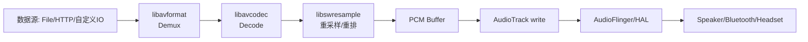
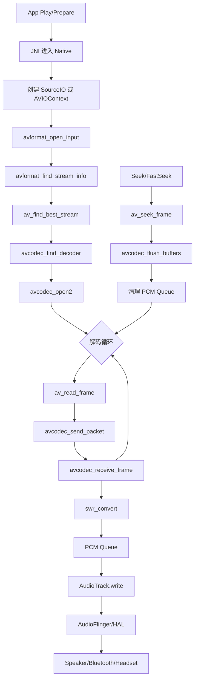

> FFmpeg 是一个开源跨平台多媒体框架，提供音视频的解封装、编解码、转码与流媒体处理能力。

## 一、FFmpeg 提供的核心能力

- 建议按“为什么选 FFmpeg -> 需要哪些能力 -> 如何落地 -> 代价与取舍”来梳理。
- 一句话结论：FFmpeg 的价值不只是“能解码”，而是“可控地稳定解码并统一输出 PCM”。

### 1.1 多媒体能力总览

- **解封装（Demux）**：从 MP3/AAC/FLAC/MP4 等容器中拆出音视频流。
- **解码（Decode）**：把压缩码流还原成原始音频/视频帧（如 PCM/YUV）。
- **编码（Encode）**：把原始数据压缩成目标编码格式（如 AAC、Opus、H.264）。
- **转封装（Remux）**：不改编码内容，仅更换容器格式。
- **转码（Transcode）**：解码 + 重编码，常用于格式统一与码率压缩。
- **流媒体与协议支持**：支持文件、本地流、HTTP/HTTPS 等输入输出。

**为什么播放内核优先选 FFmpeg**

- **格式覆盖更完整**：AAC/MP3/FLAC/Opus 等能力一致，减少“某机型可播、某机型不可播”的风险。
- **运行时行为更可控**：可精细控制解码、重采样、Seek、错误恢复流程。
- **输入侧扩展更灵活**：可通过 `AVIOContext` 统一接入文件、缓存、网络和加密数据源。
- **代价可管理**：CPU、so 体积和接入复杂度会增加，但可通过裁剪、队列策略和降级机制控制。

### 1.2 当前播放内核实际需要的 FFmpeg 能力与功能

| 能力 | 在内核里的功能 | 关键 FFmpeg 知识点 |
| --- | --- | --- |
| 自定义数据源接入 | 统一支持文件/网络/加密源读取 | `AVIOContext`、`read/seek` 回调 |
| 流探测与音轨选择 | 获取时长、采样率、声道并选中音轨 | `avformat_find_stream_info`、`av_find_best_stream` |
| 音频解码 | 将 AAC/MP3/FLAC/Opus 解码为 PCM | `avcodec_send_packet/avcodec_receive_frame` |
| PCM 统一输出 | 统一采样率、声道、样本格式（含 planar -> packed） | `SwrContext`、`swr_convert` |
| 时间戳与进度计算 | 支撑播放进度与同步基准 | `PTS/time_base`、`av_q2d` |
| Seek/FastSeek | 拖动定位与跳播后恢复解码链路 | `av_seek_frame`、`AVSEEK_FLAG_BACKWARD`、`avcodec_flush_buffers` |
| 多流并行解码 | 支撑 Gapless/CrossFade 等多流并发场景 | 多实例 `AVFormatContext/AVCodecContext` 管理 |
| 兼容性降级 | 机型异常时黑名单/软解回退 | 解码器黑名单、错误码与恢复策略 |
| 生命周期与稳定性 | 长时间播放不泄漏、异常可恢复 | `AVFormatContext/AVCodecContext/AVPacket/AVFrame` 释放 |

### 1.3 这些能力在当前播放能力中的落地

| 播放能力 | 依赖的 FFmpeg 能力 | 直接结果 |
| --- | --- | --- |
| 多格式可播 | 流探测 + 音频解码 | AAC/MP3/FLAC/Opus 等都能稳定出 PCM |
| 统一渲染格式 | 重采样/重排 | 不同源格式统一成设备可消费 PCM |
| 进度与定位 | 时间戳换算 + Seek | 进度显示准确，拖动后能快速恢复播放 |
| 复杂数据源播放 | 自定义 IO 回调 | 文件/网络/加密源可复用同一解码链路 |
| 长时间稳定播放 | 错误恢复 + 生命周期管理 | 减少异常中断、降低内存泄漏风险 |

- 一句话总结：这些能力组合起来，才构成“能播、好播、稳播”的音频播放体验。

### 1.4 能力取舍

| 维度 | 收益 | 代价 | 常见优化策略 |
| --- | --- | --- | --- |
| 兼容性 | 多格式可播、跨机型行为更一致 | 接入复杂度上升 | 缩小能力边界，优先保留核心音频链路 |
| 可控性 | 可实现精细化 Seek/恢复/降级 | 需要自建状态机与错误处理 | 按初始化/执行/输出分层治理 |
| 稳定性 | 异常可恢复、长播放更稳 | 需要严格生命周期管理 | 统一资源释放与失败重建策略 |
| 性能体积 | 方案可持续扩展 | CPU 与 so 体积有成本 | `--disable-everything` 按需裁剪 |

### 1.5 播放链路图（FFmpeg 视角）



## 二、FFmpeg 在 Android 中的集成

### 2.1 集成目标

- 在 Android 端把 FFmpeg 作为 Native 解码能力接入，向上提供稳定的 PCM 输出能力。
- 集成时优先关注三件事：**可用性、体积、兼容性**。

### 2.2 常见集成方式

| 方式 | 说明 | 适用场景 |
| --- | --- | --- |
| 预编译 so 直接接入 | 直接引入 `arm64-v8a/armeabi-v7a` 等产物 | 快速验证、工程改动小 |
| 项目内源码编译 | 在 CI 或本地按需编译 FFmpeg | 需要长期维护与裁剪 |
| 第三方封装层接入 | 通过已有播放器内核封装调用 | 团队希望减少 FFmpeg 细节维护 |

### 2.3 Android 集成最小组件

- 音频播放常用最小集合：`libavformat + libavcodec + libavutil + libswresample`。
- 如果有网络流场景，需要按需启用 `protocol`（如 `http/https`）。
- 如果只做本地音频播放，可进一步收敛到更小组件集。

### 2.4 编译裁剪原则（移动端重点）

- 建议从 `--disable-everything` 开始，再按业务格式逐项开启。
- 只保留线上需要的 decoder/demuxer/parser/protocol，避免“全家桶”配置。
- 裁剪目标是：在功能覆盖满足业务的前提下，尽量减少 so 体积与加载耗时。

### 2.5 推荐 configure（按当前播放内核能力裁剪）

#### 方案 A：推荐（自定义 IO 主导，体积更小）

```bash
./configure \
  --target-os=android \
  --arch=arm64 \
  --enable-cross-compile \
  --disable-programs \
  --disable-doc \
  --disable-debug \
  --enable-small \
  --disable-avdevice \
  --disable-avfilter \
  --disable-postproc \
  --disable-swscale \
  --disable-network \
  --disable-everything \
  --enable-avformat \
  --enable-avcodec \
  --enable-avutil \
  --enable-swresample \
  --enable-protocol=file,pipe \
  --enable-demuxer=mov,mp3,aac,flac,ogg,wav \
  --enable-decoder=aac,aac_latm,mp3,flac,opus,vorbis,pcm_s16le \
  --enable-parser=aac,mpegaudio,flac,opus,vorbis
```

#### 方案 B：需要 FFmpeg 直连 HTTP/HTTPS 时

```bash
./configure \
  ... \
  --enable-network \
  --enable-protocol=file,pipe,http,https,tcp,tls
```

- 若播放内核已经通过 `AVIOContext` 接管网络读取，优先用方案 A。
- 若要让 FFmpeg 自己拉取 URL，再用方案 B，并补齐 TLS 依赖（如 OpenSSL）。
- `demuxer/decoder/parser` 列表应与线上格式覆盖率保持一致，定期回看埋点后再增减。

### 2.6 与 Android 工程对接要点

- 通过 JNI 调用 Native 解码模块，把压缩音频输入 FFmpeg，输出 PCM 给渲染层。
- 注意 ABI 产物对齐（`arm64-v8a` 等）与打包体积控制。
- 数据源可通过自定义 IO 回调接入（便于支持文件、网络、加密源统一读取）。

### 2.7 集成验收清单

1. 常见格式（AAC/MP3/FLAC/Opus）可稳定解码。
2. Seek 后可继续正常出声，无明显爆音或长时间静音。
3. so 体积与冷启动耗时满足发布目标。
4. 关键机型回归通过（含蓝牙/耳机切换场景）。

## 三、FFmpeg 运行时解码流程

### 3.1 解码能力

- 初始化目标是把“输入源 + 音轨 + 解码器实例”准备到可解码状态。
- 若使用业务数据源（缓存、加密、分段下载），应先接入 `AVIOContext` 的 `read/seek` 回调，再进入开流流程。
- 初始化阶段任一步失败，都应立即停止链路并回收资源，避免半初始化状态。

**关键方法**

- `avformat_open_input`：打开输入并创建 `AVFormatContext`。
- `avformat_find_stream_info`：探测流信息，补全 codec 参数。
- `av_find_best_stream`：选择目标音轨。
- `avcodec_find_decoder` + `avcodec_open2`：匹配并打开解码器；成功后才进入可解码状态。

**Format/Codec 生命周期（与初始化对应）**

| 初始化动作 | 运行时对象 | 关闭/释放动作 | 说明 |
| --- | --- | --- | --- |
| `avformat_open_input` | `AVFormatContext` | `avformat_close_input`（手动 `avformat_alloc_context` 时可补 `avformat_free_context`） | 对应输入打开阶段，停止或切流时回收 |
| `avcodec_alloc_context3` + `avcodec_open2` | `AVCodecContext` | `avcodec_close` + `avcodec_free_context` | 对应解码器初始化阶段，失败与结束都需回收 |
| `av_packet_alloc` / `av_frame_alloc` | `AVPacket` / `AVFrame` | 循环内 `av_packet_unref` / `av_frame_unref`，结束时 `av_packet_free` / `av_frame_free` | 兼顾高频复用与最终释放 |

```cpp
// 与初始化阶段对应的常见释放顺序
avcodec_close(dec_ctx);
avcodec_free_context(&dec_ctx);
avformat_close_input(&fmt);
av_packet_free(&pkt);
av_frame_free(&frame);
```

**失败处理（初始化阶段）**

| 失败点 | 常见原因 | 建议处理 | 典型错误码映射 |
| --- | --- | --- | --- |
| `avformat_open_input` 失败 | 数据源不可用、路径/参数错误、IO 中断 | 立即停止初始化并回收 context；按策略重试或切换数据源 | `kAudioPlayerUnkownOpenStreamError` / `kAudioPlayerIOError` |
| `avformat_find_stream_info` 失败 | 流信息不完整、文件损坏 | 终止开流流程并上报不可播 | `kAudioPlayerNoAudioStreamInfo` |
| `av_find_best_stream` 返回负值 | 无可用音轨 | 终止流程并返回不支持错误 | `kAudioPlayerNoAudioStreamInfo` |
| `avcodec_find_decoder` 返回空 | 编码不支持或被禁用 | 尝试降级策略（如黑名单回退），否则失败返回 | `kAudioPlayerUnSupportAuidoCodec` |
| `avcodec_open2` 失败 | 解码器参数不兼容或初始化失败 | 清理并重建解码器；连续失败直接终止 | `kAudioPlayerOpenAudioCodecError` |
| `avcodec_alloc_context3` 失败 | 内存不足 | 立即失败并清理已分配资源 | `kAudioPlayerErrorNoMemory` |

### 3.2 执行能力

- 解码核心是 `av_read_frame -> avcodec_send_packet -> avcodec_receive_frame` 的双循环。
- 一个 `AVPacket` 可能产出多个 `AVFrame`，必须持续 `receive` 直到 `EAGAIN/EOF`。
- `EAGAIN` 要区分方向处理：`send` 返回 `EAGAIN` 先 `receive`，`receive` 返回 `EAGAIN` 再回到 `send`。
- Seek 或切流后需要执行 `av_seek_frame` + `avcodec_flush_buffers`，并同步清空上层 PCM 队列。

```cpp
AVPacket* pkt = av_packet_alloc();
AVFrame* frame = av_frame_alloc();

while (av_read_frame(fmt, pkt) >= 0) {
    if (pkt->stream_index != aidx) {
        av_packet_unref(pkt);
        continue;
    }

    int ret = 0;

    // send 侧 EAGAIN: 先 receive 清掉内部输出，再重试 send 当前 packet
    while ((ret = avcodec_send_packet(dec_ctx, pkt)) == AVERROR(EAGAIN)) {
        while ((ret = avcodec_receive_frame(dec_ctx, frame)) >= 0) {
            // 输出 frame，后续进入 PCM 格式统一
            av_frame_unref(frame);
        }
        if (ret != AVERROR(EAGAIN) && ret != AVERROR_EOF) {
            break;
        }
    }
    av_packet_unref(pkt);

    if (ret < 0 && ret != AVERROR_EOF) {
        // 当前包失败：计数、上报、必要时重建解码器
        continue;
    }

    while (true) {
        ret = avcodec_receive_frame(dec_ctx, frame);
        if (ret == AVERROR(EAGAIN) || ret == AVERROR_EOF) break;
        if (ret < 0) break;

        // 输出 frame，后续进入 PCM 格式统一
        av_frame_unref(frame);
    }
}
```

**关键方法**

- `av_read_frame`：从 demux 层读取 `AVPacket`，只处理目标音轨。
- `avcodec_send_packet` + `avcodec_receive_frame`：推进解码状态机并产出 `AVFrame`。
- `av_seek_frame` + `avcodec_flush_buffers`：定位后清空旧解码状态，恢复到新位置继续解码。
- `avcodec_send_packet(dec_ctx, nullptr)`：文件结束时触发 drain，取完解码器内部残留帧。
- `av_packet_unref` / `av_frame_unref`：循环复用对象，避免长时间播放内存增长。

**EAGAIN 双向状态机（send/receive）**

| 当前调用 | 返回值 | 含义 | 正确动作 |
| --- | --- | --- | --- |
| `avcodec_send_packet` | `AVERROR(EAGAIN)` | 解码器输出未取空 | 先循环 `avcodec_receive_frame`，再重试 `send` 当前包 |
| `avcodec_receive_frame` | `AVERROR(EAGAIN)` | 输入不足，暂时无帧可取 | 回到 `av_read_frame + avcodec_send_packet` |
| `avcodec_receive_frame` | `AVERROR_EOF` | 解码器已被 drain 完 | 结束当前流或进入切流流程 |

**失败处理（执行阶段）**

| 阶段 | 常见失败点 | 建议处理 | 典型错误码映射 |
| --- | --- | --- | --- |
| 读包阶段 | `av_read_frame` `< 0` 且非 EOF | 短重试 + 统计失败；超过阈值中止并上报 | `kAudioPlayerErrorIORead` |
| 喂包阶段 | `avcodec_send_packet` 非 `EAGAIN` 负值 | 丢弃当前包并继续；连续失败则重建 `AVCodecContext` | `kAudioPlayerAudioDecodeUnkown` |
| 取帧阶段 | `avcodec_receive_frame` 非 `EAGAIN/EOF` 负值 | 跳过坏帧；连续失败触发降级/重建 | `kAudioPlayerAudioDecodeUnkown` |
| Seek 恢复 | `av_seek_frame` 或 flush 失败 | 回退到最近可播点；清队列后重试或上报失败 | `kAudioPlayerSeekUnkownError` |
| Drain 结束 | `send(nullptr)` / `receive` 异常 | 结束当前流并执行资源清理，避免卡死在尾包 | `kAudioPlayerAudioDecodeUnkown` |

**返回码处理建议**

| 返回码 | 语义 | 建议动作 |
| --- | --- | --- |
| `AVERROR(EAGAIN)` | 当前阶段暂不可继续 | 切换 send/receive 方向继续推进 |
| `AVERROR_EOF` | 当前解码阶段结束 | 进入 drain/结束流程 |
| `< 0` 其他错误 | 数据损坏/状态异常/参数错误 | 计数上报并按策略重建或降级 |

### 3.3 PCM 输出能力

- 解码帧通常不能直接喂设备，需要统一采样率、声道布局、样本格式。
- 输出阶段通常是 `swr_convert -> PCM Buffer/Queue -> AudioTrack.write`。
- PCM 规格统一后，渲染层可维持单一输入格式，减少设备兼容问题。

**关键方法**

- `swr_convert`：执行重采样、重排与 planar/packed 转换，输出设备可消费的 PCM。
- `SwrContext` 初始化参数需与目标输出格式一致，否则可能出现音调异常、速度异常或爆音。
- `swr_init` + `swr_close` / `swr_free`：分别对应重采样器的启动与关闭；切流、格式变更、停止时都要成对处理。

**重采样关闭（与初始化对应）**

- 初始化：`swr_alloc_set_opts` -> `swr_init`。
- 重建：先 `swr_close` + `swr_free` 释放旧实例，再按新格式重新 `swr_init`。
- 结束：Stop/Close/Destroy 阶段统一执行 `swr_close` + `swr_free`，并把指针置空，避免悬挂引用。

**失败处理（PCM 输出阶段）**

| 阶段 | 常见失败点 | 建议处理 | 典型错误码映射 |
| --- | --- | --- | --- |
| 重采样初始化 | `swr_alloc`/`swr_init` 失败 | 释放并重建 `SwrContext`；必要时降级输出格式 | `kAudioPlayerErrorSwr` / `kAudioPlayerErrorNoMemory` |
| 重采样执行 | `swr_convert` 返回负值 | 丢弃当前帧并重建重采样器；连续失败中止链路 | `kAudioPlayerErrorSwr` |
| 输出格式变更 | 采样率/声道/样本格式切换 | 标记新格式并触发设备重配，清理旧 PCM 缓冲 | `kAudioPlayerAudioFormatChanged` |
| PCM 供给不足 | 上游解码抖动导致队列短缺 | 进入 buffering 或短静音填充，等待解码恢复 | `kAudioPlayerBufferEmpty` |

### 3.4 运行时解码链路（整体流程）

```cpp
AVFormatContext* fmt = nullptr;
AVCodecContext* dec_ctx = nullptr;
SwrContext* swr = nullptr;

// 1) 打开输入并探测流信息
int ret = avformat_open_input(&fmt, url, nullptr, nullptr);
if (ret < 0) return ret;

ret = avformat_find_stream_info(fmt, nullptr);
if (ret < 0) return ret;

// 2) 选择音轨并打开解码器
int aidx = av_find_best_stream(fmt, AVMEDIA_TYPE_AUDIO, -1, -1, nullptr, 0);
if (aidx < 0) return aidx;

const AVCodec* dec = avcodec_find_decoder(fmt->streams[aidx]->codecpar->codec_id);
if (!dec) return AVERROR_DECODER_NOT_FOUND;

dec_ctx = avcodec_alloc_context3(dec);
if (!dec_ctx) return AVERROR(ENOMEM);

ret = avcodec_parameters_to_context(dec_ctx, fmt->streams[aidx]->codecpar);
if (ret < 0) return ret;

ret = avcodec_open2(dec_ctx, dec, nullptr);
if (ret < 0) return ret;

// 3) 解码循环 + PCM 统一
AVPacket* pkt = av_packet_alloc();
AVFrame* frame = av_frame_alloc();

while (av_read_frame(fmt, pkt) >= 0) {
    if (pkt->stream_index != aidx) {
        av_packet_unref(pkt);
        continue;
    }

    ret = avcodec_send_packet(dec_ctx, pkt);
    av_packet_unref(pkt);
    if (ret < 0) continue;

    while (true) {
        ret = avcodec_receive_frame(dec_ctx, frame);
        if (ret == AVERROR(EAGAIN) || ret == AVERROR_EOF) break;
        if (ret < 0) break;

        // 4) 重采样后写入 PCM 队列，再由渲染线程写 AudioTrack
        // swr_convert(...)

        av_frame_unref(frame);
    }
}

// 5) 退出时回收（与初始化阶段一一对应）
swr_free(&swr);
avcodec_close(dec_ctx);
avcodec_free_context(&dec_ctx);
avformat_close_input(&fmt);
av_packet_free(&pkt);
av_frame_free(&frame);
```



- 建议链路顺序：`open_input -> find_stream_info -> find_best_stream -> open2 -> read/send/receive -> swr_convert -> queue/write`。
- Seek 链路顺序：`av_seek_frame -> avcodec_flush_buffers -> 清理 PCM 队列 -> 恢复 read/send/receive`。

## 四、FFmpeg 重采样与 PCM 格式统一

### 4.1 能力目标与适用边界

- 重采样的核心目标是把解码后的多种 PCM（不同采样率/声道/样本格式）统一成设备可稳定消费的目标 PCM。
- 在播放内核里，重采样不只等于“改采样率”，还包括声道重排、`planar -> packed`、样本格式统一（如 `FLT -> S16`）。
- 理论上一句话：重采样是对离散信号做带限重建后按新采样时钟重新取样，其中下采样前必须先低通以避免混叠（aliasing）。
- 当输入规格与目标输出规格完全一致时，可直接透传，避免不必要的 CPU 开销。

### 4.2 输入输出规格模型

| 维度 | 输入侧（src） | 输出侧（dst） | 说明 |
| --- | --- | --- | --- |
| 采样率 | `src_rate` | `dst_rate` | 如 44.1k -> 48k |
| 声道布局 | `src_ch_layout` | `dst_ch_layout` | 如 5.1 -> stereo |
| 样本格式 | `src_sample_fmt` | `dst_sample_fmt` | 如 `FLTP -> S16` |

- 只要以上三项任一发生变化，就需要重建 `SwrContext`。

#### 4.2.1 Interleaved（Packed）与 Planar

- **Interleaved（Packed）**：多声道样本按时间点交错存储，双声道常见布局为 `L0 R0 L1 R1 ...`。
- **Planar**：每个声道独立存储，双声道常见布局为 `L0 L1 L2 ...` 与 `R0 R1 R2 ...`。
- 在播放链路里，解码输出常见 `Planar`，而设备写入侧通常更常用 `Interleaved`，因此经常需要 `planar -> packed` 转换。

| 形态 | 内存布局示例（2ch） | 常见 sample_fmt | 常见风险 |
| --- | --- | --- | --- |
| Interleaved（Packed） | `L0 R0 L1 R1 ...` | `S16`、`FLT` | 声道数或帧长计算错误会导致错位 |
| Planar | `L0 L1 ...` + `R0 R1 ...` | `S16P`、`FLTP` | 误当交错数据写设备会出现杂音 |

- 实践建议：统一把输出规格定为设备可消费的 packed 格式（如 `S16` 或 `FLT`），由 `swr_convert` 负责重排与重采样。

#### 4.2.2 多声道 Downmix（降级播放）

- 当输入是 5.1/7.1 等多声道，而设备或业务策略要求双声道输出时，需要执行 downmix。
- 在 FFmpeg 链路里，downmix 本质是“声道布局转换 + 重混音（rematrix）”，通常在 `SwrContext` 中完成。
- 常见策略是把输出布局统一为 `stereo`，再结合 `lfe_mix_level` 控制低频（LFE）混入比例。

```cpp
// 典型 downmix 目标：multichannel -> stereo
mSwAContext = swr_alloc_set_opts(
    nullptr,
    dst_ch_layout /* stereo */, dst_sample_fmt, dst_rate,
    src_ch_layout /* 5.1/7.1 */, src_sample_fmt, src_rate,
    0, nullptr
);

// 可选：控制 downmix 的低频混合比例
av_opt_set_double(mSwAContext, "lfe_mix_level", lfe_mix_level, 0);
swr_init(mSwAContext);
```

### 4.3 初始化与重建（`SwrContext`）

- 初始化步骤：准备 src/dst 规格 -> `swr_alloc_set_opts` -> `swr_init`。
- 重建时机：切歌、Seek、设备规格变化、解码输出规格突变。
- 重建原则：先释放旧 context，再按新规格创建，避免上下文污染。

```cpp
SwrContext* swr = swr_alloc_set_opts(
    nullptr,
    dst_ch_layout, dst_sample_fmt, dst_rate,
    src_ch_layout, src_sample_fmt, src_rate,
    0, nullptr
);
if (!swr) return kAudioPlayerErrorNoMemory;

int ret = swr_init(swr);
if (ret < 0) {
    swr_free(&swr);
    return kAudioPlayerErrorSwr;
}
```

### 4.4 运行时转换与缓冲估算

- 运行时建议固定为三步：估算输出样本数 -> 估算输出缓冲 -> `swr_convert`。
- `AV_ROUND_UP` 建议保留，优先保证缓冲足够，避免尾样本截断。

```cpp
// 1) 输出样本数估算
int out_count = (int)av_rescale_rnd(
    swr_get_delay(swr, src_rate) + in_samples,
    dst_rate,
    src_rate,
    AV_ROUND_UP
);

// 2) 输出缓冲字节数估算
int out_size = av_samples_get_buffer_size(
    nullptr,
    dst_channels,
    out_count,
    dst_sample_fmt,
    0
);
if (out_size <= 0) return kAudioPlayerErrorSwr;

// 3) 执行转换
int out_samples = swr_convert(
    swr,
    out_data,
    out_count,
    (const uint8_t**)in_data,
    in_samples
);
if (out_samples < 0) return kAudioPlayerErrorSwr;
```

### 4.5 格式突变处理流程

- 突变判定：`sample_rate`、`channel_layout`、`sample_fmt` 任一变化。
- 推荐流程：
  1. 打标记（如 `FLAG_BUFFER_NEW_FORMAT`）通知上游/下游。
  2. 释放旧 `SwrContext`。
  3. 以新规格重建重采样器。
  4. 必要时触发设备重配与 PCM 队列清理。
  5. 重建成功后恢复写入，失败则走错误上报和降级。

### 4.6 失败处理（重采样阶段）

| 失败点 | 常见原因 | 建议处理 | 典型结果 |
| --- | --- | --- | --- |
| `swr_init` 失败 | 参数不合法、context 状态异常 | 释放并重建；必要时降级输出规格 | 当前曲目失败或短暂静音恢复 |
| `swr_convert` 失败 | 输入帧异常、上下文污染 | 丢弃坏帧并重建；连续失败中止链路 | 偶发丢帧或错误回调 |
| `out_size <= 0` | 缓冲估算参数异常 | 拒绝写入并上报，避免越界 | 保护性失败 |
| 格式变化未重建 | 流程遗漏 | 强制触发重建与设备重配 | 避免音调异常/声道错位 |

### 4.7 生命周期管理

- 建议生命周期：`create -> use -> reinit(if needed) -> free`。
- 创建时机：Prepare 后确定输入输出规格，或业务主动修改目标规格。
- 重建时机：切歌/Seek/设备切换/解码格式变化。
- 释放时机：Stop、Close、Destroy、以及每次重建前先释放旧 context。

**管理要点**

1. `单点持有`：由解码或重采样模块统一管理 `SwrContext`。
2. `线程安全`：创建/重建/释放在受控线程或加锁区间执行。
3. `异常完备`：所有失败分支都保证 `swr_free` 可达。

### 4.8 验收清单

1. 同一设备上，44.1k/48k/96k 音源都能稳定输出目标 PCM。
2. `planar -> packed` 与多声道 downmix 后无明显声道错位。
3. Seek、切歌、格式切换后无长时间静音与爆音。
4. 长时播放下重采样上下文可重复重建，内存无持续增长。

### 4.9 目的与作用总结

- **目的**：把解码侧输出的“多种 PCM 规格”统一成设备侧稳定可消费的“单一 PCM 规格”。
- **作用 1（兼容性）**：屏蔽不同音源在采样率、声道布局、样本格式上的差异，确保多格式可播。
- **作用 2（稳定性）**：在 Seek、切歌、格式突变时维持播放链路连续，减少爆音、串音和无声。
- **作用 3（可维护性）**：上层处理与设备输出可依赖统一格式，降低后续音效、变速、混音接入复杂度。
- **一句话**：重采样与 PCM 统一层是“能播、稳播、好维护”的关键基础设施。

## 五、FFmpeg 稳定性与异常恢复

### 5.1 目标与范围

- 本节目标是建立“可持续播放”的运行时能力：出现异常时能恢复，不能恢复时能快速失败并上报。
- 关注范围包含：解码执行期异常、Seek/切流恢复、上下文重建、资源回收与稳定性验收。
- 不展开业务功能，只聚焦 FFmpeg 主链路的稳定性治理。

### 5.2 异常分级与处理原则

| 异常级别 | 典型返回/现象 | 处理原则 | 目标 |
| --- | --- | --- | --- |
| 可恢复 | `AVERROR(EAGAIN)`、`AVERROR(EBUSY)`、偶发 `AVERROR_INVALIDDATA` | 切换调用方向、短重试、跳过坏帧 | 不中断播放 |
| 可重建 | `AVERROR_OUTPUT_CHANGED`、`swr_convert < 0`、解码连续失败 | 重建 `SwrContext` 或 `AVCodecContext` | 快速恢复可播 |
| 不可恢复 | 初始化失败、持续 `AVERROR(EIO)`、内存分配失败 | 终止当前链路并上报错误 | 避免卡死与脏状态 |

- 处理顺序建议：先判定级别，再执行最小恢复动作，最后再考虑重建或终止。

### 5.3 解码执行期恢复（EAGAIN/重试/丢帧）

- `send_packet` 返回 `AVERROR(EAGAIN)`：先 `receive_frame` 排空，再重试当前 `send`。
- `receive_frame` 返回 `AVERROR(EAGAIN)`：说明输入不足，回到 `read_frame + send_packet`。
- `AVERROR_INVALIDDATA`：丢弃当前坏包/坏帧，继续推进，不立即中断整条链路。
- 为避免长时间空转，建议设置“连续重试阈值”，超阈值后进入重建或失败上报。

### 5.4 Seek 与状态恢复链路

#### 5.4.1 Seek 能力模型

- **快速 Seek（FastSeek）**：优先“快到达”，允许落点与目标时间存在小偏差，适合拖动预览。
- **精确 Seek（Accurate Seek）**：优先“落点准确”，通常需要 Seek 后继续解码并丢弃前置样本，成本更高。
- 能否稳定 FastSeek 取决于输入是否支持随机访问：自定义 `AVIOContext` 场景下，`seek` 回调能力是关键前提。

#### 5.4.2 时间换算与目标点计算

- 业务层通常以毫秒传入，需要先换算到流时间基。
- 建议统一使用 `av_rescale_q`，避免浮点误差累计。

```cpp
// seek_ms -> stream time_base
int64_t seek_ts = av_rescale_q(
    seek_ms,
    av_make_q(1, 1000),
    stream->time_base
);
```

#### 5.4.3 API 与 flag 选择

- `av_seek_frame`：常用入口，简单直接，适合大多数文件流。
- `avformat_seek_file`：可提供 `min_ts/max_ts` 搜索窗口，适合更可控的定位策略。

| 选项 | 含义 | 常见场景 |
| --- | --- | --- |
| `AVSEEK_FLAG_BACKWARD` | 向后回退到可解码位置 | 优先保证成功率和可播性 |
| `AVSEEK_FLAG_FRAME` | 按帧语义定位 | 对帧边界敏感的定位策略 |
| `AVSEEK_FLAG_ANY` | 允许非关键点定位 | 追求更近落点，但恢复代价可能更高 |

#### 5.4.4 标准恢复顺序（推荐）

1. 计算目标 `seek_ts`，执行 `av_seek_frame`；失败时可回退到 `avformat_seek_file`。
2. 调用 `avcodec_flush_buffers` 清理解码器内部旧状态。
3. 清理上层 `packet/frame/pcm` 队列，防止旧位置数据串入。
4. 若 Seek 后检测到格式变化，重建 `SwrContext`（`swr_close/swr_free -> swr_init`）。
5. 恢复 `read -> send -> receive` 循环，重新建立时间戳连续性。

```cpp
int64_t seek_ts = av_rescale_q(seek_ms, av_make_q(1, 1000), stream->time_base);

int ret = av_seek_frame(fmt, stream_index, seek_ts, AVSEEK_FLAG_BACKWARD);
if (ret < 0) {
    ret = avformat_seek_file(fmt, stream_index, INT64_MIN, seek_ts, INT64_MAX, AVSEEK_FLAG_FRAME);
}
if (ret < 0) {
    return kAudioPlayerSeekUnkownError;
}

avcodec_flush_buffers(dec_ctx);
clear_packet_queue();
clear_frame_queue();
clear_pcm_queue();

if (need_reinit_swr) {
    swr_close(swr);
    swr_free(&swr);
    // reinit swr with new format
}
```

#### 5.4.5 常见场景与处理要点

| 场景 | 典型问题 | 建议动作 |
| --- | --- | --- |
| VBR（如 MP3） | 落点偏差较大 | Seek 后继续解码短窗口并丢弃前置帧，拉近目标落点 |
| AAC priming / end padding | Seek 后首段听感不准或尾段异常 | 维护 priming/padding 补偿策略，必要时丢弃首段样本 |
| 非随机访问输入 | `seek` 不可用或高失败率 | 降级为近似跳播、重开链路或禁用精确 Seek |
| Seek 后格式突变 | 采样率/声道/样本格式变化 | 标记格式变化并重建重采样器与输出链路 |
| 弱网/忙状态 | `EIO/EBUSY` 导致恢复抖动 | 限次重试 + 退避；超阈值后失败上报并回退 |

#### 5.4.6 Seek 验收关注点

- 响应时延：从发起 Seek 到恢复稳定出声的耗时。
- 落点误差：实际播放时间与目标时间偏差。
- 听感质量：Seek 后是否出现爆音、串音、长静音。
- 稳定性：高频拖动场景下是否出现状态错乱或内存增长。

### 5.5 上下文重建与回退策略

| 对象 | 触发条件 | 重建动作 | 失败后动作 |
| --- | --- | --- | --- |
| `SwrContext` | 格式变化、`swr_init/swr_convert` 失败 | `swr_close + swr_free` 后按新规格 `swr_init` | 降级输出格式或中止当前曲目 |
| `AVCodecContext` | `send/receive` 连续失败或状态异常 | `avcodec_close + avcodec_free_context` 后重新 open | 上报解码错误并切换回退策略 |
| `AVFormatContext` | 输入侧严重错误、流状态不可用 | `avformat_close_input` 后重新 open/probe | 上报 IO/开流失败并停止链路 |

- 重建原则：同一时刻只重建必要对象，避免全链路“过度重建”带来的抖动。

### 5.6 资源回收与泄漏防护

- 循环内复用：`av_packet_unref`、`av_frame_unref`。
- 退出时释放：`av_packet_free`、`av_frame_free`、`avcodec_close`、`avcodec_free_context`、`avformat_close_input`、`swr_free`。
- 自定义 IO 场景下，`AVIOContext` 与其 buffer 也要在关闭路径中成对释放。
- 异常路径要与正常路径同等对待，确保每个提前返回分支都可达释放逻辑。

### 5.7 稳定性验收指标

1. 解码错误率：`send/receive/read` 错误占比可持续低于阈值。
2. 恢复成功率：异常后自动恢复到可播状态的比例。
3. Seek 恢复时延：Seek 到重新稳定出声的耗时。
4. 听感稳定性：Seek/切歌后无明显爆音、串音、长静音。
5. 资源稳定性：长时播放下内存曲线平稳，无持续增长。

## 六、业务兼容策略与运行配置

### 6.1 解码黑名单策略（`SetBlackCodecIds`）

#### 6.1.1 能力目标

- 当某些编解码路径在特定机型/系统版本上高概率异常时，通过黑名单快速屏蔽高风险 codec，优先保证稳定可播。
- 黑名单策略的核心价值是“可运行时调整”，避免每次兼容问题都依赖发版修复。

#### 6.1.2 配置入口与生效链路

1. 业务侧下发或本地配置 codec id 列表。
2. 通过播放器接口 `SetBlackCodecIds` 注入内核。
3. 解码器初始化阶段读取目标音轨 `codec_id` 并与黑名单匹配。
4. 命中则终止该解码路径，未命中继续正常 `find_decoder/open2`。

#### 6.1.3 命中规则与当前行为

- 命中判断时机：完成流选择后、`avcodec_find_decoder` 前。
- 当前行为：命中黑名单后直接返回“不支持该编码”的错误，停止当前曲目解码初始化。
- 这是一种“拦截式兼容策略”：优点是简单稳定，缺点是未内置自动回退链路。

**可参考逻辑**

```cpp
// initAudioCodec() 中，选中音轨后进行黑名单判定
int codec_id = (int)mAudioStream->codecpar->codec_id;
for (int id : black_codec_ids_) {
    if (codec_id == id) {
        // 命中即拦截，返回不支持编码
        return kAudioPlayerUnSupportAuidoCodec;
    }
}

// 未命中再继续 avcodec_find_decoder / avcodec_open2
```

- 该实现的结果是“提前失败、避免高风险路径进入运行态”，并由上层统一错误上报与后续业务处理。

#### 6.1.4 运行配置建议

| 配置维度 | 建议内容 | 说明 |
| --- | --- | --- |
| codec 维度 | `codec_id` 列表 | 最小化命中范围，避免误伤 |
| 平台维度 | Android/iOS/macOS 分开配置 | 平台实现差异大，需独立治理 |
| 机型维度 | 品牌/机型/系统版本 | 针对性屏蔽高风险组合 |
| 版本维度 | 配置版本号 + 生效时间 | 便于灰度、回滚、审计 |

- 配置来源建议：`本地兜底配置 + 服务端动态配置`。
- 配置生效建议：启动拉取、失败回退本地；播放中更新时应保证线程安全和原子切换。

#### 6.1.5 可选增强方向

1. **自动回退**：命中黑名单后尝试备用解码路径，而不是直接失败。
2. **观测指标**：记录命中率、回退成功率、失败率和机型分布。
3. **策略闭环**：结合线上异常日志，定期增删黑名单项，避免长期配置膨胀。

### 6.2 多声道 Downmix 降级策略

#### 6.2.1 能力目标

- 对多声道文件（如 5.1）提供可控降级路径，在设备能力不足或业务策略要求双声道时仍可稳定播放。
- 降级目标是“可播优先”：牺牲部分空间感，换取更高兼容性与更低故障率。

#### 6.2.2 运行配置与核心参数

| 配置项 | 作用 | 典型取值 |
| --- | --- | --- |
| `downmix_enable` | 是否启用多声道降级 | `true/false` |
| `lfe_mix_level` | LFE（低频）混入强度 | `0.0 ~ 1.0`（按听感调优） |

- 建议把 downmix 配置作为运行时策略下发项，支持快速启停与参数调优。

#### 6.2.3 当前播放内核实现参考

1. 业务侧写入 downmix 配置（启用开关 + `lfe_mix_level`）。
2. 设备层格式建议阶段，若命中策略则把 5.1 布局降为 `stereo`。
3. 播放器把设备渲染格式回传给解码流作为目标输出格式。
4. 解码器在 `InitSwrContext` 中基于 `src_layout -> dst_layout` 建立 `SwrContext` 并设置 `lfe_mix_level`。
5. 运行时由 `swr_convert` 输出降级后的双声道 PCM。

#### 6.2.4 使用边界与风险提示

- Downmix 主要解决“能播”与“兼容”问题，不等价于高保真空间音频还原。
- `lfe_mix_level` 过高可能导致低频过重，过低可能导致低频信息损失。
- 建议在耳机、外放、蓝牙等主要设备路径分别做听感回归。

### 6.3 PCM 计算公式与单位换算（速查）

- `bytes_per_sample = bits_per_sample / 8`
- `bytes_per_frame = channels * bytes_per_sample`
- `bytes_per_second = sample_rate * bytes_per_frame`

- `duration_ms(bytes) = byte_count * 1000 / bytes_per_second`
- `sample_count(bytes) = byte_count / bytes_per_frame`
- `duration_ms(samples) = sample_count * 1000 / sample_rate`

- `frame_block` 常用定义：`frame_block = sample_bits * channel / 8`（每采样点跨所有声道的字节数）。
- 计算建议统一使用 `int64_t`，避免高码率长时播放时整数溢出。

**示例（48kHz / 16bit / 2ch）**

- `bytes_per_sample = 16 / 8 = 2`
- `bytes_per_frame = 2 * 2 = 4`
- `bytes_per_second = 48000 * 4 = 192000`
- 若 `byte_count = 96000`，则 `duration_ms = 96000 * 1000 / 192000 = 500ms`

- 该口径与第 4 节 `4.4 运行时转换与缓冲估算` 中的 `out_count/out_size` 计算方式保持一致。

### 6.4 Planar/Interleaved 常见错误症状对照

| 症状 | 常见根因 | 快速排查 | 修复动作 |
| --- | --- | --- | --- |
| 明显杂音/电流声 | 把 `planar` 数据按 `interleaved` 直接写设备 | 检查 `sample_fmt` 是否为 `*P`（如 `FLTP/S16P`） | 统一走 `swr_convert` 输出 packed（`S16/FLT`） |
| 声道错位/左右声道异常 | 声道重排顺序错误或通道数判断错误 | 对比 `channel_layout` 与写入通道配置 | 显式指定 `src_ch_layout -> dst_ch_layout` 并做重排 |
| 播放时长不准（偏长/偏短） | 把 `bytes_per_sample` 当作 `bytes_per_frame` 使用 | 核对 `frame_block = sample_bits * channels / 8` | 所有时长换算按 `bytes_per_frame` 计算 |
| 周期性爆音/断续 | 写入长度不是 `frame_block` 整数倍 | 检查 `write_len % frame_block` 是否为 0 | 对齐写入块，尾部不足部分做缓冲拼接 |
| 单声道有声、另一声道接近静音 | planar 只拷贝了 `data[0]`，未合并其他声道平面 | 检查多声道时是否遍历所有 `data[ch]` | 使用 `swr_convert` 或完整平面合并逻辑 |
| 音调/速度异常 | 采样格式或采样率解释错误（如把 `float` 当 `s16`） | 核对 `sample_rate/sample_fmt` 与设备输入配置 | 统一格式后再写设备，避免隐式转换 |

- 最小自检清单：`sample_fmt`、`channel_layout`、`frame_block`、`write_len` 对齐、时长公式口径一致。
