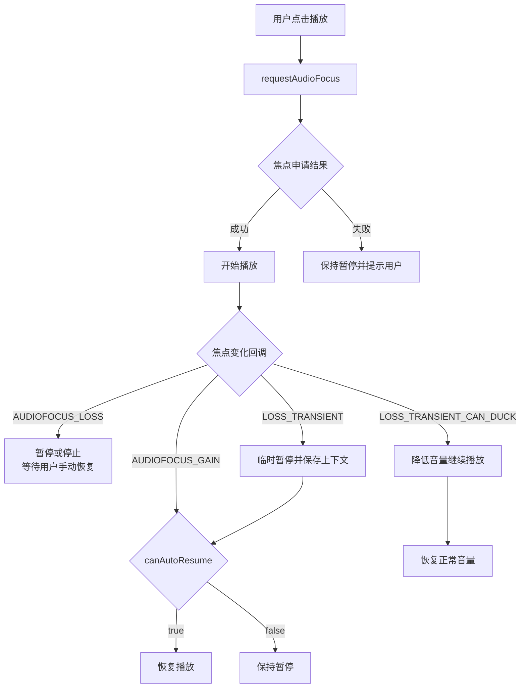
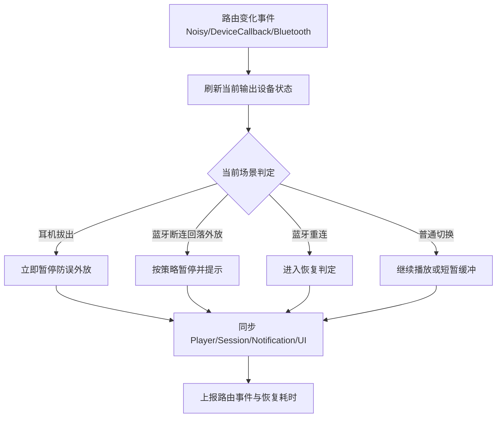
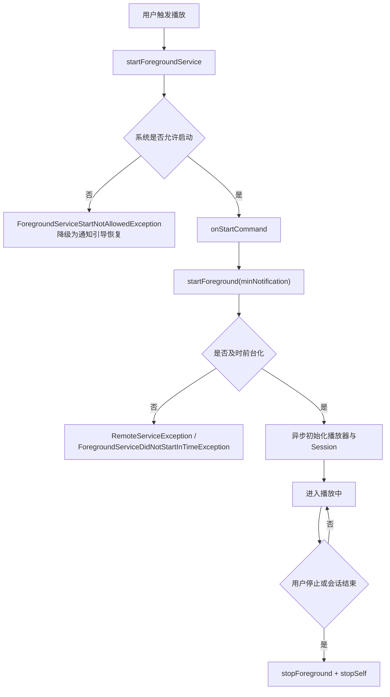
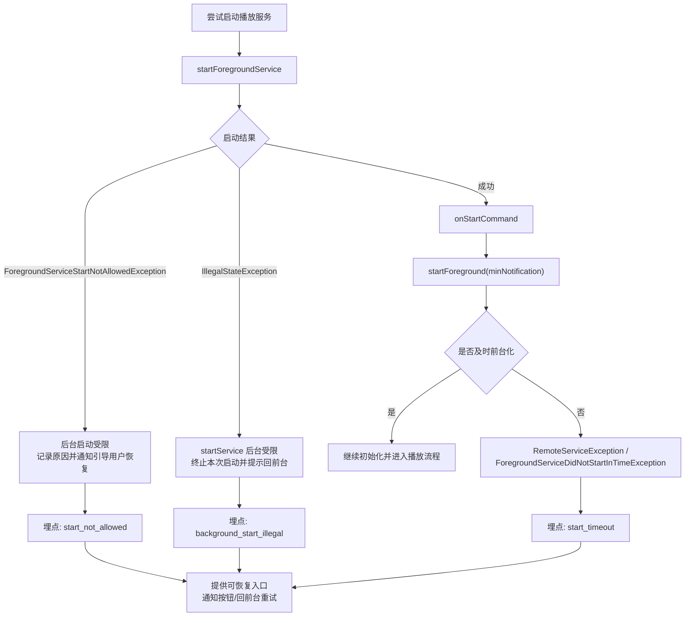
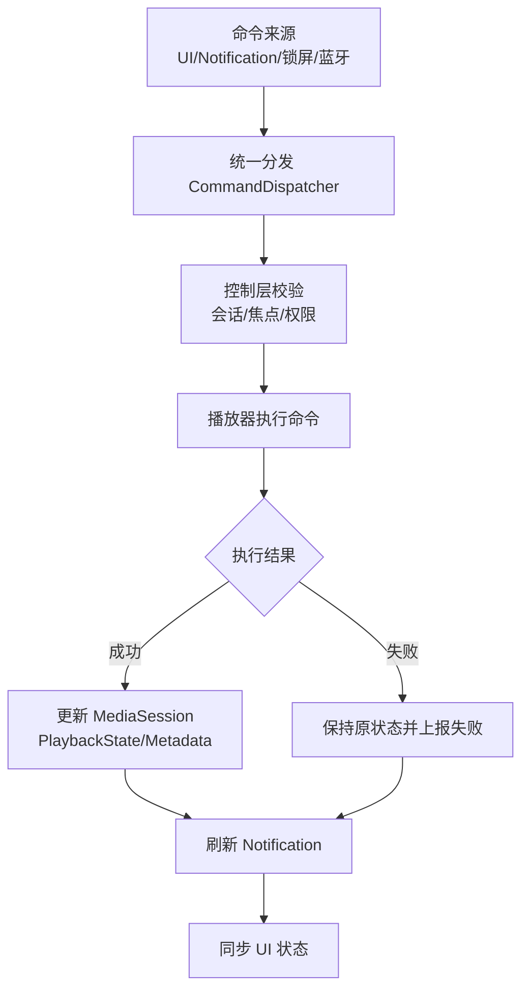

## 一、AudioFocus：功能与关键参数

### 1.1 AudioFocus 的核心功能

- **发声仲裁**：当多个 App 同时需要播放音频时，系统通过 AudioFocus 决定“谁可以发声”。
- **中断分级**：区分长期中断、短期中断、可降音中断，不同类型触发不同动作（暂停/降音/恢复）。
- **恢复控制**：焦点恢复后不等于必须自动播放，仍需结合用户意图与业务状态判定。
- **体验兜底**：减少“界面显示播放中但无声”“通话后误播”等常见问题。

### 1.2 常用 API（上层最常用）

- `AudioManager.requestAudioFocus(focusRequest)`：申请焦点。
- `AudioManager.abandonAudioFocusRequest(focusRequest)`：释放焦点。
- `OnAudioFocusChangeListener`：接收焦点变化回调，统一进入控制层处理。

> Android 8.0（API 26）及以上建议统一使用 `AudioFocusRequest`。

### 1.3 申请侧关键参数（你主动设置）

| 参数 | 作用 | 常见取值 | 建议 |
| --- | --- | --- | --- |
| `focusGain` | 声明焦点需求强度与时长 | `AUDIOFOCUS_GAIN` / `AUDIOFOCUS_GAIN_TRANSIENT` / `AUDIOFOCUS_GAIN_TRANSIENT_MAY_DUCK` / `AUDIOFOCUS_GAIN_TRANSIENT_EXCLUSIVE` | 音乐/播客常用 `AUDIOFOCUS_GAIN` |
| `AudioAttributes.usage` | 声明音频使用场景 | `USAGE_MEDIA` / `USAGE_VOICE_COMMUNICATION` / `USAGE_ASSISTANCE_NAVIGATION_GUIDANCE` | 内容播放通常用 `USAGE_MEDIA` |
| `AudioAttributes.contentType` | 声明内容类型 | `CONTENT_TYPE_MUSIC` / `CONTENT_TYPE_SPEECH` | 播客、有声书可考虑 `SPEECH` |
| `setAcceptsDelayedFocusGain` | 是否接受延迟获得焦点 | `true` / `false` | 允许排队等待时可设 `true` |
| `setWillPauseWhenDucked` | 可降音场景是否改为暂停 | `true` / `false` | 语音内容常设 `true`，音乐常设 `false` |

### 1.4 回调侧关键参数（系统返回）

| 回调值 | 含义 | 推荐动作 |
| --- | --- | --- |
| `AUDIOFOCUS_GAIN` | 焦点恢复 | 恢复音量；按“可恢复条件”决定是否恢复播放 |
| `AUDIOFOCUS_LOSS` | 长期失焦 | 暂停/停止；通常不自动恢复 |
| `AUDIOFOCUS_LOSS_TRANSIENT` | 短期失焦 | 暂停并保存上下文 |
| `AUDIOFOCUS_LOSS_TRANSIENT_CAN_DUCK` | 可降音失焦 | 优先降音继续，避免不必要暂停 |

### 1.5 参数选择建议（业务默认）

- 长音频/音乐：`AUDIOFOCUS_GAIN + USAGE_MEDIA + CONTENT_TYPE_MUSIC`
- 短提示音/播报：`AUDIOFOCUS_GAIN_TRANSIENT` 或 `AUDIOFOCUS_GAIN_TRANSIENT_MAY_DUCK`
- 恢复策略始终走统一判定：**用户意图 + 中断前状态 + 场景许可 + 业务拦截**

### 1.6 焦点重新获取后的播放

核心原则：**只恢复“被系统打断前正在播放”的会话，不恢复“用户主动暂停”的会话。**

在失焦时保存以下上下文（用于 `AUDIOFOCUS_GAIN` 判定）：

- `wasPlayingBeforeLoss`：失焦前是否在播放。
- `lossType`：失焦类型（`LOSS` / `LOSS_TRANSIENT` / `LOSS_TRANSIENT_CAN_DUCK`）。
- `pauseReason`：暂停原因（焦点中断、来电、路由切换等）。
- `userIntent`：用户当前意图（想继续播放 / 主动暂停）。
- `contentId/sessionId`：会话是否一致，避免误恢复到旧内容。

恢复判定建议：

```text
canAutoResume =
  wasPlayingBeforeLoss == true
  && lossType != AUDIOFOCUS_LOSS
  && userIntent == WANT_PLAY
  && sceneAllowsResume == true
  && businessBlock == false
  && sameSession == true
```

常见策略约定：

- `AUDIOFOCUS_LOSS`：默认不自动恢复，交由用户手动播放。
- `AUDIOFOCUS_LOSS_TRANSIENT`：满足判定条件可自动恢复。
- `AUDIOFOCUS_LOSS_TRANSIENT_CAN_DUCK`：通常不断播；收到 `AUDIOFOCUS_GAIN` 后恢复正常音量。

### 1.7 版本兼容要点（AudioFocus）

| 能力 | 关键版本 | 差异说明 | 建议 |
| --- | --- | --- | --- |
| 焦点申请 API | API < 26 | 使用旧接口：`requestAudioFocus(listener, streamType, durationHint)` | 封装一层兼容适配，避免业务层判断版本 |
| 焦点申请 API | API >= 26 | 使用新接口：`AudioFocusRequest` + `AudioAttributes` | 统一使用新接口，策略可配置性更好 |
| 延迟焦点与 Duck 行为配置 | API < 26 | 不支持 `setAcceptsDelayedFocusGain`、`setWillPauseWhenDucked` 这类 Builder 配置 | 通过业务层兜底逻辑处理（延迟播/手动暂停） |
| 延迟焦点与 Duck 行为配置 | API >= 26 | 支持在 `AudioFocusRequest.Builder` 中显式配置 | 优先用系统能力表达策略，减少自定义分支 |
| 焦点事件处理 | 全版本 | `GAIN/LOSS/LOSS_TRANSIENT/CAN_DUCK` 语义一致 | 保持统一状态机，避免版本分叉实现 |

### 1.8 AudioFocus 中断与恢复流程图



## 二、音频路由（Audio Routing）

### 2.1 音频路由的作用

- 音频路由决定“声音从哪里出来”，例如扬声器、有线耳机、蓝牙耳机、车机。
- 路由切换本身不是播放失败，但处理不当会出现“进度在走但无声”或“误外放”。
- 上层目标是：**路由变化可感知、动作可控、状态一致**。

### 2.2 常见路由变化场景

- 有线耳机拔出（`ACTION_AUDIO_BECOMING_NOISY`）。
- 蓝牙设备断开后回落扬声器。
- 蓝牙设备重连后切回蓝牙输出。
- 用户在系统面板主动切换输出设备。

### 2.3 监听入口（上层常用）

- `ACTION_AUDIO_BECOMING_NOISY`：高优先级安全信号，优先用于耳机拔出保护。
- `AudioDeviceCallback`：监听设备增删变化（`onAudioDevicesAdded/Removed`）。
- 蓝牙连接状态广播：辅助判断断连/重连窗口，避免误判播放器异常。

### 2.4 路由切换处理流程（推荐）

```text
routeChanged
  -> refreshCurrentDevice()
  -> decideAction(pause/continue/duck)
  -> syncPlayerUiNotificationState()
  -> reportRouteEventAndRecoverTime()
```

处理要点：

- 先更新路由状态，再做动作，避免动作和状态错位。
- 切换瞬间允许短暂静音窗口，不要立刻判定为播放失败。
- 所有动作统一走控制层，不在页面层分散处理。

### 2.5 默认策略建议（音乐 App）

- 耳机拔出：立即暂停，防止误外放。
- 蓝牙断连：若回落扬声器且处于后台，默认暂停并提示用户。
- 蓝牙重连：不强制自动播放，走“焦点恢复判定 + 用户意图”流程。
- 路由恢复后：校验 `MediaSession`、UI、通知栏状态与播放器状态一致。

### 2.6 常见问题

- “进度在走但无声”：多为路由状态未刷新或切换后音量/设备状态未同步。
- “蓝牙断开后自动外放”：未做外放保护策略或后台策略未生效。
- “UI 显示播放中但实际暂停”：播放器状态与 UI 状态源不一致。

### 2.7 版本兼容要点（Audio Routing）

| 能力 | 关键版本 | 差异说明 | 建议 |
| --- | --- | --- | --- |
| `ACTION_AUDIO_BECOMING_NOISY` | API 3+ | 经典耳机拔出广播，覆盖面最广 | 作为路由安全兜底，务必监听 |
| `AudioDeviceCallback` | API 23+ | 可监听设备增删（更精细） | API 23+ 用回调，低版本用广播/状态轮询兜底 |
| 蓝牙权限模型 | API 31+ | 蓝牙相关访问权限更严格（如 `BLUETOOTH_CONNECT`） | 动态权限 + 降级处理，避免权限缺失导致路由状态不准 |
| 路由切换稳定性 | 不同厂商 ROM | 广播时机和设备回调一致性存在差异 | 多信号合并判定（设备回调 + 播放状态 + 超时） |

### 2.8 音频路由处理流程图



## 三、后台播放（Background Playback）

### 3.1 ForegroundService

`ForegroundService`（前台服务）是 Android 提供的“可长期运行且用户可感知”的服务形态，典型场景就是音乐播放、导航、通话。

#### 3.1.1 和普通 Service 的区别

- 普通 `Service`：后台优先级较低，系统内存紧张时更容易被回收。
- `ForegroundService`：必须绑定持续通知，进程优先级更高，更适合连续播放。
- 关键认知：前台服务是“更不容易被杀”，不是“绝不会被杀”。

#### 3.1.2 为什么音乐播放需要前台服务

- 用户切到后台后，播放任务仍需稳定持续。
- 需要通知栏/锁屏提供可见、可控的播放入口。
- 需要让系统明确这是用户正在感知的任务，避免被当成普通后台任务处理。

#### 3.1.3 基本启动链路

```text
user action(play)
  -> startForegroundService(intent)
  -> onStartCommand()
  -> startForeground(notificationId, notification)
  -> keep playing in service layer
```

- 建议只在“用户明确触发播放”后启动前台服务。
- 启动后应尽快调用 `startForeground(...)`，避免被系统判定为异常启动。

#### 3.1.4 生命周期基础

- 常见组合是 `start + bind`：页面通过 bind 控制服务，页面销毁后播放仍可继续。
- 播放结束或用户明确停止后，调用 `stopForeground(...)` 并 `stopSelf()`。
- 在 `onTaskRemoved` 等时机保存会话快照（内容、进度、播放态），用于异常恢复。

#### 3.1.5 合规与实现注意点

- 清单中正确声明前台服务能力与类型（音频场景通常是 `mediaPlayback`）。
- 前台服务必须对应真实可感知任务，不要在长时间暂停时无意义常驻。
- 通知动作（播放/暂停/下一首）应统一回到控制层，避免页面和服务状态分叉。


#### 3.1.6 `startService` 与 `startForegroundService` 前后台差异

| 场景 | 后台服务 `startService` | 前台服务 `startForegroundService` | 常见限制/报错 |
| --- | --- | --- | --- |
| 应用处于前台 | 可启动（API 全版本） | API < 26 无此方法；API >= 26 可启动 | 若已调用 `startForegroundService()` 但未及时 `startForeground()`：`android.app.RemoteServiceException: Context.startForegroundService() did not then call Service.startForeground()`（部分系统映射为 `ForegroundServiceDidNotStartInTimeException`） |
| 应用处于后台 | API < 26 可启动；API >= 26 受限 | API 26-30 通常可启动，但需及时 `startForeground()`；API >= 31 默认受限（豁免场景除外） | `java.lang.IllegalStateException: Not allowed to start service Intent ... app is in background`；`BackgroundServiceStartNotAllowedException`（31+）；`ForegroundServiceStartNotAllowedException`（31+） |

异常触发场景说明：

- `IllegalStateException`：Android 8+ 在应用后台直接调用 `startService()` 启动普通服务，系统会拦截并抛出该异常。
- `BackgroundServiceStartNotAllowedException`：Android 12+ 后台启动普通服务时的更明确限制异常（机型和系统实现可能与 `IllegalStateException` 表现不同）。
- `ForegroundServiceStartNotAllowedException`：Android 12+ 在不满足豁免条件时，从后台调用 `startForegroundService()` 会直接失败。
- `RemoteServiceException` / `ForegroundServiceDidNotStartInTimeException`：已调用 `startForegroundService()`，但服务未在时限内执行 `startForeground()`，触发前台化超时。

实践建议：持续播放场景统一走 `startForegroundService -> startForeground(最小通知) -> 异步初始化`，避免用 `startService` 兜底后台播放。

#### 3.1.7 `startForeground(...)` 参数介绍

常用方法签名：

- API 29 以下：`startForeground(int id, Notification notification)`
- API 29 及以上：`startForeground(int id, Notification notification, int foregroundServiceType)`

参数说明：

| 参数 | 作用 | 关键约束 | 音乐 App 建议 |
| --- | --- | --- | --- |
| `id` | 前台通知 ID，用于更新和取消同一条通知 | 必须是正整数且会话内保持稳定；不要频繁换 ID | 固定一个播放通知 ID（如 `1001`） |
| `notification` | 系统展示的前台通知实体 | Android 8+ 必须有通知渠道；应包含 `smallIcon` 和基础控制动作 | 先发最小可用通知，再异步补封面/进度 |
| `foregroundServiceType`（API 29+） | 声明前台服务类型，帮助系统做能力和权限校验 | 必须与清单声明匹配；音频播放通常使用 `FOREGROUND_SERVICE_TYPE_MEDIA_PLAYBACK` | 播放场景统一使用 `mediaPlayback` 类型 |

补充说明：

- Android 14+ 对前台服务类型和权限校验更严格，类型声明与权限缺失会导致启动失败。
- `startForegroundService()` 后应尽快调用 `startForeground(...)`，否则可能触发前台化超时异常。
- 通知参数建议先保证“可展示、可交互”，非关键信息（封面、歌词）后置更新。

#### 3.1.8 `stopForeground(...)` 使用说明

`stopForeground(...)` 用于把服务从前台态降级，和 `startForeground(...)` 成对出现。

常用方法签名：

- 旧签名：`stopForeground(boolean removeNotification)`
- 新签名（推荐）：`stopForeground(int flags)`

`flags` 常用取值：

| flags | 含义 | 典型场景 |
| --- | --- | --- |
| `STOP_FOREGROUND_REMOVE` | 降级前台并移除通知 | 用户明确停止播放，服务即将结束 |
| `STOP_FOREGROUND_DETACH` | 降级前台但保留通知 | 需要保留通知入口，等待用户后续操作 |

音乐播放场景建议：

- 用户“停止播放/退出播放”时：`stopForeground(STOP_FOREGROUND_REMOVE)`，随后 `stopSelf()`。
- 短暂停且仍需保留控制入口时：可使用 `STOP_FOREGROUND_DETACH` 保留通知。
- 长时间暂停不应持续占用前台态，避免合规风险和无意义常驻。

实现注意点：

- 先同步播放器与 `MediaSession` 状态，再执行 `stopForeground(...)`，避免通知残留“播放中”假状态。
- 若多个模块共用同一通知 ID，移除通知时可能互相影响，建议播放服务使用独立通知 ID。

#### 3.1.9 ForegroundService 启停流程图



#### 3.1.10 ForegroundService 异常处理流程图



### 3.2 Notification & MediaSession

`Notification`、`MediaSession` 和 `startForeground(...)` 在后台播放中是同一条链路：

- `startForeground(...)` 负责把服务提升为前台态，保障持续运行。
- `Notification` 提供用户可见、可点的控制入口。
- `MediaSession` 对系统暴露标准播放语义，承接锁屏、耳机按键、车机、蓝牙设备控制。

#### 3.2.1 三者分工

| 组件 | 主要职责 | 关键点 |
| --- | --- | --- |
| `ForegroundService` | 承载后台播放生命周期 | 通过通知保持前台态 |
| `Notification` | 展示状态与控制按钮 | 播放/暂停/上一首/下一首等动作回到控制层 |
| `MediaSession` | 向系统声明播放状态与媒体信息 | 保证 `PlaybackState` 与真实播放器一致 |

#### 3.2.2 Notification 与 MediaSession 的绑定

- 音乐场景建议使用 `MediaStyle` 通知，并绑定 `MediaSession` token。
- 常见写法：`Notification.MediaStyle().setMediaSession(sessionToken)`。
- 绑定后，系统可在锁屏、蓝牙外设、车机界面复用同一套媒体状态。

#### 3.2.3 推荐交互链路

```text
user/notification/media button action
  -> control layer dispatch command
  -> player state changed
  -> update MediaSession(PlaybackState/Metadata)
  -> refresh Notification UI
```

顺序建议：先更新真实播放器状态，再同步 `MediaSession` 和通知，避免“按钮状态对但实际未播放”。

#### 3.2.4 一致性要求

- 播放器、`MediaSession`、通知栏三者状态必须同源更新。
- `MediaSession` 的 `isActive`、`PlaybackState` 不能滞后，否则外设控制会失真。
- 通知按钮不直接操作 UI 层，统一走 Service/控制层，避免前后台状态分叉。

#### 3.2.5 常见问题

- 通知栏点击无效：`PendingIntent` 或命令分发链路未落到控制层。
- 锁屏状态不更新：`MediaSession` 的 `PlaybackState`/`Metadata` 更新不及时。
- 蓝牙按键行为错乱：通知和 `MediaSession` 同步顺序不一致或会话被重复创建。

#### 3.2.6 版本兼容要点（Notification & MediaSession）

| 能力 | 关键版本 | 差异说明 | 建议 |
| --- | --- | --- | --- |
| `MediaSession` | API 21+ | 原生 `MediaSession` 可用 | 统一在服务层维护单实例会话 |
| `MediaSessionCompat` | API < 21 | 通过兼容库向低版本提供接近一致能力 | 若需覆盖低版本，优先用 Compat 封装 |
| 通知渠道（`NotificationChannel`） | API 26+ | 前台通知必须有渠道 | 启动时确保渠道存在，避免通知创建失败 |
| 前台服务类型参数 | API 29+ | `startForeground(id, notification, type)` 可声明 `mediaPlayback` | 与清单声明一致，避免高版本校验失败 |
| 通知权限 | API 33+ | `POST_NOTIFICATIONS` 影响通知可见与交互体验 | 提前引导授权，未授权时提供可恢复入口 |
| 前台服务类型校验 | API 34+ | 类型与权限校验更严格 | 启动前检查类型、权限、触发时机是否合规 |

#### 3.2.7 `PlaybackState` 与真实播放器同源

原则：`MediaSession` 是对外暴露层，不是状态源。真实状态应来自播放器状态机（或统一控制层）。

- 推荐“单向同步”：`player -> session -> notification`，不要让通知和 `MediaSession` 反向推导播放器状态。
- `PlaybackState` 至少保持这几项一致：`state`、`position`、`playbackSpeed`、`actions`。
- 暂停时 `playbackSpeed` 应为 `0f`；播放时通常为 `1f`（倍速场景按真实值）。
- 进入 `BUFFERING`、`ERROR`、`ENDED` 等状态时要及时同步到 `MediaSession`，否则锁屏和蓝牙端状态会滞后。

建议在播放器回调中统一映射：

```text
onPlayerStateChanged(...)
  -> mapToPlaybackState(...)
  -> mediaSession.setPlaybackState(...)
```

#### 3.2.8 锁屏/蓝牙按键回调统一到控制层

锁屏按钮、蓝牙耳机按键、通知按钮、页面按钮，本质都是“播放命令输入源”，应走同一条命令链。

- 统一入口建议：`PlayerCommandDispatcher`（或同等控制层）。
- `MediaSession.Callback` 只做命令转发，不直接操作 UI。
- `Notification` 的 `PendingIntent` 也只发命令，不绕过控制层直调播放器。
- 所有命令串行执行（单线程队列/协程 actor），避免并发下的状态抖动。

可收敛为：

```text
input(UI/Notification/MediaButton/Bluetooth)
  -> dispatch(Command)
  -> control layer validate
  -> player execute
```

#### 3.2.9 通知与 `MediaSession` 更新顺序

推荐顺序：**先播放器，再 `MediaSession`，最后通知**。

- 先执行播放器动作并确认结果（成功/失败）。
- 再更新 `MediaSession`（`PlaybackState`、`Metadata`），保证系统侧语义正确。
- 最后刷新通知按钮与文案，确保用户看到的状态和系统状态一致。

原因：如果先改通知或 `MediaSession`，播放器动作失败时会出现“显示已播放但实际未播”的假状态。

推荐时序：

```text
onCommand(play/pause/next)
  -> player.tryExecute()
  -> update MediaSession
  -> update Notification
```

异常分支建议：若播放器执行失败，保持 `MediaSession`/通知在原状态，并回传失败原因（用于提示和埋点）。

#### 3.2.10 `MediaSession` 生命周期与激活边界

`MediaSession` 建议和播放服务同生命周期管理，避免页面反复创建造成会话抖动。

- 创建时机：服务初始化阶段创建单实例 `MediaSession`，并设置 `Callback`。
- 激活时机：真正可响应媒体命令时再 `setActive(true)`（通常在播放器可用后）。
- 失活时机：会话结束、明确退出播放或不再接收外设控制时 `setActive(false)`。
- 释放时机：服务销毁时 `release()`，避免系统保留“僵尸会话”。
- 约束：同一播放域尽量只保留一个活跃 Session，避免锁屏/蓝牙控制路由不确定。

#### 3.2.11 `PlaybackState` 深水区细节

`PlaybackState` 不仅是状态值，还影响锁屏进度、车机控制可用按钮和蓝牙外设行为。

- `actions` 要和当前能力一致：不可 seek 时不要暴露 seek action，避免系统展示无效按钮。
- `position` + `playbackSpeed` + `updateTime` 要成组更新，否则锁屏进度会漂移。
- 缓冲态建议使用 `STATE_BUFFERING` 并同步 `bufferedPosition`，减少“卡住但显示播放中”。
- 错误态建议带可读错误码/文案（`STATE_ERROR` + error info），便于上层提示和埋点归因。
- 未知进度可使用 `PLAYBACK_POSITION_UNKNOWN`，不要硬填 0 导致系统误判回到开头。

#### 3.2.12 `Metadata` 与队列（Queue）更新策略

`Metadata` 和 Queue 直接决定锁屏/车机显示内容是否可信。

- 最小字段建议：`title`、`artist`、`duration`，缺失会影响系统展示完整性。
- 切歌时机：先确认播放器已切到新内容，再更新 `Metadata`，避免“歌名已变但声音未变”。
- 封面策略：优先 URI + 异步加载，避免大 Bitmap 频繁跨进程传输导致卡顿。
- Queue 项应有稳定 `queueId`，不要每次刷新都重建 ID，避免系统侧丢失当前项定位。
- 若支持上一首/下一首，`actions` 与 Queue 可达性要一致（到边界时收敛 action）。

#### 3.2.13 外设媒体按键的命令仲裁

蓝牙耳机、车机、锁屏按键会出现重复触发和并发触发，需要控制层做仲裁。

- 统一只处理一次有效命令（防抖/去重），避免单击触发两次 `play/pause`。
- 对 `next/previous` 设置短时间节流，避免连续按键触发多次切歌。
- 命令执行前先校验当前会话可用性（Session active、播放器存活、焦点策略允许）。
- 外设命令失败时回传失败结果，不要静默吞掉，否则用户感知为“按键失灵”。

#### 3.2.14 多 Session 冲突与排查

多会话并存是锁屏错乱、蓝牙按键串台的高频根因。

- 避免页面层各自创建 Session；统一在服务层持有单会话。
- 切换页面或播放源时复用同一个 Session token，减少系统侧重建成本。
- 发生控制错乱时，优先排查是否存在多个 active Session。
- 可用 `adb shell dumpsys media_session` 查看当前活跃会话、状态和命令归属。
- 建议日志携带：`sessionId`、`commandSource`、`playbackState`、`contentId`，便于复现链路。

#### 3.2.15 Notification & MediaSession 同步流程图


