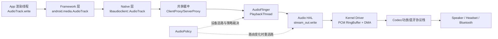

## 导读：边界与阅读路线

- 本文聚焦 `AudioTrack` 拿到 PCM 之后，到系统最终出声的链路。
- 上游解码（FFmpeg）与上层业务控制（AudioFocus/路由策略）仅做衔接，不重复展开。
- 阅读建议：按优先级建议阅读顺序：全景链路 -> write 行为 -> AudioFlinger/Mixer -> 分支路径 -> Policy/HAL -> 排障与观测 -> 时延分层（补充）。

## 一、全景链路：从 write 到出声

### 1.1 一张总图（主链路）



- 如果只记一条主线，可以记成：`write -> 共享缓冲 -> AudioFlinger 消费 -> HAL 写设备 -> DMA 出声`。
- 这条链路里有两条并行逻辑：**数据流**（PCM 往下走）和**控制流**（路由/策略往下发）。
- 数据流决定“有没有声音”，控制流决定“从哪里出来、走哪种输出路径”。

### 1.2 各层职责（工程视角）


| 层级               | 典型组件                                             | 核心职责                              | 工程速记                   |
| ---------------- | ------------------------------------------------ | --------------------------------- | ---------------------- |
| App 层            | 播放内核渲染线程                                         | 按节拍把 PCM 写入 `AudioTrack`，处理短写与错误码 | 负责“持续喂数据”，不直接驱动硬件      |
| Framework/Native | Java `AudioTrack` + `libaudioclient::AudioTrack` | 建链、参数校验、把数据写入共享缓冲                 | 是应用和系统音频服务的桥接层         |
| AudioFlinger     | `PlaybackThread` / `Track`                       | 按线程周期消费轨道，做混音/重采样/音量处理            | 是系统真正执行播放调度的核心         |
| AudioPolicy      | `AudioPolicyService/Manager`                     | 选择输出设备与输出 profile，处理路由变化          | 负责“选路与裁决”，不是搬运 PCM     |
| Audio HAL        | `audio_stream_out.write`                         | 把系统音频帧送到厂商驱动/设备链路                 | 是 Android 音频框架到硬件的标准接口 |
| Kernel/Device    | ALSA 驱动、DMA、Codec、蓝牙链路                           | 完成硬件搬运与电声转换，最终发声                  | 最后一公里，决定最终听感稳定性        |


- 记忆技巧：`App 喂数 -> Flinger 调度 -> Policy 选路 -> HAL 下发 -> Driver 出声`。
- 常见误区是把 `AudioPolicy` 当成“播放线程”；它主要做策略与设备选择，不负责逐帧混音。

### 1.3 关键认知

`write(...)` 返回 `> 0`，只表示“本次数据成功进入上游缓冲/链路”，不表示“此刻已经从喇叭放出”。

从时间线上看，至少还会经过这几段：


| 阶段     | 发生位置                          | 为什么会产生延后             |
| ------ | ----------------------------- | -------------------- |
| 写入成功   | App -> 共享缓冲                   | 只是进入待消费队列            |
| 线程调度等待 | AudioFlinger `PlaybackThread` | 要等到下一个 mix 周期才会消费    |
| 下游缓冲排队 | HAL/Driver Buffer             | 设备侧也有自己的 ring buffer |
| 物理输出   | Codec/蓝牙链路                    | 电声转换、蓝牙编码传输仍有开销      |


- 所以“进度在走但听感滞后”不一定是 bug，可能是正常的缓冲与调度结果。
- 真正需要警惕的是：**延后持续扩大**（例如 `writeCostMs` 持续上升、`written < requested` 高频出现）。
- 工程上可用这个心智模型：

```text
听到声音总延后 = App 写入排队 + Flinger 调度周期 + HAL/Driver 缓冲 + 设备输出链路耗时
```

- 本章结论：先把链路分层看清，再谈优化与排障，能避免 80% 的误判。

## 二、应用进程内：write(...) 后发生什么

### 2.1 参数一致性

在应用进程里，`AudioTrack` 能否稳定出声，第一前提是参数口径一致：`sampleRate/channel/encoding/bufferSize` 必须和写入 PCM 对齐。


| 参数           | 一致性要求                                 | 不一致时常见结果                | 建议                          |
| ------------ | ------------------------------------- | ----------------------- | --------------------------- |
| `sampleRate` | 与 PCM 采样率一致                           | 触发重采样，增加 CPU 开销，极端时听感异常 | 优先按源参数或设备主采样率（常见 `48000`）创建 |
| `channel`    | 与 PCM 声道数/布局一致                        | 下混/上混、声道错位、部分机型静音       | 明确使用 `MONO`/`STEREO`，避免隐式转换 |
| `encoding`   | 与 PCM 数据类型一致（`PCM_16BIT`/`PCM_FLOAT`） | 杂音、爆音或无声                | `AudioFormat` 与真实数据一一对应     |
| `bufferSize` | 不小于系统最小值                              | 过小易 underrun，过大增加时延     | 通常从 `2 x minBuffer` 起调      |


- 参数一致性决定“可播”，节拍和调度决定“稳播”。

### 2.2 write 语义

`write(...)` 的关键不是“调了一次”，而是“能否持续、稳定地喂给下游”。


| 模式                   | 行为               | 优点        | 风险       | 建议       |
| -------------------- | ---------------- | --------- | -------- | -------- |
| `WRITE_BLOCKING`     | 缓冲不足时等待可写        | 节拍更稳、逻辑简单 | 写线程可能长阻塞 | 常规音乐播放优先 |
| `WRITE_NON_BLOCKING` | 立即返回，可能短写或返回 `0` | 调度灵活、时延可控 | 需要补写重试   | 实时性要求高再用 |


| 返回值   | 含义           | 处理动作              |
| ----- | ------------ | ----------------- |
| `> 0` | 本次成功写入       | 累加 offset，继续写剩余数据 |
| `= 0` | 本次未写入（非阻塞常见） | 短暂等待后重试           |
| `< 0` | 错误码          | 记录日志并按错误类型恢复      |


短写补写的最小模型：

```text
while (remain > 0 && playing) {
  n = write(data, offset, remain, mode)
  if (n > 0) { offset += n; remain -= n; continue }
  if (n == 0) { sleep/retry; continue }
  handle_error(n); break
}
```

- 注意：`byte[]/short[]/float[]/ByteBuffer` 重载的单位不同，offset 累加必须按对应单位计算。


| `write` 重载                     | `offset/size` 单位 | 返回值单位       |
| ------------------------------ | ---------------- | ----------- |
| `write(byte[] ...)`            | 字节               | 字节          |
| `write(short[] ...)`           | `short` 采样点      | `short` 采样点 |
| `write(float[] ...)`           | `float` 采样点      | `float` 采样点 |
| `write(ByteBuffer, size, ...)` | 字节               | 字节          |


- 实践中最容易踩坑的是把 `short[]/float[]` 的长度按字节传入，导致短写判断和 offset 计算全部错位。

### 2.3 `ERROR_DEAD_OBJECT` 等异常恢复动作

`ERROR_DEAD_OBJECT` 是最关键的恢复信号之一，常见于路由切换、音频服务重建、底层句柄失效。


| 错误码                       | 常见原因                | 恢复动作                                 |
| ------------------------- | ------------------- | ------------------------------------ |
| `ERROR_BAD_VALUE`         | offset/size 越界、参数非法 | 校验入参并重试                              |
| `ERROR_INVALID_OPERATION` | 状态非法、对象未初始化         | 检查 `getState()/getPlayState()`，必要时重建 |
| `ERROR_DEAD_OBJECT`       | 底层对象失效              | 立即执行完整重建流程                           |


推荐恢复流程：

```text
stop -> flush -> release -> recreate AudioTrack -> restore volume/session/state -> play
```

- `ERROR_DEAD_OBJECT` 不建议在旧实例上无限重试；“快速重建”通常更稳。
- 重建后要补齐上下文（音量、会话、播放态、路由相关状态），否则容易出现“重建成功但听感异常”。

恢复后建议回放的上下文清单：

1. 音量状态（`setVolume` / 业务缓存值）。
2. 播放状态（是否应自动恢复播放）。
3. 会话与效果链（`sessionId` 与音效绑定关系）。
4. 关键观测值（重建次数、错误码、耗时）用于线上排障。

## 三、跨进程建链：AudioFlinger 接管流

### 3.1 建链过程

`AudioTrack` 的跨进程建链主要发生在创建阶段，不是在每次 `write(...)` 时反复走 Binder。


| 步骤  | 发生位置           | 关键动作                                           | 结果              |
| --- | -------------- | ---------------------------------------------- | --------------- |
| 1   | App 进程（Java）   | 创建 `AudioTrack`，准备 `format/attributes/buffer`  | 进入 native 初始化   |
| 2   | JNI/Native 客户端 | `native_setup` -> `libaudioclient::AudioTrack` | 准备向系统申请 Track   |
| 3   | Binder IPC     | 调用 `IAudioFlinger::createTrack`                | 把请求发送到音频服务进程    |
| 4   | AudioFlinger   | 创建服务侧 `Track`，挂到对应 `PlaybackThread`            | 轨道被纳入系统调度       |
| 5   | 跨进程共享内存        | 返回控制块与共享缓冲（`audio_track_cblk_t` / buffer）      | App 与服务侧可高效共享数据 |
| 6   | 控制阶段           | `play()` 激活 Track                              | 进入“可被周期消费”的状态   |


建链可以压成一行：

```text
new AudioTrack -> native_setup -> createTrack(Binder) -> 分配共享缓冲 -> 挂入 PlaybackThread -> play
```

- 重点是“创建期 Binder 建链 + 运行期共享缓冲”，这也是音频链路跨进程仍可低开销运行的关键。
- 运行期 `write(...)` 主要是写共享内存并推进读写指针，通常不会为每一包音频再走一次 Binder。

跨进程链路可以拆成两条通道：


| 通道   | 典型内容                         | 传输方式                          | 频率特征    |
| ---- | ---------------------------- | ----------------------------- | ------- |
| 数据通道 | PCM 帧数据                      | 共享缓冲（ClientProxy/ServerProxy） | 高频、持续   |
| 控制通道 | `play/pause/stop/flush`、状态同步 | Binder IPC                    | 低频、事件驱动 |


### 3.2 共享缓冲与消费节拍

稳定播放阶段，`write(...)` 的主要工作是把 PCM 写进共享缓冲，并更新读写指针；AudioFlinger 线程按固定节拍消费。


| 环节     | 生产端                   | 消费端                           | 节拍特征       | 结果        |
| ------ | --------------------- | ----------------------------- | ---------- | --------- |
| 写入共享缓冲 | App 渲染线程（ClientProxy） | -                             | 由业务写入节拍决定  | 写太快会顶满缓冲  |
| 系统周期消费 | -                     | `PlaybackThread`（ServerProxy） | 由 mix 周期驱动 | 不是“写完立刻播” |
| 下发设备   | `PlaybackThread`      | HAL/Driver                    | 设备侧也有缓冲周期  | 进一步增加可听延后 |


- 可以把它看成“生产者-消费者模型”：App 是生产者，AudioFlinger 是消费者。
- 当生产速度长期小于消费速度时，会出现 underrun；反过来生产过快，会出现写入阻塞或短写。
- 一个简单估算：

```text
bufferedMs = bufferedFrames * 1000 / sampleRate
```

- `bufferedMs` 过低容易抖动，过高会拉大听感时延，核心是保持稳定而不是一味压小。


| 现象   | 主要阶段    | 典型特征        | 优先排查                               |
| ---- | ------- | ----------- | ---------------------------------- |
| 首帧慢  | 建链/开流阶段 | 第一次播或重建后明显  | `createTrack`、路由初始化、首次缓冲填充         |
| 稳态卡顿 | 运行阶段    | 播放一段时间后出现抖动 | `fillCostMs/writeCostMs`、缓冲水位、线程调度 |


### 3.3 时延与阻塞来源

跨进程后最常见的问题不是“IPC 太慢”，而是“缓冲与调度失配”。


| 阻塞点            | 典型表现                         | 快速判断                             | 常用动作                                   |
| -------------- | ---------------------------- | -------------------------------- | -------------------------------------- |
| 建链阶段 Binder/开流 | 首帧慢、首次播放启动慢                  | 只在创建或重建时明显                       | 预创建/复用实例，减少频繁重建                        |
| 共享缓冲写满         | `writeCostMs` 升高，阻塞写明显       | `fillCostMs` 正常但 `writeCostMs` 高 | 调整 chunk 与 buffer，避免过激低延迟              |
| 线程调度竞争         | 耗时抖动、偶发卡顿                    | 前后台切换或高负载时更明显                    | 收敛渲染线程重操作，减少锁竞争                        |
| 路由切换/设备重配      | 写入异常、无声或 `ERROR_DEAD_OBJECT` | 耳机/蓝牙切换前后集中出现                    | `stop -> flush -> release -> recreate` |
| 下游设备链路拥塞       | 总延后持续扩大                      | route 变化时延显著波动                   | 路由稳定后重建并回放状态                           |


- 观测建议按顺序看：`fillCostMs -> writeCostMs -> requested/written -> playState/route`。
- 排查原则是先分层（App/共享缓冲/Flinger/HAL），再定动作，避免把“下游阻塞”误判成“上游没数据”。

`ERROR_DEAD_OBJECT` 的高频触发场景可单独记住：


| 场景      | 常见动作     | 结果           |
| ------- | -------- | ------------ |
| 蓝牙断连/重连 | 输出设备重配   | 旧 Track 句柄失效 |
| 耳机插拔    | route 切换 | 写入返回异常       |
| 音频服务重启  | 服务端对象重建  | 客户端持有句柄失效    |


- 这类异常的通用策略是快速重建而不是旧实例重试：`stop -> flush -> release -> recreate`。

### 3.4 AudioFlinger 速览（对象模型 + 线程家族）

前面讲了“怎么建链、怎么共享缓冲”。这一小节把 AudioFlinger 相关概念收拢一下，后面第 4/5/7 节就只引用它，不再重复解释。

#### 3.4.1 对象模型（你需要认识的几个名词）

| 名词 | 所在侧 | 作用（直观解释） | 典型源码位置 |
| --- | --- | --- | --- |
| `AudioFlinger` | 服务端（`audioserver`） | 系统音频服务核心，负责创建 Track、管理输出线程 | `frameworks/av/services/audioflinger/AudioFlinger.cpp` |
| `PlaybackThread` | 服务端 | 播放线程基类，按周期消费 Track 并把数据写到 HAL | `frameworks/av/services/audioflinger/Threads.h` |
| `Track` | 服务端 | “服务端的音频轨道对象”，代表一条正在播放的流 | `frameworks/av/services/audioflinger/Tracks.h` |
| `AudioMixer` | 服务端 | 多轨混音引擎，把多路 PCM 混到同一份输出 buffer | `frameworks/av/media/libaudioprocessing/AudioMixer.cpp` |
| `FastMixer` | 服务端 | Fast 相关高优先级调度/混音线程（用于低时延） | `frameworks/av/services/audioflinger/FastMixer.cpp` |

一句话把“App 写入”和“系统播放”边界说清：

```text
App 侧 AudioTrack.write -> 写共享缓冲；AudioFlinger 的 PlaybackThread -> 按周期读共享缓冲 -> 处理后写入 HAL
```

#### 3.4.2 线程家族（最终会落到哪种 Thread）

AudioFlinger 侧常见的输出线程类型（只列和本文相关的）：

| Thread 类型 | 核心特点 | 典型场景 | 典型源码位置 |
| --- | --- | --- | --- |
| `MixerThread` | 通用混音主路径，多 Track 混音、兼容性最强 | 普通媒体播放 | `frameworks/av/services/audioflinger/Threads.cpp` |
| `DirectOutputThread` | “直出”输出线程，尽量减少通用混音链路干预 | Direct 输出（受设备 profile/flags 限制） | `frameworks/av/services/audioflinger/Threads.cpp` |
| `OffloadThread` | 压缩 offload 播放线程，强调省电与硬件协作 | 后台长时音乐播放（硬件支持时） | `frameworks/av/services/audioflinger/Threads.cpp` |

要点：Fast 不是简单的“换一种 PlaybackThread 子类”，它通常是 `MixerThread` 与 `FastMixer` 协作实现低时延。

#### 3.4.3 一条流的最短执行主线（便于跟源码）

```text
AudioFlinger::createTrack
  -> Track attach to PlaybackThread
  -> PlaybackThread::threadLoop (周期驱动)
     -> MixerThread: AudioMixer.process -> write to HAL
     -> Direct/Offload: direct write to HAL (各自线程逻辑不同)
```

如果只记一个观测结论：`dumpsys media.audio_flinger` 里看到的线程类型，基本就对应了这条流最终走的是哪条路径。

## 四、主路径细节：MixerThread

### 4.1 为什么它是主路径

`MixerThread` 是 AudioFlinger 的默认主路径，核心原因不是“最快”，而是“最稳、最兼容”。

| 选择维度 | MixerThread 的表现 | 工程意义 |
| --- | --- | --- |
| 多流并发 | 原生支持把多路 Track 混到同一路输出 | 音乐 + 提示音 + 系统音可共存 |
| 格式兼容 | 可做重采样、声道重排、音量处理 | 上游格式不统一时也能稳定出声 |
| 路由适配 | 设备切换时可在统一线程模型下恢复 | 耳机/蓝牙切换更容易兜底 |
| 音效链支持 | 便于挂接系统音效/后处理链路 | 功能完整，业务改造成本低 |
| 回退能力 | Fast/Direct/Offload 条件不满足时回落到它 | 保证“先可播，再优化” |

- 对通用媒体播放而言，系统通常优先保证可用性和稳定性，因此 Mixer 路径覆盖面最大。
- 如果你没有显式满足其他路径的门槛，最终大概率都会落到 MixerThread。

核心优势速记（可直接用于设计评审）：

1. 多流兼容：一条主链路承载多路声音并发，业务组合能力强。
2. 路由稳定：耳机/蓝牙切换后更容易恢复，不易出现长时间无声。
3. 回退兜底：Fast/Direct/Offload 条件失配时可平滑回到 Mixer，优先保证可播。

### 4.2 Mixer 在做什么

MixerThread 的工作可以理解为“按周期把所有活跃轨道处理后，合成一帧设备可消费的数据”。

典型周期流程：

```text
collect active tracks
  -> per-track format adapt (resample/remap)
  -> per-track volume/effect/ramp
  -> mix into sink buffer
  -> write to HAL
```

| 阶段 | 关键动作 | 对体验的影响 |
| --- | --- | --- |
| 轨道收集 | 获取当前可播放的 active tracks | 直接决定是否有声、是否会丢轨 |
| 格式适配 | 重采样、声道映射、样本格式统一 | 影响 CPU 开销与音质一致性 |
| 增益处理 | Track 音量、淡入淡出、静音策略 | 影响听感平滑度与爆音风险 |
| 混音合成 | 把多路 PCM 合并到输出缓冲 | 轨道越多、计算越重 |
| 下发设备 | 调用 HAL `write` 输出 | 决定本周期是否准时出帧 |

- 这也是为什么“写入线程很快”仍可能卡顿：瓶颈可能在 Mixer 周期处理或下游 `write`。
- 工程里应把 `fillCostMs` 和 `writeCostMs` 分开看，避免把混音/下游阻塞误判成上游供数慢。

### 4.3 体验特征

Mixer 路径的体验特征可以概括为：稳定和兼容优先，时延不是最低。

| 维度 | Mixer 路径特征 | 说明 |
| --- | --- | --- |
| 稳定性 | 高 | 多数机型、多数路由场景都能持续播放 |
| 兼容性 | 高 | 对格式差异和多流并发容忍度高 |
| 时延 | 中等 | 通常高于 Fast 路径，但波动更可控 |
| 功耗 | 中等偏高 | 由 AP 参与混音计算，轨道越多开销越高 |
| 复杂度 | 可控 | 统一主路径便于治理与排障 |

常见边界与建议：

1. 如果目标是极低时延，优先评估 Fast 路径；Mixer 不应硬扛实时场景。
2. 如果目标是复杂播放能力（多流、音效、稳定切路由），Mixer 往往是更稳妥选择。
3. 当出现“偶发卡顿但非持续”时，先查线程调度和缓冲水位，再考虑是否切路径。

- 本节结论：MixerThread 不是性能极限路径，但它是通用播放器最可靠的基线能力。

### 4.4 MixerThread 源码定位（只看主线程）

如果这一节只聚焦 `MixerThread`，建议先看这 4 个源码入口：

| 类型 | 路径/类 | 重点关注 |
| --- | --- | --- |
| 线程定义 | `frameworks/av/services/audioflinger/Threads.h` -> `AudioFlinger::MixerThread` | 类关系、成员缓冲、线程职责 |
| 线程实现 | `frameworks/av/services/audioflinger/Threads.cpp` | `threadLoop`、`prepareTracks_l`、`write` 下发 |
| 混音引擎 | `frameworks/av/media/libaudioprocessing/AudioMixer.cpp` | 多轨混音、增益计算、采样格式处理 |
| 轨道定义 | `frameworks/av/services/audioflinger/Tracks.h` | Track 生命周期、状态机与读写协作 |

可以按这条主线跟代码：

```text
MixerThread::threadLoop
  -> prepareTracks_l (收集 active tracks)
  -> AudioMixer.process (混音到 sink buffer)
  -> write() to HAL
```

运行时验证建议优先看：

- `adb shell dumpsys media.audio_flinger`：确认 `MixerThread`、active tracks、线程负载和 write 行为。

## 五、分支路径：Fast / Direct / Offload

先把概念讲直白：这不是三种“播放状态”，而是系统可能给同一条音频流选择的三种“出声通道”。

- `Fast`：目标是更快出声（低时延）。
- `Direct`：目标是少做中间处理（尽量直出）。
- `Offload`：目标是更省电（把更多处理交给 DSP/硬件）。

### 5.1 Fast 路径（你最关心“延迟”时）

当你希望“点播放后更快听到声音”、或做实时互动场景时，会优先尝试 Fast。

| 你会看到的特征 | 说明 |
| --- | --- |
| 起播和交互响应更快 | 调度周期更激进 |
| 对参数要求严格 | 采样率/声道/格式越贴近设备越容易命中 |
| 容易掉回普通路径 | 条件不满足时自动回到 Mixer |

常见请求方式：

```java
new AudioTrack.Builder()
    .setAudioAttributes(attributes)
    .setAudioFormat(format)
    .setPerformanceMode(AudioTrack.PERFORMANCE_MODE_LOW_LATENCY)
    .build();
```

- 关键认知：Fast 是“尽量低时延”，不是“强制低时延”。

### 5.1.1 Fast：Thread/flags 与源码入口

| 关注点 | 对应 Thread/对象 | 典型源码位置 | 说明 |
| --- | --- | --- | --- |
| 输出线程基类 | `PlaybackThread` | `frameworks/av/services/audioflinger/Threads.cpp` | 最终都要落到某种 PlaybackThread |
| fast 相关线程 | `FastMixer` | `frameworks/av/services/audioflinger/FastMixer.cpp` | 高优先级调度，主打低时延 |
| Track 侧 fast 能力 | fast track（概念） | `frameworks/av/services/audioflinger/Tracks.h` | 是否能作为 fast track 由条件决定 |

配置项如何区分 Fast：

| 层级 | 关键项 | 作用 |
| --- | --- | --- |
| App 请求 | `PERFORMANCE_MODE_LOW_LATENCY` | 在 framework 侧映射为 `AudioAttributes.FLAG_LOW_LATENCY`，向策略层表达“低时延意图” |
| Policy 结果 | `output flags`（含 `FAST` 语义） | 只有策略/硬件允许时，才会给到可用于 fast 的输出 |
| 设备配置 | `/vendor/etc/audio_policy_configuration.xml` 的 `mixPort flags` | 设备侧声明是否存在支持低时延/fast 的输出 profile |

在 framework 侧，`setPerformanceMode(LOW_LATENCY)` 最终会改变 attributes flags（来自 `AudioTrack.Builder.build()` 的逻辑，伪代码）：

```text
if (performanceMode == LOW_LATENCY) {
  attributes.flags |= FLAG_LOW_LATENCY
  attributes.flags &= ~FLAG_DEEP_BUFFER
}
```

fast 的“简单实现”可以这样理解（伪代码）：

```text
if (output supports FAST) {
  create/enable FastMixer thread
  route eligible track(s) as fast track
} else {
  fall back to normal MixerThread
}
```

### 5.2 Direct 路径（你最关心“少处理”时）

当你希望数据尽量不经过框架侧混音、重采样、下混等处理时，会关注 Direct。

| 你会看到的特征 | 说明 |
| --- | --- |
| 中间处理更少 | 更接近“原样输出” |
| 多流并发能力变弱 | 常见限制是并发混音和某些音效能力 |
| 是否命中很看设备 | 依赖 policy 配置和硬件支持 |

可用性查询：

- API 29~32：`AudioTrack.isDirectPlaybackSupported(...)`（已废弃）。
- API 33+：`AudioManager.getDirectPlaybackSupport(...)`（返回位标记）。

- 关键认知：查询返回“支持”只代表能力存在，不保证当前这次一定走 Direct。

### 5.2.1 Direct：Thread/flags 与源码入口

| 关注点 | 对应 Thread/对象 | 典型源码位置 | 说明 |
| --- | --- | --- | --- |
| direct 输出线程 | `DirectOutputThread` | `frameworks/av/services/audioflinger/Threads.cpp` | 直出线程，通常不走通用 AudioMixer |
| 线程选择入口 | `AudioFlinger` openOutput/create thread | `frameworks/av/services/audioflinger/AudioFlinger.cpp` | 根据 output flags 创建对应 Thread |

配置项如何区分 Direct：

| 层级 | 关键项 | 作用 |
| --- | --- | --- |
| Policy 结果 | `AUDIO_OUTPUT_FLAG_DIRECT` | 典型直出标志，命中后 AudioFlinger 更可能创建 Direct 线程 |
| 设备配置 | `mixPort/profile` 的 format/rate/channels | Direct 更依赖“完全匹配”的 profile 能力 |

Direct 的“简单实现”可以这样理解（伪代码）：

```text
if (outputFlags has DIRECT) {
  thread = new DirectOutputThread(...)
  // 单路或少路 track 直出到 HAL
} else {
  thread = new MixerThread(...)
}
```

### 5.3 Offload 路径（你最关心“省电”时）

当你是“长时间后台听歌”这种场景，Offload 通常最有价值，因为 AP 可以更省电。

| 你会看到的特征 | 说明 |
| --- | --- |
| 功耗更低 | 处理更多下沉到 DSP/专用硬件 |
| 格式与路由限制更多 | 不是所有编码/设备都支持 |
| 路由变化时容易退出 | 蓝牙切换时常回退到 Mixer |

典型请求方式：

```java
new AudioTrack.Builder()
    .setAudioAttributes(attributes)
    .setAudioFormat(format)
    .setOffloadedPlayback(true)
    .build();
```

使用前通常先判断：`AudioManager.isOffloadedPlaybackSupported(...)`。

### 5.3.1 Offload：Thread/flags 与源码入口

| 关注点 | 对应 Thread/对象 | 典型源码位置 | 说明 |
| --- | --- | --- | --- |
| offload 输出线程 | `OffloadThread` | `frameworks/av/services/audioflinger/Threads.cpp` | 压缩 offload 播放线程，常与 DSP/硬件协作 |
| offload 事件/状态 | offload 回调与状态机（概念） | `frameworks/av/services/audioflinger/Threads.cpp` | buffer/teardown 等事件驱动行为更明显 |

配置项如何区分 Offload：

| 层级 | 关键项 | 作用 |
| --- | --- | --- |
| App 请求 | `setOffloadedPlayback(true)` | 强请求 offload；不满足条件通常创建就失败或后续回退 |
| Policy 结果 | `AUDIO_OUTPUT_FLAG_COMPRESS_OFFLOAD` | 命中后通常创建 OffloadThread（部分实现也会同时具备 DIRECT 语义） |
| 设备配置 | `mixPort flags` + 支持的压缩格式 profile | 决定 offload 能力范围（哪些编码可下沉） |

Offload 在 framework 侧的一个关键“门槛检查”点（来自 `AudioTrack.Builder.build()` 的逻辑，伪代码）：

```text
if (offloadRequested) {
  if (performanceMode == LOW_LATENCY) throw
  if (!direct/offload supported for this format+attributes) throw
}
```

### 5.4 系统如何选择与回退（最重要）

你可以请求路径，但最终由系统决定：AudioPolicy 先选路，AudioFlinger 再落线程，运行中还会动态变化。

| 你的请求 | 系统会综合判断 | 可能结果 |
| --- | --- | --- |
| 请求 Fast | 参数是否匹配、当前并发、资源是否充足 | Fast 或回退 Mixer |
| 请求 Direct | 设备 profile、当前路由、直出资源可用性 | Direct 或回退 Mixer |
| 请求 Offload | 编码支持、路由状态、硬件能力、策略限制 | Offload 或回退 Mixer |

### 5.4.1 output flags 如何决定 Thread

线程选择的核心逻辑可以压缩成一句话：**AudioPolicy 产出 output flags，AudioFlinger 用 flags 决定创建哪类 Thread。**

| output flags（示意） | 对应 Thread（示意） | 源码定位 |
| --- | --- | --- |
| `COMPRESS_OFFLOAD` | `OffloadThread` | `frameworks/av/services/audioflinger/Threads.cpp` |
| `DIRECT` | `DirectOutputThread` | `frameworks/av/services/audioflinger/Threads.cpp` |
| `FAST` | `FastMixer`（配合 PlaybackThread） | `frameworks/av/services/audioflinger/FastMixer.cpp` |
| 其他/默认 | `MixerThread` | `frameworks/av/services/audioflinger/Threads.cpp` |

可以把它记成：

```text
请求 -> 系统裁决 -> 实际线程 -> 运行期持续检查 -> 条件变化则回退
```

- 对单个 `AudioTrack` 来说，同一时刻只会落到一条实际输出路径。
- “回退”是正常系统行为，不等于播放失败。

### 5.5 按场景快速选

| 业务场景 | 首选请求 | 主要目标 | 不命中时兜底 |
| --- | --- | --- | --- |
| 实时互动、音效响应 | Fast | 低时延 | 回到 Mixer，优先保稳定 |
| 高保真/直通输出 | Direct | 少中间处理 | 回到 Mixer，接受系统处理 |
| 后台长时音乐播放 | Offload | 省电 | 回到 Mixer，继续可播 |
| 普通音乐播放 | Mixer（默认） | 兼容+稳定 | 保持主路径 |

运行时定位建议：

1. `adb shell dumpsys media.audio_flinger`：看当前实际线程（Mixer/Direct/Offload）。
2. `adb shell dumpsys media.audio_policy`：看路由、flags 和策略变化。
3. 业务日志记录“请求路径 + 实际路径 + 回退原因”。

### 5.6 源码入口（速查）

| 关注点 | 路径/类 |
| --- | --- |
| 请求入口 | `frameworks/base/media/java/android/media/AudioTrack.java`（`setPerformanceMode`、`setOffloadedPlayback`） |
| 能力查询 | `frameworks/base/media/java/android/media/AudioManager.java`（`getDirectPlaybackSupport`、`isOffloadedPlaybackSupported`） |
| 策略裁决 | `frameworks/av/services/audiopolicy/managerdefault/AudioPolicyManager.cpp` |
| 线程落点 | `frameworks/av/services/audioflinger/Threads.cpp`（`MixerThread/DirectOutputThread/OffloadThread`） |
| 配置来源 | `/vendor/etc/audio_policy_configuration.xml` |

## 六、策略层：AudioPolicy 选路与重选路

### 6.1 AudioPolicy 的职责

先说直白一点：`AudioPolicy` 不负责“搬 PCM”，它负责“决定这路声音该走哪条路、从哪个设备出”。

更具体地说，它通常同时在“选两件事”：

1. 选**输出设备**：声音是从 `speaker/headset/A2DP/SCO` 哪个设备出。
2. 选**输出能力模型**：匹配哪个 output profile（`mixPort/profile`）以及输出 flags（例如 `LOW_LATENCY/DEEP_BUFFER/DIRECT/OFFLOAD`），从而影响最终落到的线程类型（Mixer/Direct/Offload 等）。

| 输入信息 | AudioPolicy 做的决策 | 直接影响 |
| --- | --- | --- |
| `AudioAttributes`（usage/content） | 选策略分支（媒体/通话/提示音等） | 优先走哪类设备与输出策略 |
| `AudioFormat`（采样率/声道/编码） | 匹配 output profile | 能否命中 Fast/Direct/Offload |
| 当前已连接设备 | 选具体输出设备（speaker/headset/A2DP） | 实际从哪里出声 |
| 系统模式与并发状态 | 调整路由与优先级 | 是否需要重选路或回退 |
| `audio_policy_configuration.xml` | 提供可用 mixPort/devicePort/route/flags | 设备侧真实能力边界 |

可以把策略层理解成一个“调度中枢”：

```text
App 请求播放
  -> AudioPolicyManager 匹配 profile + route + flags
  -> AudioFlinger 按结果分配输出线程
  -> 运行中设备变化时由 AudioPolicy 触发重选路
```

- 关键认知：你在 App 里设置的是“意图”，`AudioPolicy` 给出的是“当前时刻可落地方案”。

### 6.2 决策链：从请求到输出线程

这一小节只聚焦“策略如何决定 output/profile/flags”，不重复展开第 3 节的跨进程建链细节。

决策链本质是在回答一个问题：**给定 `AudioAttributes/AudioFormat`，系统要把声音路由到哪个设备，并用什么输出能力模型承接它？**

把关键节点串起来可以写成：

```text
AudioAttributes/AudioFormat
  -> 策略归类（strategy/product strategy）
  -> 候选输出设备集合（connected devices + policy rules）
  -> 匹配输出 profile（mixPort/profile: format/rate/channels）
  -> 决定 output flags（low latency / deep buffer / direct / offload ...）
  -> openOutput（打开对应输出）
  -> AudioFlinger 创建对应线程（MixerThread / DirectOutputThread / OffloadThread ...）
```

注意这条链路的输出不是“一个 bool”，而是一组结果：

- `output handle`：后续 `createTrack` 要绑定到哪个 output。
- `selected device`：最终从哪个设备出声。
- `output profile`：`mixPort/profile` 匹配到的能力模型（支持的 format/rate/channels）。
- `output flags`：决定 low latency / deep buffer / direct / offload 等行为。

源码执行主线（典型路径，不同版本会有命名差异）：

```text
AudioTrack (frameworks/base)
  -> native_setup / libaudioclient::AudioTrack (frameworks/av)
    -> AudioSystem::getOutputForAttr (frameworks/av)
      -> AudioPolicyService::getOutputForAttr (frameworks/av)
        -> AudioPolicyManager::getOutputForAttr (frameworks/av)
          -> choose devices/profile/flags
          -> openOutput (if needed)
    -> IAudioFlinger::createTrack (frameworks/av)
      -> AudioFlinger::createTrack
        -> PlaybackThread attach (MixerThread/DirectOutputThread/OffloadThread)
```

源码入口（按排查顺序）：

1. `frameworks/av/services/audiopolicy/service/AudioPolicyService.cpp`：`getOutputForAttr` 的服务侧入口。
2. `frameworks/av/services/audiopolicy/managerdefault/AudioPolicyManager.cpp`：profile 匹配、设备选择、flags 决策的核心。
3. `frameworks/av/services/audioflinger/AudioFlinger.cpp`：`createTrack` 与 output/thread 绑定。
4. `frameworks/av/services/audioflinger/Threads.cpp`：线程类型落点（Mixer/Direct/Offload）。

如果要定位“为什么没命中某条路径”，优先看两件事：

1. policy 最终给了什么 `output flags`（决定大方向）。
2. AudioFlinger 最终建了什么线程（决定实际落地）。

### 6.3 路由切换

路由切换是策略层最常见的动态行为，典型触发包括耳机插拔、蓝牙断连重连、系统面板切设备。

| 场景 | AudioPolicy 常见动作 | 结果表现 |
| --- | --- | --- |
| 有线耳机拔出 | 从 headset route 切回 speaker route | 可能短暂静音，随后恢复外放 |
| 蓝牙 A2DP 断连 | 重新匹配本地输出设备与 profile | 线程/路径可能切换，偶发回退 Mixer |
| 蓝牙 A2DP 重连 | 再次匹配蓝牙输出能力 | 可能重新打开输出，旧 track 句柄失效 |
| 用户手动切设备 | 强制重选 route | 当前播放链路重新绑定输出 |

为什么有时会“看起来在播但没声”？

1. 路由刚切换，链路处于短暂重配置窗口。
2. 旧输出句柄失效，`AudioTrack` 还在向旧对象写入。
3. 新设备能力与原路径不匹配，系统发生回退但上层状态没及时同步。

工程处理建议：

- 把路由变化当作“正常事件”，不是异常本身。
- 路由变化后优先观察 `playState + route + write 返回值`。
- 发现 `ERROR_DEAD_OBJECT` 时直接重建：`stop -> flush -> release -> recreate`。

### 6.3.1 打断与恢复（AudioFocus/通话/通知）

“路由切换”经常和“播放打断”同时发生：例如来电/通话、系统语音交互、导航语音等场景，会触发 AudioFocus 变化、系统模式变化（`MODE_IN_CALL/MODE_IN_COMMUNICATION`）以及输出设备重配。

推荐把策略收敛成两件事：

1. **先响应打断**（暂停/duck/停止），避免在通话链路里继续硬播导致音质变差。
2. **再做恢复**（必要时重建），避免焦点恢复但输出仍绑定旧 output。

一个最小可用的 AudioFocus 策略表：

| 回调事件 | 建议动作 | 说明 |
| --- | --- | --- |
| `AUDIOFOCUS_LOSS` | `pause/stop` + 记录用户意图 | 长时抢占，通常不应自动继续 |
| `AUDIOFOCUS_LOSS_TRANSIENT` | `pause` | 来电/短时打断，等待恢复 |
| `AUDIOFOCUS_LOSS_TRANSIENT_CAN_DUCK` | `duck`（降低音量） | 导航/提示音常见，避免完全打断 |
| `AUDIOFOCUS_GAIN` | 恢复音量；按“用户意图”恢复播放 | 不要无条件自动播（要区分用户手动暂停） |

恢复阶段的一个经验做法：

- `AUDIOFOCUS_GAIN` 到来后延迟 500~1500ms 再检查 routed device（路由回切可能有窗口期）。
- 如果 `write` 返回 `ERROR_DEAD_OBJECT` 或 routed device 明显不符合预期，优先重建 AudioTrack 触发重选路。

### 6.3.2 一个常见特殊 case：通话结束后仍卡在 SCO（音质变差）

- 现象：来电/通话结束后音乐继续播放，但输出仍是 `Bluetooth SCO`（听感发闷、带宽低），且不会自动恢复到 A2DP。
- 常见原因：
  1. 系统通信模式未恢复（`MODE_IN_COMMUNICATION` 未回到 `MODE_NORMAL`），或仍有其他会话占用通信路由。
  2. 播放流仍绑定旧 output，未触发重新选路/重建。
- 处理建议（尽量简单且稳定）：
  1. 以 `AUDIOFOCUS_GAIN` / 设备回调作为“通话结束恢复点”，延迟 500~1500ms 等路由稳定。
  2. 播放中用 `AudioTrack.getRoutedDevice()` 判断是否仍是 `TYPE_BLUETOOTH_SCO`。
  3. 若仍为 SCO，直接重建 AudioTrack 触发重新选路：`stop -> flush -> release -> recreate -> play`。

### 6.4 请求与裁决

这一节最重要的是边界清晰：**代码负责请求，系统负责裁决，运行时可能改判**。

| 维度 | App 可控制 | 系统最终决定 |
| --- | --- | --- |
| 播放意图 | `AudioAttributes`、`AudioFormat`、`performanceMode/offload` 请求 | 是否接受该请求 |
| 输出路径 | 只能提高命中概率 | 实际线程是 Mixer/Fast/Direct/Offload |
| 输出设备 | 可表达偏好或触发切换 | 结合设备可用性和策略做最终选路 |
| 运行期变化 | 监听并恢复状态 | 资源变化时回退/重路由 |

建议把实现做成三段式：

```text
1) 请求：按场景设置 attributes/format/flag
2) 观测：读取实际路径与实际路由（dumpsys + 日志）
3) 兜底：接受回退并保持可播
```

- 真正稳定的实现不是“强制命中某路径”，而是“命中则用，不命中也稳”。

## 七、HAL 到硬件：最后一公里

### 7.1 HAL 输出

从框架视角看，`AudioFlinger` 负责把“这一周期需要播放的 PCM 帧”算出来；但真正把数据送到硬件、最终能否按节拍稳定出声，取决于 HAL 与驱动。

HAL 是 Android framework 与厂商实现的分界线：

- HAL 之上（framework）是 AOSP 统一逻辑：线程调度、混音/重采样、策略选路。
- HAL 之下（vendor）是设备相关逻辑：DSP、codec、功放、蓝牙、USB、以及驱动对接。

在实现形式上，Android 历史上有 legacy C HAL（`audio_stream_out.write`），也有 HIDL/AIDL 版本；但对上层而言都可以理解成同一件事：**把一段音频帧写入输出流**。

| HAL 输出流的典型能力 | 你会在上层感知到什么 |
| --- | --- |
| `open_output_stream` / `close_output_stream` | 路由切换时的重建、首帧慢 |
| `set_parameters`（路由/模式/设备参数） | 切设备、切模式引起的短暂静音或回退 |
| `write`（把帧送到设备） | `writeCostMs`、阻塞/短写、是否 underrun |
| `get_latency` / buffer 配置 | 听感延后、视频音画同步能力 |
| `standby` / power 管理 | 后台省电、恢复播放的启动开销 |

把调用链压成一行就是：

```text
PlaybackThread (Mixer/Direct/Offload) -> output.write(...) -> HAL stream_out.write(...) -> driver
```

一个非常关键的工程点：

- `out_write` 可能阻塞（设备侧 buffer 满或链路拥塞时），这会在上层表现为写入耗时升高。
- 对 Offload/Bitstream 这类直出场景，`write` 的 payload 可能不是普通 PCM（取决于具体实现），但“写入输出流 + 下游缓冲/节拍”这个模型仍然成立。

### 7.2 内核与 DMA

在大多数手机上，HAL 最终会落到内核音频驱动（常见是 ALSA PCM，或等价的厂商驱动）。它的核心结构可以理解为一个 ring buffer：

- 写入方：HAL（或 DSP 代理）持续把音频帧写进 ring buffer。
- 消费方：硬件 DMA 按固定节拍从 ring buffer 读走数据，送到 I2S/TDM，再到 codec。

一个简化示意：

```text
|<---------------- kernel pcm ring buffer ---------------->|
      appl_ptr (write) ---> ............ ---> (read) hw_ptr
```

| 概念 | 含义 | 直接影响 |
| --- | --- | --- |
| `period` | 一次 DMA 搬运/中断的基本单位 | 抖动、回调频率、CPU/IRQ 压力 |
| `buffer` | 多个 period 组成的总缓冲 | 端到端时延、是否易 underrun |
| `hw_ptr` | 硬件当前读到的位置 | 真正的“播放进度” |
| `appl_ptr` | 软件写到的位置 | 写入阻塞与短写 |

用一个常见估算把“设备侧缓冲时延”落到数字上：

```text
deviceBufferMs ≈ bufferFrames * 1000 / sampleRate
bufferFrames ≈ periodSizeFrames * periodCount
```

为什么会发生卡顿/爆音（underrun）？

- DMA 消费速度固定，如果 `appl_ptr` 推进不够快，`hw_ptr` 追上来就会 underrun。
- 相反如果写得过快导致 buffer 满，`write` 就会阻塞（上层看到 `writeCostMs` 变大）。

所以在“最后一公里”里，稳定性往往取决于：**period/buffer 配置 + 写入节拍是否稳定 + 下游链路是否拥塞**。

### 7.3 输出设备差异

同样是 `AudioTrack` 播放，最终的“出声链路”会因输出设备不同而差别很大：

| 输出设备 | 典型链路 | 时延/音质特征 | 工程注意点 |
| --- | --- | --- | --- |
| 扬声器/有线耳机 | PCM -> driver/DMA -> codec/amp -> 发声 | 时延较低、稳定性高 | 最常见基线链路，适合做问题对照 |
| 蓝牙 A2DP | PCM ->（编码/封包）-> 蓝牙传输 -> 设备解码发声 | 时延更高、波动更大 | 路由切换频繁，常伴随重建与回退 |
| 蓝牙 SCO（HFP） | 语音链路（带宽窄） | 音质明显下降 | 通话/语音场景常见；媒体播放不应长期停留在 SCO |
| USB/HDMI（外设） | PCM -> USB/HDMI 输出 | 能力差异大（可能支持高规格） | 依赖外设能力与系统 profile 匹配 |

经验结论：

1. 发现“音质/时延突然变化”，先看 routed device 是否变化（A2DP <-> SCO 是高频根因）。
2. 蓝牙链路比本地 codec 更容易触发重选路、回退与 `ERROR_DEAD_OBJECT`，播放器要把重建当成常态。
3. 调优一定要区分输出设备：对 speaker 优化的 buffer 配置不一定适合蓝牙。

### 7.4 数据单位与口径（bytes / samples / frames）

音频链路里最容易“看懂了但算错”的点，就是单位混用。建议统一用 `frames` 做口径：

- `sample`：单个采样点（每声道一个值）。
- `frame`：同一时间点的所有声道采样点的集合。
- `bytes`：实际内存/IO 传输大小。

把它们串起来只需要两个公式：

```text
frameBytes = channelCount * bytesPerSample
frames = bytes / frameBytes
```

再把它换算成时间：

```text
ms = frames * 1000 / sampleRate
```

举个最常见的例子（48kHz / stereo / PCM_16BIT）：

```text
bytesPerSample = 2
frameBytes = 2(ch) * 2 = 4 bytes
20ms 对应 frames = 48000 * 0.02 = 960 frames
20ms 对应 bytes = 960 * 4 = 3840 bytes
```

为什么这和第 7.2 的 `hw_ptr/appl_ptr` 有关？

- driver/HAL 往往用“frames 的推进”表达播放进度（接近 `hw_ptr` 的语义）。
- App/网络层通常统计“bytes 的写入量”，但 bytes 必须换算到 frames 才能对齐“真实播放进度”。

实践建议：

1. 线上埋点尽量同时记录 `writtenBytes` 和换算后的 `writtenFrames`（以及 sampleRate/channel/encoding）。
2. 计算时延时优先用 `frames`，避免不同编码/声道下换算错位。

### 7.5 payload 差异（PCM / Offload / Bitstream）

虽然上层都叫 `write(...)`，但写下去的 payload 可能完全不是一回事，这直接影响“能否混音/调音量/时延/功耗”。

| 场景/路径 | 写入到输出流的 payload（常见） | 框架侧能做的处理 | 典型影响 |
| --- | --- | --- | --- |
| Mixer/Fast | PCM（如 16bit/float） | 混音、音量、重采样、部分音效 | 兼容性强，但 AP 计算多 |
| Direct（PCM） | 高规格 PCM（需 profile 完全匹配） | 处理受限（通常不走通用混音链） | 更接近“原样输出”，并发能力弱 |
| Offload | 压缩码流（AAC/MP3/FLAC 等，取决于硬件） | 处理受限（解码/渲染下沉） | 更省电，但路由/格式约束多 |
| Bitstream passthrough | 封装后的比特流（常见 IEC61937 之类封装） | 基本不做音量/混音等修改 | 依赖外设解码，时延与能力看外设 |

这也是为什么：

- 同样是“播放一首歌”，走 Offload/Bitstream 时系统可能无法像 Mixer 那样自由混音或做音量缩放。
- 切路由/并发变化时，Direct/Offload 更容易触发回退到 Mixer（先保可播）。

## 八、排障实战：从症状到动作

### 8.1 进度在走但无声

这个现象的特点是：上层 UI 的“时间在走”，但耳朵听不到声音。

要避免第一时间陷入“是不是没解码/没写入”的误区，建议按下面顺序排查（从最常见、成本最低的点开始）：

| 排查顺序 | 看什么 | 典型结论 | 下一步动作 |
| --- | --- | --- | --- |
| 1. 路由（route） | 当前 routed device（speaker/A2DP/SCO/有线）是否符合预期 | 走到了错误设备或卡在 SCO | 先等路由稳定；必要时重建 AudioTrack 触发重选路 |
| 2. 状态（state） | `AudioTrack.getState/getPlayState` 是否正常 | track 未初始化/未 play | 先修正状态机（play/重建） |
| 3. 参数（format） | sampleRate/channel/encoding 是否与 PCM 一致 | 参数不匹配导致处理异常/静音 | 统一 format，避免隐式转换（见第 2.1） |
| 4. 写入（write） | `write` 是否持续 `>0`，是否出现错误码/短写 | 写入失败或写入到旧句柄 | 记录错误码；`ERROR_DEAD_OBJECT` 走重建 |
| 5. 会话（policy/focus） | AudioFocus、通话模式、是否被 duck/mute | 焦点丢失或模式未恢复 | 按第 6.3.1 打断与恢复策略处理 |

一个快速“定位闭环”（建议落到日志/埋点）：

```text
route + trackState + requested/written + writeCostMs + (errorCode)
```

常见根因与特征（不要求一次性全排，但要能对号入座）：

| 根因 | 你通常会看到的特征 | 常用动作 |
| --- | --- | --- |
| 路由不符合预期（例如 A2DP <-> SCO） | 音质/延迟突变，或完全无声 | 延迟 500~1500ms 等路由稳定；仍异常则重建 AudioTrack |
| `ERROR_DEAD_OBJECT` | `write` 直接返回错误码 | `stop -> flush -> release -> recreate` |
| AudioFocus 丢失/duck | 来电/导航后音量被压低或暂停逻辑不一致 | 统一处理 focus 回调；恢复时按“用户意图”决定是否继续 |
| PCM 实际为静音 | `write` 正常但 waveform 全 0 | 上游检查数据源/处理链；必要时在关键节点做 PCM 抽样校验 |
| 音量/静音策略问题 | 系统音量/应用音量为 0，或被静音 | 先排查音量链（系统/应用/音效） |

### 8.2 卡顿与 underrun

卡顿/爆音（underrun）多数不是“某个 API 调用失败”，而是播放链路没有按周期稳定出帧。

一个足够用的心智模型：

```text
PlaybackThread 每个周期都有 deadline
  -> 周期内算不完（fill 慢）或写不出去（write 慢）
  -> 下一周期拿不到足够数据
  -> underrun（听感卡顿/爆音）
```

### 8.2.1 快速判断：fill 慢 vs write 慢

建议先把“瓶颈在上游还是下游”判出来，再决定动作：

| 现象/指标 | 更可能的瓶颈 | 常见原因 | 常用动作 |
| --- | --- | --- | --- |
| `fillCostMs` 高、波动大 | 处理/调度侧 | 混音/重采样/音效负载高，或 CPU 抢占导致线程迟到 | 减少处理量（音效/轨道数）、减少重采样、降低回调线程负担 |
| `writeCostMs` 高、阻塞明显 | 下游链路 | HAL/driver buffer 满、蓝牙链路抖动、设备重配窗口 | 适当增大 buffer、避免过小 chunk、路由稳定后必要时重建 |
| `written < requested`（非阻塞） | 缓冲已满 | 生产太快或下游消费慢 | 做短暂 backoff/重试，或改用 blocking + 合理 buffer |
| 偶发卡顿且多出现在切路由 | 重选路/重建 | output 重开导致短暂空窗或句柄失效 | 监听路由变化，必要时 `release/recreate` |

快速定位顺序（不深入内核也够用）：

1. 用 `dumpsys media.audio_flinger` 确认当前线程类型（Mixer/Direct/Offload）以及是否出现 underrun。
2. 对照埋点/日志里的 `fillCostMs` 和 `writeCostMs`，判断“算得慢”还是“写得慢”。
3. 结合 routed device（speaker/A2DP/SCO）判断是否是链路切换或蓝牙抖动引起。

- 提醒：提高线程优先级只能缓解“抢不到 CPU”，解决不了“下游写不出去”或“链路本身不稳定”。

### 8.3 路由切换异常

路由切换异常通常出现在：耳机插拔、蓝牙断连重连、通话开始/结束、用户手动切设备。

先记一个结论：**切路由本身不是 bug，切路由后的“状态同步和恢复闭环”才是稳定性的关键。**

建议把“切路由后的恢复”拆成 3 个阶段：

```text
阶段1：收到事件（route/focus/mode）
阶段2：等待系统重配置窗口结束（通常 500~1500ms）
阶段3：验证实际路径与设备；失败则重建/回退
```

| 阶段 | 你应该做什么 | 你不应该做什么 |
| --- | --- | --- |
| 阶段1：事件到达 | 记录 route/focus/mode；必要时先 pause | 继续高频 write 硬顶（容易写到旧句柄） |
| 阶段2：等待窗口 | 给系统一点时间重配 output/HAL | 立刻连续重建（容易 thrash） |
| 阶段3：验证与恢复 | 检查 routed device/线程类型；异常则重建 | 只靠“切歌”让用户自愈 |

更具体一点的“验证点”（从外到内）：

1. `AudioTrack.getRoutedDevice()` 是否与预期一致（尤其 A2DP/SCO）。
2. `write` 是否开始出现错误码（`ERROR_DEAD_OBJECT`）或明显阻塞。
3. `dumpsys media.audio_flinger` 是否出现线程/track 重建（见第 9 节）。

如果你的播放器支持 Offload/Direct，需要额外接受一个现实：

- 路由变化时，这两类路径更容易退出并回退到 Mixer（“先保可播”）。
- 业务上要把“请求路径”和“实际路径”分开记录，否则看起来像“能力失效”。

### 8.4 恢复闭环

当你无法明确判断根因，或者某类异常出现频率过高时，建议有一个统一兜底的恢复闭环，确保“最终一定可播”。

最小闭环（建议写成可复用函数）：

```text
pause feeding
  -> stop
  -> flush
  -> release
  -> recreate AudioTrack
  -> restore volume/session/state
  -> warm up (optional)
  -> play & resume write
```

| 触发条件（例） | 建议动作 | 说明 |
| --- | --- | --- |
| `ERROR_DEAD_OBJECT` | 直接重建 | 最明确的“旧句柄不可用”信号 |
| routed device 不符合预期且持续 > 1s | 延迟校验后重建 | 给路由窗口留时间，避免抖动 |
| `writeCostMs` 长期异常升高 | 重建 + 适当增大 buffer | 可能是下游链路拥塞或 output 处于异常状态 |
| 连续 underrun/卡顿 | 回退到稳定路径 | 先保可播，再谈低时延 |

降级策略（按“破坏性从小到大”的顺序）：

1. 去掉 `LOW_LATENCY` 请求（让系统更容易回到 Mixer 稳定链路）。
2. 退出 Offload（用 PCM + Mixer 继续播）。
3. 编码/采样格式降级（如 `PCM_FLOAT -> PCM_16BIT`）。
4. 增大 buffer 或减少单次处理负载（音效/轨道数）。

实现时建议加两条保护：

- **重建限频**：例如 3 秒内最多重建 1 次，避免在路由抖动时疯狂重建。
- **意图一致**：只有在“用户希望继续播放”的前提下自动恢复（避免用户手动暂停后又被自动播起）。

## 九、观测与验证

### 9.1 `dumpsys media.audio_flinger`

`dumpsys media.audio_flinger` 是“事实来源”：它告诉你系统里有哪些播放线程、每个线程的输出参数、活跃 Track、以及是否出现 underrun 等现象。

常用命令：

```bash
adb shell dumpsys media.audio_flinger
```

读输出的 3 个步骤（建议按顺序来）：

1. **先找线程类型**：确认当前实际走的是 `MixerThread`、`DirectOutputThread`、`OffloadThread`，以及是否存在 `FastMixer` 相关信息。
2. **再定位你的 Track**：用 `AudioTrack.getAudioSessionId()`、进程 pid/uid（或包名）去匹配 dumpsys 里的 Track 条目。
3. **最后看异常信号**：是否有 underrun、是否长期处于 standby、输出参数是否符合预期（sampleRate/format/channel）。

常用过滤关键词（不同 Android 版本输出格式会略有差异）：

- 线程：`MixerThread`、`DirectOutputThread`、`OffloadThread`、`FastMixer`、`Output thread`、`PlaybackThread`
- 参数：`sample rate`、`format`、`channel mask`、`frame count`、`latency`
- 异常：`underrun`、`standby`、`blocked`、`starvation`

几个“看到了就能下结论”的点：

| 你看到的现象 | 说明 | 常见下一步 |
| --- | --- | --- |
| Track 挂在 `MixerThread` | 走通用混音主路径 | 正常；再结合 route/flags 看是否是回退 |
| Track 挂在 `DirectOutputThread` | 走 Direct 直出 | 再确认输出参数是否与 profile 完全匹配 |
| Track 挂在 `OffloadThread` | 走 Offload（压缩下沉） | 再用 `track.isOffloadedPlayback()` 交叉验证 |
| 出现 underrun 相关计数/日志 | 消费侧拿不到连续数据 | 回到第 8.2：先判 fill 慢还是 write 慢 |
| 输出 sampleRate/format 异常 | 当前 output profile 变了 | 去看 `dumpsys media.audio_policy` 的 route/profile/flags |

实践建议：

- 把 `audioSessionId` 打到日志里（创建时打印一次），排查时用它去定位 Track 是最快的。
- 不要只看“请求了什么”（LOW_LATENCY/OFFLOAD），要看 dumpsys 里“实际落到什么线程”。

### 9.2 `dumpsys media.audio_policy`

`dumpsys media.audio_policy` 用来回答“为什么从这个设备出声、为什么选了这个 output/profile/flags”。它是策略层的事实来源。

常用命令：

```bash
adb shell dumpsys media.audio_policy
```

你通常关心两类信息：

1. **当前路由结果**：媒体（`USAGE_MEDIA`）最终选了哪个设备（speaker/A2DP/SCO/有线/USB）。
2. **profile/flags**：匹配到了哪个输出能力模型（format/rate/channels）以及 output flags（DIRECT/OFFLOAD/LOW_LATENCY/DEEP_BUFFER 等）。

常用过滤关键词：

- 设备：`speaker`、`wired`、`A2DP`、`SCO`、`USB`、`HDMI`
- 策略：`strategy` / `product strategy`、`getOutputForAttr`
- 能力：`mixPort`、`profile`、`flags`、`route`

如何和第 9.1 组合使用：

| 你想确认的问题 | 先看 policy（9.2） | 再看 flinger（9.1） |
| --- | --- | --- |
| 为什么没命中 Direct/Offload | 是否匹配到对应 profile/flags | 实际线程是否仍是 MixerThread |
| 为什么切到 SCO/音质变差 | route 是否已变成 SCO/communication | 线程输出参数是否随之变化（rate/format） |
| 路由切换后无声 | route 是否重选中/输出是否重开 | Track 是否重建、是否出现 `ERROR_DEAD_OBJECT` |

### 9.3 指标埋点

`dumpsys` 适合线下定位；线上更可靠的是“用最少的埋点还原链路状态”。

建议把埋点分成三类：创建参数、写入行为、状态事件。

| 类别 | 指标/字段 | 获取方式 | 用途 |
| --- | --- | --- | --- |
| 创建参数 | `sampleRate/channel/encoding/bufferSize` | 记录构建参数 | 回放时还原 format 口径，定位隐式转换 |
| 创建参数 | `performanceMode/offloadRequested` | Builder 参数 | 区分“请求路径” |
| 状态验证 | `routedDeviceType` | `AudioTrack.getRoutedDevice()` | 识别 A2DP/SCO/speaker 等切换 |
| 状态验证 | `isOffloadedPlayback` | `AudioTrack.isOffloadedPlayback()` | 识别 offload 是否实际命中 |
| 写入行为 | `requested` / `written` | `write` 入参与返回值 | 判断短写/阻塞、上游供数是否稳定 |
| 写入行为 | `writeCostMs` | 计时 `write` 调用耗时 | 判断下游拥塞（写不出去） |
| 供数行为 | `fillCostMs` | 计时“取/产出 PCM”耗时 | 判断上游处理是否跟得上（算得慢） |
| 播放质量 | `underrunCount` | `AudioTrack.getUnderrunCount()` | 量化卡顿/爆音风险 |
| 时延估算 | `presentedFrames/queuedMs` | `getTimestamp`/`getPlaybackHeadPosition` + 写入累计 | 判断系统侧堆积（见第 10.1.1） |
| 事件 | `audioFocusEvent` | focus 回调 | 打断与恢复闭环（见第 6.3.1） |
| 事件 | `routeChangeEvent` | 设备回调/自有监听 | 解释“为什么突然变差/无声/回退” |
| 事件 | `recreateCount/recreateReason` | 重建逻辑记录 | 防止 silent recover 变成无限重建 |

可选补充：

- `AudioTrack.getMetrics()`：系统侧会返回一份 `PersistableBundle`，里面包含一些可用指标（不同版本/机型字段有差异，适合调试阶段使用）。

### 9.4 注意事项（App 侧快速验证口径）

这一节的核心是“口径一致”，避免拿到数据后误判：

1. `AudioTrack.getRoutedDevice()` 只有在 track **正在播放**时才可靠，不在 playing 状态可能返回 null。
2. `AudioTrack.getPreferredDevice()` 表示“偏好”，不等于“实际路由结果”；实际路由以 `getRoutedDevice()` 和 policy/flinger 为准。
3. App 侧很难 100% 判断“是否走 DirectOutputThread”，Direct/Offload/Fast 的最终落点建议以 `dumpsys media.audio_flinger` 作为事实来源。
4. `getPlaybackHeadPosition()` 可能回绕（wrap）且受 `flush/stop` 影响；线上做 `queuedMs` 估算时要做好回绕与重置处理。
5. `getTimestamp(...)` 更接近“已播放进度”，但可能返回失败或精度不稳定（依赖设备/路由/实现）。建议准备降级：timestamp 不可用时退回 headPosition 近似。
6. 对压缩/Offload/Bitstream 场景，一些 API 的“frames”语义可能退化为 bytes（例如 `getBufferCapacityInFrames()` 的注释），做换算时务必确认口径。
7. `getUnderrunCount()` 是“应用级 write buffer underrun”，并不能覆盖所有下游链路问题（例如蓝牙链路抖动、HAL 阻塞）。遇到复杂问题仍建议用 dumpsys 交叉验证。

## 十、时延分层：时间花在哪

### 10.1 分层模型

从“用户听到声音”的视角看，时延往往不是一个单点，而是多级缓冲叠加的结果。

先用一张分层示意把位置感建立起来：

```text
App 自己的 PCM 缓冲/队列
  -> AudioTrack 共享缓冲（Client/Server）
    -> AudioFlinger（线程周期 + 混音/处理）
      -> HAL stream_out.write
        -> driver/DMA ring buffer
          -> codec/蓝牙/外设链路
            -> 耳朵听到
```

| 层级 | 这层“缓冲/等待”是什么 | 常见目的 | 过大时的代价 |
| --- | --- | --- | --- |
| App Buffer | 你自己缓存的 PCM（解码/处理后还没写入 AudioTrack） | 抗网络抖动、跨线程解耦 | 用户操作（暂停/seek/切歌）响应变慢 |
| AudioTrack Buffer | App 写入后的共享缓冲水位 | 保证 AudioFlinger 周期能取到数据 | 听感延后增大，且 `write` 更容易阻塞 |
| AudioFlinger 周期 | `PlaybackThread` 按周期消费并产出输出帧 | 稳定出帧、统一处理（mix/resample/volume） | 周期越大，基础延后越大；周期越小，负载越高 |
| HAL/Driver Buffer | 设备侧 ring buffer + period | 抗抖动、保证 DMA 连续 | buffer 越大，设备侧可听延后越大 |
| 传输/外设 Buffer | 蓝牙/USB/HDMI/外设解码缓冲 | 适配协议、纠错、同步 | 延后通常显著（尤其 A2DP） |

有两个实用的“总量”概念：

1. **App 侧未写入的排队时长**：你自己队列里还没写进 AudioTrack 的那部分。
2. **系统侧已写入但未出声的排队时长**：AudioTrack/Flinger/HAL/设备链路里累计的那部分。

二者相加，大体就是用户的听感延后。

#### 10.1.1 系统侧排队时长如何估算（推荐用 frames 口径）

对播放链路来说，更关键的是“写进去多少帧、已经播出多少帧”，这比单纯统计 bytes 更可靠（单位换算见第 7.4）。

一种可落地的估算方式是：

```text
queuedFrames ≈ totalWrittenFrames - presentedFrames
queuedMs ≈ queuedFrames * 1000 / sampleRate
```

其中：

- `totalWrittenFrames`：App 自己累计的写入量（按 frame 计）。
- `presentedFrames`：系统已经播放到的帧位置（可用 `AudioTrack.getTimestamp(...)` 或 `getPlaybackHeadPosition()` 近似）。

注意：这是一种“端到端队列长度”的估算（包含 AudioTrack + Flinger + HAL/driver 的缓冲），用于判断“当前系统里压了多少音频”非常有效。

### 10.2 首帧时延 vs 稳态时延

时延通常要拆成两类看，否则很容易“优化错方向”：

| 类型 | 定义（直观） | 主要由什么决定 | 常见波动点 |
| --- | --- | --- | --- |
| 首帧时延 | 从用户触发播放，到第一段声音真正出来 | 建链/开流 + 首次缓冲填充 + 设备从 standby 恢复 | 创建输出、切路由、蓝牙握手、首次预缓冲 |
| 稳态时延 | 播放稳定后，声音相对“实时”的固定延后量 | 各级 buffer 的目标水位 + 线程周期 + 设备侧 buffer | CPU 抢占、音效负载、蓝牙链路抖动、偶发回退 |

首帧时延通常由“初始化动作 + 填充动作”构成：

```text
open output / createTrack / play
  + 填满到可播的最小水位
  + 设备链路从 standby 拉起
```

稳态时延更像是“系统在维持的水位”，它不一定越小越好：

- 水位太低：更容易 underrun（卡顿）。
- 水位太高：交互响应变慢（seek/暂停的听感延后大）。

### 10.3 调优取舍

调优前先明确目标：你要的是“更快响应”，还是“更稳不断”，还是“更省电”。不同目标的最优解完全不同。

| 目标 | 常见策略 | 倾向路径 | 代价/风险 |
| --- | --- | --- | --- |
| 低时延（交互/实时） | 减小 buffer、请求 `LOW_LATENCY`、格式贴近设备、减少处理链 | Fast（命中则用）/Mixer（回退） | 更易 underrun、CPU 压力更大 |
| 稳定（通用音乐） | 合理 buffer 水位、blocking 写入、避免频繁重建 | Mixer（主路径） | 时延中等、功耗中等 |
| 省电（后台长播） | 能 offload 就 offload、减少 AP 参与 | Offload（支持时） | 格式/路由限制多，切路由易回退 |
| 蓝牙优先（A2DP） | 接受更高基础时延、重点做“抖动治理” | 多数落在 Mixer/Direct 视实现 | 低时延目标往往不可达 |

一个很实用的调优顺序：

1. 先保证不 underrun（稳定第一）。
2. 再把“系统侧排队时长（queuedMs）”压到业务可接受范围。
3. 最后再尝试命中 Fast/Direct/Offload 这类路径优化。

## 十一、落地检查清单

1. 参数一致：`sampleRate/channel/encoding/bufferSize` 与 PCM 输入口径一致。
2. 路径可知：主路径与回退路径都有日志与观测点。
3. 异常可恢复：`ERROR_DEAD_OBJECT`、切路由失败等场景可自动重建。
4. 时延可拆解：首帧与稳态时延可按分层模型定位。
5. 体验可兜底：异常持续时可回退到稳定链路先保可播。

### 11.1 参考链接（AOSP 关键类）

> 分支基线：`android-latest-release`

- `android.media.AudioTrack`：[https://cs.android.com/android/platform/superproject/+/android-latest-release:frameworks/base/media/java/android/media/AudioTrack.java](https://cs.android.com/android/platform/superproject/+/android-latest-release:frameworks/base/media/java/android/media/AudioTrack.java)
- `android.media.AudioManager`（Direct/Offload 能力查询）：[https://cs.android.com/android/platform/superproject/+/android-latest-release:frameworks/base/media/java/android/media/AudioManager.java](https://cs.android.com/android/platform/superproject/+/android-latest-release:frameworks/base/media/java/android/media/AudioManager.java)
- `android::AudioTrack`：[https://cs.android.com/android/platform/superproject/+/android-latest-release:frameworks/av/media/libaudioclient/AudioTrack.cpp](https://cs.android.com/android/platform/superproject/+/android-latest-release:frameworks/av/media/libaudioclient/AudioTrack.cpp)
- `AudioFlinger`：[https://cs.android.com/android/platform/superproject/+/android-latest-release:frameworks/av/services/audioflinger/AudioFlinger.cpp](https://cs.android.com/android/platform/superproject/+/android-latest-release:frameworks/av/services/audioflinger/AudioFlinger.cpp)
- `AudioFlinger::PlaybackThread / MixerThread / DirectOutputThread / OffloadThread`：[https://cs.android.com/android/platform/superproject/+/android-latest-release:frameworks/av/services/audioflinger/Threads.cpp](https://cs.android.com/android/platform/superproject/+/android-latest-release:frameworks/av/services/audioflinger/Threads.cpp)
- `AudioPolicyService`：[https://cs.android.com/android/platform/superproject/+/android-latest-release:frameworks/av/services/audiopolicy/service/AudioPolicyService.cpp](https://cs.android.com/android/platform/superproject/+/android-latest-release:frameworks/av/services/audiopolicy/service/AudioPolicyService.cpp)
- `AudioPolicyManager`：[https://cs.android.com/android/platform/superproject/+/android-latest-release:frameworks/av/services/audiopolicy/managerdefault/AudioPolicyManager.cpp](https://cs.android.com/android/platform/superproject/+/android-latest-release:frameworks/av/services/audiopolicy/managerdefault/AudioPolicyManager.cpp)
- `audio_policy_configuration.xml`（AOSP 模板）：[https://cs.android.com/android/platform/superproject/+/android-latest-release:frameworks/av/services/audiopolicy/config/audio_policy_configuration.xml](https://cs.android.com/android/platform/superproject/+/android-latest-release:frameworks/av/services/audiopolicy/config/audio_policy_configuration.xml)
- `audio_policy_configuration.xml`（设备侧路径）：`/vendor/etc/audio_policy_configuration.xml`

 
