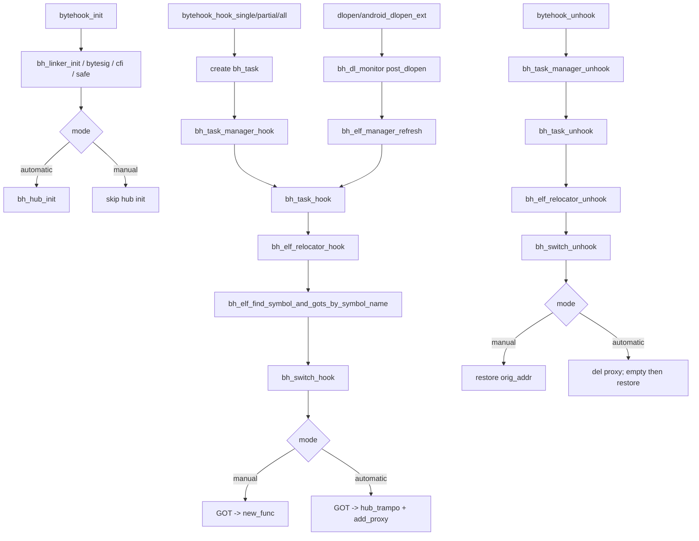

# BHook源码解析

> 基于 ByteHook 1.1.1（main 分支思路），只保留核心链路与高价值细节。


## ByteHook 是什么

ByteHook（BHook）是 Android Native 的 PLT Hook 框架。

核心动作：**解析调用方 ELF 的重定位项 -> 找到 GOT/DATA 地址 -> 改写为代理函数地址**。

相比“能改 GOT 就行”的实现，ByteHook重点在工程化：

- 支持 `single / partial / all` 三种任务模型。
- 支持新 so 加载后的自动补 Hook。
- automatic 模式下支持多方 Hook 共存与独立 unhook。
- 提供信号保护、CFI 处理、records 记录等稳定性能力。


## 总链路（先记这个）

```text
init:
bytehook_init
  -> bh_linker_init
  -> bytesig_init(SIGSEGV/SIGBUS)
  -> bh_cfi_disable_slowpath
  -> bh_safe_init
  -> (automatic) bh_hub_init

hook:
bytehook_hook_* 
  -> bh_task_manager_hook
  -> bh_task_hook
  -> bh_elf_relocator_hook
  -> bh_elf_find_symbol_and_gots_by_symbol_name
  -> bh_switch_hook
  -> bh_elf_relocator_reloc

unhook:
bytehook_unhook
  -> bh_task_manager_unhook
  -> bh_task_unhook
  -> bh_elf_relocator_unhook
  -> bh_switch_unhook
```

## 单页流程图




## 关键模块速览

| 模块 | 关键文件 | 作用 |
| :-- | :-- | :-- |
| API 入口 | `bytehook.c` | 对外 init/hook/unhook 接口 |
| Task | `bh_task.c` | 定义 hook 任务模型与状态 |
| Task 管理 | `bh_task_manager.c` | 管理任务队列，触发执行 |
| ELF 缓存 | `bh_elf_manager.c` | 维护进程中 ELF 列表与生命周期 |
| ELF 解析 | `bh_elf.c` | 解析 `.dynamic` 与重定位项 |
| 重定位改写 | `bh_elf_relocator.c` | `mprotect + atomic` 写 GOT/DATA |
| 模式切换 | `bh_switch.c` | manual/automatic 分流 |
| automatic 运行时 | `bh_hub.c` | proxy 链、prev 调用、递归保护 |
| so 监控 | `bh_dl_monitor.c` | 监听 `dlopen` 家族，处理增量 so |


## 初始化：`bytehook_init` 做了什么

| 步骤 | 关键函数 | 作用 | 失败码（示例） |
| :-- | :-- | :-- | :-- |
| 参数校验 | mode 检查 | 只允许 automatic/manual | `INITERR_INVALID_ARG` |
| linker 适配 | `bh_linker_init` | 适配不同 Android linker 符号 | `INITERR_SYM` |
| 信号保护 | `bytesig_init` | 把危险读写从崩溃转为可控错误 | `INITERR_SIG` |
| CFI 处理 | `bh_cfi_disable_slowpath` | 处理 CFI 相关限制 | `INITERR_CFI` |
| 安全封装 | `bh_safe_init` | 安全 syscall/TLS 包装 | `INITERR_SAFE` |
| automatic 准备 | `bh_hub_init` | 初始化 trampoline/proxy 运行时 | `INITERR_HUB` |


## Hook API 与 Task 模型

| API | 作用 | 任务状态特点 |
| :-- | :-- | :-- |
| `bytehook_hook_single` | 只 hook 指定 caller so | 命中后可进入 finished |
| `bytehook_hook_partial` | 按过滤函数 hook 部分 caller | 长期任务，持续监听新 so |
| `bytehook_hook_all` | hook 所有 caller | 长期任务，持续监听新 so |

`bh_task_t` 里最关键的字段：

- `sym_name`：目标符号
- `new_func`：代理函数
- `caller_path_name` / `callee_path_name`：匹配边界
- `status` / `status_code`：任务状态与结果


## hooked 回调语义（高频易混淆）

```c
typedef void (*bytehook_hooked_t)(bytehook_stub_t task_stub, int status_code,
                                  const char *caller_path_name, const char *sym_name,
                                  void *new_func, void *prev_func, void *arg);
```

| 场景 | status_code | `prev_func` 含义 | 是否回调 |
| :-- | :-- | :-- | :-- |
| manual hook 成功 | `OK` | 原始函数地址 | 是 |
| automatic hook 成功 | `OK` | 当前位点原始地址（由 hub/switch 管理） | 是 |
| manual 早期回调 | `ORIG_ADDR` | 原始函数地址（改 GOT 前） | 是 |
| single 失败 | `NOSYM/SET_GOT/...` | `NULL` | 是 |
| partial/all 的 `NOSYM`/`READ_ELF` | `NOSYM/READ_ELF` | `NULL` | 否（内部跳过） |
| unhook 阶段 | 各类 unhook 码 | - | 否（UNHOOKING 状态） |


## ELF 解析与改写（核心实现）

### 1) 解析动态信息

`bh_elf_parse_dynamic` 解析：

- `DT_SYMTAB / DT_STRTAB`
- `DT_JMPREL / DT_REL(A)`
- `DT_HASH / DT_GNU_HASH`

### 2) 定位符号并收集 GOT/DATA

`bh_elf_find_symbol_and_gots_by_symbol_name`：

1. 先用 SYSV/GNU hash 定位符号。
2. 扫描 `.rel.plt/.rela.plt`、`.rel.dyn/.rela.dyn`。
3. 兼容 APS2 压缩重定位格式。
4. 收集命中地址和页权限。

### 3) 执行改写

`bh_elf_relocator_reloc`：

- 读取原地址。
- 必要时 `mprotect` 加写权限。
- `__atomic_store_n` 写新地址。

并用 `BH_SIG_TRY(SIGSEGV, SIGBUS)` 兜底，避免直接崩溃。


## 模式切换：automatic vs manual

| 维度 | manual | automatic |
| :-- | :-- | :-- |
| 首次写入 | GOT -> `new_func` | GOT -> `hub_trampo` |
| 重复 Hook 同位点 | 常见 `DUP` | 追加 proxy 到 hub |
| 调用链 | 单层替换 | 多层 proxy 链 |
| 调原函数 | 通常依赖 `ORIG_ADDR` 保存地址 | 用 `BYTEHOOK_CALL_PREV` 动态取下一跳 |
| unhook | 直接恢复 `orig_addr` | 先删 proxy，最后一个删掉才恢复 `orig_addr` |
| 推荐 | 单方控制/调试 | 线上与多 SDK 并存 |

automatic 相关关键方法：

- `bh_hub_push_stack`
- `bh_hub_add_proxy`
- `bh_hub_get_prev_func`
- `bh_hub_pop_stack`


## 新 so 自动补 Hook：`bh_dl_monitor`

| API Level | Hook 目标 | 关键兼容策略 |
| :-- | :-- | :-- |
| 16 ~ 20 | `dlopen` | 直接走 `dlopen` 代理 |
| 21 ~ 23 | `dlopen` + `android_dlopen_ext` | 增加 `android_dlopen_ext` 监控 |
| 24 ~ 25 | `dlopen` + `android_dlopen_ext` | 兼容 7.x linker namespace（`dlopen_ext` / `do_dlopen`） |
| >= 26 | `__loader_dlopen` + `__loader_android_dlopen_ext` | 适配 O+ 导出入口变化 |

统一闭环：`post_dlopen -> bh_elf_manager_refresh -> 对新 ELF 执行 task`。


## Unhook 过程

```text
bytehook_unhook
  -> bh_task_manager_del
  -> bh_task_manager_unhook
  -> bh_task_unhook (status=UNHOOKING)
  -> bh_elf_relocator_unhook
  -> bh_switch_unhook
```

| 模式 | unhook 行为 |
| :-- | :-- |
| manual | 直接恢复 `orig_addr`，移除 switch |
| automatic | 先删当前 proxy；仅当最后一个 proxy 移除时恢复 `orig_addr` |


## Hook 生效边界与失效场景

生效前提：**调用必须经过导入重定位项**。

| 场景 | 结果 | 原因 |
| :-- | :-- | :-- |
| 同 so 内部直调 | 常不生效 | 不经过 PLT/GOT |
| inline/LTO | 常不生效 | 调用点被优化掉 |
| `-Bsymbolic` | 常不生效 | 内部本地绑定优先 |
| `dlsym` 函数指针直调 | 可能不生效 | 调用来源不在该导入项 |
| caller/callee/sym 不匹配 | `NOSYM` | 匹配条件错误 |
| 页权限或地址异常 | `SET_PROT/SET_GOT` | 改写失败 |

实用判断：

```bash
readelf -rW libcaller.so | grep "目标符号名"
```

看不到重定位项，基本不在 ByteHook 生效边界内。


## 常见状态码速查

| 状态码 | 含义 | 优先排查 |
| :-- | :-- | :-- |
| `INITERR_INVALID_ARG` | 初始化参数错 | 检查 init mode |
| `INITERR_SYM` | linker 适配失败 | 看 `bh_linker_init` 分支 |
| `INITERR_SIG` | 信号保护失败 | 看 `bytesig_init` |
| `INITERR_DLMTR` | so 监控初始化失败 | 看 `bh_dl_monitor` 或 dl_init/fini 注册 |
| `NOSYM` | 未找到符号/重定位项 | `readelf -rW` + 参数核对 |
| `READ_ELF` | ELF 读取异常 | 看并发卸载/目标 so 状态 |
| `SET_PROT` | `mprotect` 失败 | 看页权限与映射 |
| `SET_GOT` | 写 GOT 失败 | 看地址有效性与并发 |
| `DUP` | manual 重复 Hook 同位点 | 切 automatic 或调整策略 |
| `NOT_FOUND` | unhook 目标不存在 | 检查 stub 生命周期/重复 unhook |


## 快速排查顺序

1. `bytehook_init` 是否成功。
2. `caller/callee/sym` 是否精确匹配。
3. `readelf -rW` 是否存在目标导入重定位。
4. 查看 records 与 debug 日志中的状态码。
5. 检查代理函数是否正确使用 `BYTEHOOK_CALL_PREV`、`BYTEHOOK_STACK_SCOPE/POP_STACK`。


## 要点总结

- ByteHook 本质是 PLT Hook：改调用方 GOT/DATA，不改函数入口。
- BHook主链路：`init -> task -> elf -> reloc -> switch -> monitor -> unhook`。
- 生效前提是调用经过导入重定位项；同 so 直调、inline/LTO 常不在边界内。
- automatic 用 hub/proxy 链解决多方 Hook 冲突；manual 更适合单方调试场景。
- 新 so 自动补 Hook 依赖 `dlopen` 监控或 `dl_init/dl_fini` 回调。
- 线上稳定性核心是 signal 保护、CFI 兼容、并发同步与状态码可观测。


## 参考地址

[ByteHook 仓库](https://github.com/bytedance/bhook)

[项目介绍和原理概述](https://github.com/bytedance/bhook/blob/main/doc/overview.zh-CN.md)

[快速开始](https://github.com/bytedance/bhook/blob/main/doc/quickstart.zh-CN.md)

[Native API 手册](https://github.com/bytedance/bhook/blob/main/doc/native_manual.zh-CN.md)

[状态码文档](https://github.com/bytedance/bhook/blob/main/doc/status_code.zh-CN.md)

[Android bionic linker 源码](https://cs.android.com/android/platform/superproject/main/+/main:bionic/linker/)
