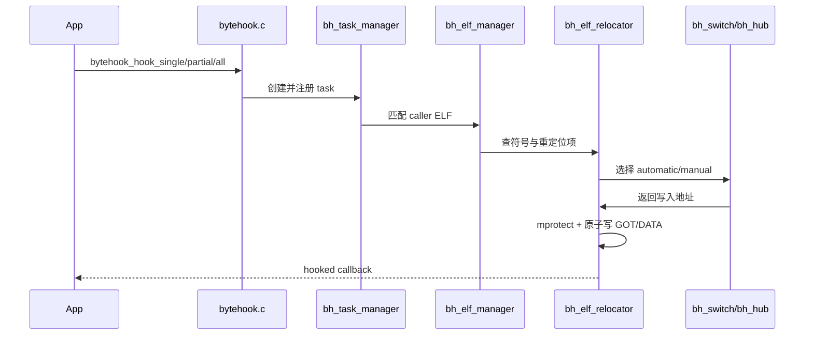

> 基于 ByteHook 1.1.1（main 分支实现思路）分析，侧重 Android Native Hook 的基础原理与核心源码链路。

在 、、 之后再看 ByteHook，会更容易把源码串起来：

- PLT Hook 负责“改哪里”（GOT/DATA 导入项）。
- So 加载流程负责“何时改”（已加载 + 新加载）。
- Inline Hook 负责“边界对比”（函数入口改写 vs 导入调用点改写）。


## ByteHook 定义

ByteHook（也常写作 BHook）是字节开源的 Android PLT Hook 框架。

它提供三类 Hook 能力：

- `bytehook_hook_single`：只 Hook 指定 caller so。
- `bytehook_hook_partial`：按过滤器 Hook 部分 caller so。
- `bytehook_hook_all`：Hook 全部 caller so。

并支持：

- 自动对新加载 so 补 Hook。
- 多个 Hook/Unhook 互不冲突（automatic 模式）。
- 递归/环形调用保护。
- 记录 Hook 操作日志（records）。


## ByteHook 使用示例

### 初始化

```java
import com.bytedance.android.bytehook.ByteHook;

public class HookInit {
    public static synchronized void init() {
        // 默认 automatic 模式
        int status = ByteHook.init();
    }
}
```

### Hook 单个 so

```c++
#include "bytehook.h"

static bytehook_stub_t g_stub = nullptr;

size_t my_strlen(const char* str) {
    BYTEHOOK_STACK_SCOPE();
    return BYTEHOOK_CALL_PREV(my_strlen, str);
}

void install_hook() {
    g_stub = bytehook_hook_single(
        "libsample.so",   // caller
        nullptr,           // callee 不限制
        "strlen",         // symbol
        (void*)my_strlen,
        nullptr,
        nullptr
    );
}
```

### Unhook

```c++
void uninstall_hook() {
    if (g_stub != nullptr) {
        bytehook_unhook(g_stub);
        g_stub = nullptr;
    }
}
```

> 代理函数中建议总是配合 `BYTEHOOK_STACK_SCOPE()` + `BYTEHOOK_CALL_PREV()` 使用。


## ByteHook 源码分析

下面按“从 API 到改 GOT”的顺序看核心实现。

### 1. 初始化入口：`bytehook_init`

`bytehook.c` 中，`bytehook_init` 负责搭建运行时基础设施。

```c
int bytehook_init(int mode, bool debug) {
  ...
  if (0 != bh_linker_init()) ...
  if (0 != bytesig_init(SIGSEGV)) ...
  if (0 != bytesig_init(SIGBUS)) ...
  if (0 != bh_cfi_disable_slowpath()) ...
  if (0 != bh_safe_init()) ...
  if (BYTEHOOK_IS_AUTOMATIC_MODE) {
    if (0 != bh_hub_init()) ...
  }
  ...
}
```

关键点：

- 初始化 linker 适配层。
- 初始化 signal 保护（`SIGSEGV/SIGBUS`）。
- 处理 CFI 相关兼容。
- automatic 模式下初始化 hub/trampoline。


### 2. 注册 Hook 请求：`bytehook_hook_*`

对外 API 在 `bytehook.c`：

```c
bytehook_stub_t bytehook_hook_single(...) {
  bh_task_t *task = bh_task_create_single(...);
  if (task != NULL) {
    bh_task_manager_add(task);
    bh_task_manager_hook(task);
  }
  return (bytehook_stub_t)task;
}
```

这里的核心对象是 `bh_task_t`（定义在 `bh_task.c`），它表示一个 Hook 诉求，包含：

- 目标符号 `sym_name`
- 新函数地址 `new_func`
- caller/callee 限定条件
- 状态与回调信息


### 3. Task 管理与调度：`bh_task_manager`

`bh_task_manager.c` 负责两件事：

1. 对当前进程中已加载 ELF 执行 task。
2. 在后续新 ELF 加载时，自动补执行 task。

```c
void bh_task_manager_hook(bh_task_t *task) {
  ...
  bh_task_hook(task);
}
```

`single`、`partial`、`all` 的差异主要体现在 `bh_task_hook_or_unhook` 中的匹配策略：

- `single`：命中一个 caller 后即可结束。
- `partial`：通过过滤器匹配多个 caller。
- `all`：遍历全部 caller。


### 4. ELF 缓存管理：`bh_elf_manager`

`bh_elf_manager.c` 维护进程内 ELF 列表，支持增删与生命周期同步：

- `bh_elf_manager_load`：初次加载缓存。
- `bh_elf_manager_refresh`：刷新现有 ELF 与新 ELF。
- `bh_elf_manager_add` / `bh_elf_manager_del`：跟随加载与卸载更新缓存。

它还维护引用计数，防止“正在 Hook 的 ELF 同时被卸载”。


### 5. ELF 动态信息解析：`bh_elf_parse_dynamic`

`bh_elf.c` 中先解析 `.dynamic` 拿到关键索引：

```c
case DT_JMPREL: self->rel_plt = ...;
case DT_PLTRELSZ: self->rel_plt_cnt = ...;
case DT_REL/DT_RELA: self->rel_dyn = ...;
case DT_RELSZ/DT_RELASZ: self->rel_dyn_cnt = ...;
case DT_SYMTAB: self->dynsym = ...;
case DT_STRTAB: self->dynstr = ...;
case DT_HASH/DT_GNU_HASH: ...
```

这里会处理：

- `.rel.plt/.rela.plt`
- `.rel.dyn/.rela.dyn`
- Android APS2 压缩重定位格式


### 6. 符号定位与 GOT 收集

核心函数：`bh_elf_find_symbol_and_gots_by_symbol_name`。

执行逻辑：

1. 用 SYSV/GNU hash 先定位符号（加速）。
2. 线性扫描重定位项，筛选对应符号。
3. 收集所有要改写的地址（GOT/DATA）和页保护属性。

即：不是只改一个地址，而是“同一符号的所有命中导入项”一起处理。


### 7. 真正改写地址：`bh_elf_relocator_reloc`

`bh_elf_relocator.c` 里执行最终替换：

```c
int bh_elf_relocator_reloc(...) {
  // 读取原地址
  real_orig_addr = *((void **)gots->data[0]);

  // mprotect 放开写权限
  if (0 == (prot & PROT_WRITE)) {
    bh_util_set_addr_protect(got, prot | PROT_WRITE);
  }

  // 原子写入新地址
  __atomic_store_n((uintptr_t *)got, (uintptr_t)new_addr, __ATOMIC_SEQ_CST);
}
```

并且危险读写都包在 `BH_SIG_TRY(SIGSEGV, SIGBUS)` 保护区内，避免直接崩溃。


### 8. automatic / manual 的核心分歧：`bh_switch`

`bh_switch.c` 是模式差异的关键。

- manual：`bh_switch_hook_unique`
  - 直接把 GOT 改到 `new_func`。
- automatic：`bh_switch_hook_shared`
  - 首次把 GOT 改到 hub trampoline。
  - 每个 task 的 proxy 进入 hub 的 proxy list。

automatic 的价值：同一 Hook 点支持多方挂载与独立 unhook，不会互相覆盖。


### 9. Hub 与 trampoline：`bh_hub`

`bh_hub.c` 负责 automatic 模式下的运行时分发：

- trampoline 先进入 `bh_hub_push_stack`。
- 选择当前应执行的 proxy。
- `BYTEHOOK_CALL_PREV` 从当前 frame 中找到“下一个 proxy 或原函数”。
- `BYTEHOOK_POP_STACK` / `BYTEHOOK_STACK_SCOPE` 负责栈清理。

这套机制同时解决：

- 多 proxy 链式执行。
- 递归/环形调用规避。


### 10. 新 so 自动生效：`bh_dl_monitor`

`bh_dl_monitor.c` 内部 hook：

- `dlopen`
- `android_dlopen_ext`
- `dlclose`

在 post 回调里触发 ELF 刷新和 task 补执行。

```c
if (NULL != bh_dl_monitor_post_dlopen && NULL != handle) {
  bh_dl_monitor_post_dlopen(...);
}
```

不同 Android 版本下，ByteHook 会选择不同符号路径（如 `__loader_dlopen` 等）做兼容。

#### 10.1 版本兼容总表（`bh_dl_monitor`）

| API Level | Android 版本 | Hook 目标符号 | 代理函数回调原始加载逻辑 | 关键兼容点 |
| :-- | :-- | :-- | :-- | :-- |
| 16 ~ 20 | 4.1 ~ 4.4W | `dlopen` | 直接调用原始 `dlopen`（manual 走 `orig_*`，automatic 走 `BYTEHOOK_CALL_PREV`） | 老版本仅需覆盖 `dlopen` |
| 21 ~ 23 | 5.0 ~ 6.0 | `dlopen` + `android_dlopen_ext` | 直接调用原始函数链 | 增加 `android_dlopen_ext` 入口 |
| 24 ~ 25 | 7.0 ~ 7.1 | `dlopen` + `android_dlopen_ext` | 优先 `linker.dlopen_ext`，否则 `g_dl_mutex + do_dlopen`，并传 `caller_addr` | 兼容 7.x linker namespace 与内部调用链 |
| >= 26 | 8.0+ | `__loader_dlopen` + `__loader_android_dlopen_ext`（`libdl.so`） | 调用原始 `__loader_*`（带 `caller_addr`） | 适配 Android O+ 对外导出入口变化 |

无论哪个版本，加载成功后都会走 `post_dlopen -> bh_elf_manager_refresh -> task_manager 补 hook` 闭环。

#### 10.2 Android 6（API 23）路径表

| 阶段 | 关键函数 | 行为 |
| :-- | :-- | :-- |
| Hook 注册 | `bh_dl_monitor_hook` | 注册 `dlopen` + `android_dlopen_ext` 的内部 task |
| 代理分支 | `bh_dl_monitor_proxy_dlopen` / `bh_dl_monitor_proxy_android_dlopen_ext` | 命中 `api_level >= J && api_level <= M` 分支，调用原始函数链 |
| 增量刷新 | `bh_dl_monitor_post_dlopen` | 成功后触发 `bh_elf_manager_refresh(...)` |
| 自动补挂 | `bh_task_manager_hook_elf` | 对新加载 ELF 执行已注册 task |

#### 10.3 `dlclose` 开关表（版本 + 架构）

| 条件 | 是否 Hook `dlclose` | 说明 |
| :-- | :-- | :-- |
| `aarch64` | 否 | `bh_dl_monitor_need_to_hook_dlclose()` 固定返回 false |
| `arm` 且编译 API >= 21 | 否 | 新平台默认关闭 |
| `arm` 且编译 API < 21 | 运行时 API < 21 时开启 | 仅旧系统分支开启 |
| 其他架构（x86/x86_64 等） | 是 | 参与卸载同步与 ELF 缓存一致性 |


### 11. Unhook 过程

`bytehook_unhook` 路径：

`bytehook_unhook -> bh_task_manager_unhook -> bh_task_unhook -> bh_elf_relocator_unhook -> bh_switch_unhook`

automatic 模式下：

- 只移除当前 proxy；若仍有其他 proxy，GOT 保持指向 hub。
- 当最后一个 proxy 被移除时，再恢复原始地址。


### 12. 不同版本兼容逻辑（表格汇总）

除了 `bh_dl_monitor`，ByteHook 还在 linker、ELF 解析和运行时安全层做了兼容。

| 兼容点 | 判定条件 | 方案 A | 方案 B | 代码位置 |
| :-- | :-- | :-- | :-- | :-- |
| 新 ELF 增量监听 | `bh_linker_is_support_dl_init_fini_monitor()` | 支持：注册 `dl_init/dl_fini` 回调（shadowhook） | 不支持：hook `dlopen/android_dlopen_ext/dlclose` 后刷新 ELF | `bh_task_manager.c` |
| linker 全局锁符号 | Android 版本 + linker 导出差异 | 旧平台：`__dl__ZL10g_dl_mutex` | U-QPR2 等新符号：`__dl_g_dl_mutex`（U 版本会双尝试） | `bh_linker.c` |
| Android 7.x 加载入口 | API `N/N_MR1` | 优先 `dlopen_ext` | fallback `do_dlopen` + `g_dl_mutex` + 错误缓冲处理 | `bh_linker.c` / `bh_dl_monitor.c` |
| ELF 名称匹配策略 | 位宽 + API | 64 位：按路径匹配为主 | 32 位且 API < 23：允许 basename 后缀匹配 | `bh_linker.c` |
| 重定位类型适配 | ABI（arm/arm64/x86/x86_64/riscv） | 各 ABI 对应 `JUMP_SLOT/GLOB_DAT/ABS` 类型 | riscv 分支单独处理 `GLOB_DAT` 差异 | `bh_elf.c` |
| CFI 处理 | 位宽 + API | `__LP64__` 且 API >= 26：处理 `__cfi_slowpath*` | 其他场景跳过 CFI Hook 路径 | `bh_elf_relocator.c` |
| `dlclose` 监控开关 | 架构 + 编译/运行时 API | 需要时开启：参与卸载同步与缓存一致性 | 不需要时关闭：减少额外干预面 | `bh_dl_monitor.c` |

#### 12.1 Linker 初始化分版本表（`bh_linker_init`）

| 版本区间 | 处理逻辑 | 目的 |
| :-- | :-- | :-- |
| API < 21（4.x） | `bh_linker_mutex_get_by_stack()` 获取 `g_dl_mutex` | 兼容旧 linker，不依赖新符号导出 |
| API 21+ 且命中 `g_dl_mutex` 分支 | 解析 linker 中 `g_dl_mutex` 符号并保存 | 配合 7.x fallback 路径与锁内调用 |
| API 24~25（7.x） | 解析 `dlopen_ext`；失败则解析 `do_dlopen` + 错误缓冲符号 | 处理 namespace 后 `dlopen` 调用链变化 |
| API 34+（U/U-QPR2） | 同时兼容旧/新 `g_dl_mutex` 符号名 | 适配同 API 代际内符号变更 |


## ByteHook 关键设计点

### 1) 任务模型清晰

`single/partial/all` 对应不同覆盖范围，便于在稳定性与覆盖率之间取舍。

### 2) automatic 模式工程化更完整

通过 `switch + hub + trampoline` 解决多重 Hook/Unhook 冲突。

### 3) 兼容 Android linker 现实差异

处理 basename/pathname 差异、7.x/8.x 之后的符号与 namespace 变化。

### 4) 稳定性补齐

signal-safe 保护、CFI 处理、dlclose 同步、recordable 记录。


## ByteHook 作用边界

ByteHook 属于 PLT Hook，生效边界与 PLT/GOT 路径一致：

- 能拦截：经过导入表的外部符号调用。
- 常拦不到：同 so 内直调、`static` 函数、被 inline/LTO 优化掉的调用。
- 需关注：`-Bsymbolic`、符号版本、linker namespace 导致的匹配偏差。


## 调用链小结




## 总结

ByteHook 的核心仍是 PLT Hook：解析 ELF、定位导入重定位项、改写 GOT/DATA。

它真正拉开差距的地方在工程化：

- 任务模型（single/partial/all）
- automatic 模式下的多 Hook 协同
- 新 so 自动补 Hook
- 稳定性保护（signal/CFI/并发同步）

所以理解 ByteHook，建议始终按这条主线：

**task -> elf manager -> relocator -> switch/hub -> monitor**。


## 参考地址

[ByteHook 仓库](https://github.com/bytedance/bhook)

[项目介绍和原理概述](https://github.com/bytedance/bhook/blob/main/doc/overview.zh-CN.md)

[快速开始](https://github.com/bytedance/bhook/blob/main/doc/quickstart.zh-CN.md)

[Native API 手册](https://github.com/bytedance/bhook/blob/main/doc/native_manual.zh-CN.md)

[状态码文档](https://github.com/bytedance/bhook/blob/main/doc/status_code.zh-CN.md)

[Android bionic linker 源码](https://cs.android.com/android/platform/superproject/main/+/main:bionic/linker/)
