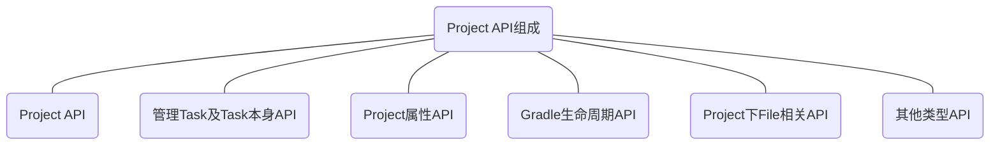

>  基于[Gradle 7.3.3源码](https://github.com/gradle/gradle/tree/v7.3.3/gradle)分析

可以通过执行`./gradlew projects`打印工程下所有Project。

> `Project`对应着项目中的`build.gradle`文件，每个gradle文件被解析后都会生成一个Project对象。所有`build.gradle`中定义的属性及方法都可以通过`Project`进行调用。

`Project相关API`主要由以下几部分组成，它们分别有以下能力：

- `Project API`：可以操作`父Project`以及管理`子Project`
- `Task相关API`：可在`Project`下管理`Task`，包括新增、修改等
- `Project属性相关API`：获取与设置`Project`相关属性及配置，包括`ext`设置
- `Project下File相关API`：获取`Project`下文件路径以及对文件的操作等
- `Project生命周期API`：可在`Project`对应生命周期下的操作
- `其他API`：配置项目依赖等

## 常用属性

> 每个`build.gradle`最后都会编译成一个`Project`对象，下面对应的API调用也都写在`build.gradle`中。
>
> [Project API文档](https://docs.gradle.org/current/javadoc/org/gradle/api/Project.html)

### Project API

> 可获取`父Project`及`子Project`，并可对他们进行操作

#### getAllprojects / allprojects

#### getSubprojects / subprojects

#### getParent / getRootProject / getProject / project

#### getChildProjects

### Task 相关API

### Project属性API

### Project下FileAPI

### Project生命周期API

### 其他API

## 参考资料

[Project官方文档](https://docs.gradle.org/current/dsl/org.gradle.api.Project.html#N153F9)

[Gradle核心揭秘](https://juejin.cn/post/6844904132092903437#heading-12)