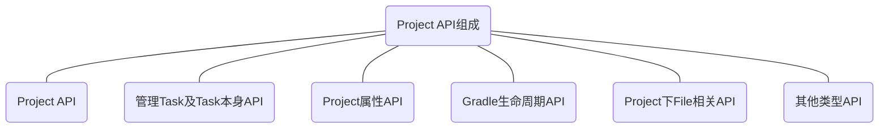

>  基于[Gradle 7.3.3源码](https://github.com/gradle/gradle/tree/v7.3.3/gradle)分析

可以通过执行`./gradlew projects`打印工程下所有Project。

> `Project`对应着项目中的`build.gradle`文件，每个gradle文件被解析后都会生成一个Project对象。所有`build.gradle`中定义的属性及方法都可以通过`Project`进行调用。



`Project相关API`主要由以下几部分组成，它们分别有以下能力：

- `Project API`：可以操作`父Project`以及管理`子Project`
- `Task相关API`：可在`Project`下管理`Task`，包括新增、修改等
- `Project属性相关API`：获取与设置`Project`相关属性及配置，包括`ext`设置
- `Project下File相关API`：获取`Project`下文件路径以及对文件的操作等
- `Project生命周期API`：可在`Project`对应生命周期下的操作
- `其他API`：配置项目依赖等

## 常用属性

> 每个`build.gradle`最后都会编译成一个`Project`对象，下面对应的API调用也都写在`build.gradle`中。
>
> [Project API文档](https://docs.gradle.org/current/javadoc/org/gradle/api/Project.html)

### Project API

> 可获取`父Project`及`子Project`，并可对他们进行操作

#### getAllprojects / allprojects

> 返回`当前Project对象`以及`所有子Project的集合`，后续可对获取的数据进行设置

```groovy
//build.gradle 
//getAllprojects
project.getAllprojects().eachWithIndex{Project project , int index->
    if(index == 0){
        println("root Project is $project")
    } else{
        println("child Project is $project")
    }
}

//allprojects
allprojects {
    println(it)
}
```

输出结果

```shell
root Project is root project 'GradlePluginDemo'
child Project is project ':app'
child Project is project ':mylibrary'


root project 'GradlePluginDemo'
project ':app'
project ':mylibrary'
```

两者最终都是得到`Project`集合

#### getSubprojects / subprojects

> 返回`所有子Project的集合`，后续可对获取的数据进行设置

```groovy
//build.gradle
project.getSubprojects().eachWithIndex { Project project, int index ->
    println("child Project is $project")
}

subprojects {
    println(it)
}
```

输出结果

```shell
child Project is project ':app'
child Project is project ':mylibrary'


project ':app'
project ':mylibrary'
```

两者最终都是得到`所有子Project`集合

#### getParent / getRootProject / getProject / project

> 返回的都是一个`独立的Project`对象
>
> `getParent`：返回`当前Project的父类`，如果为`Root Project`，返回则为null
>
> `getRootProject`：返回`Root Project`
>
> `getProject / project`：返回`当前工程对象`，或根据`name`获取`指定Project`

```groovy
//build.gradle
project("app",{
    println("根工程 "+getRootProject())
    println("父工程 "+getParent())
    println("当前工程 "+getProject())
})
```

输出结果

```shell
根工程 root project 'GradlePluginDemo'
父工程 root project 'GradlePluginDemo'
当前工程 project ':app'
```


#### getChildProjects

> 返回`所有直系子Project的集合`，可以看作近似于`getSubprojects`

```groovy
project.getChildProjects().each{
    println("${it.key}  : ${it.value}")
}
```

输出结果

```shell
app  : project ':app'
mylibrary  : project ':mylibrary'
```


### Task 相关API

> 在`Project`下管理`Task`

#### task

> 创建一个`Task`，添加到`Project`中

```groovy
//build.gradle
task clean(type: Delete) {
    delete rootProject.buildDir
}
```


#### getAllTasks

> 获取当前Project下所有`Task`，通过设置`recursive`判断是否需要`子Project`的`Task`

```groovy
//build.gradle
gradle.buildFinished {
    rootProject.getAllTasks(false).each {
        println("${it.key} and task is ${it.value}")
    }
}
```

输出结果

```shell
root project 'GradlePluginDemo' and task is [task ':buildEnvironment', task ':clean', task ':cleanIdea', task ':cleanIdeaModule', task ':cleanIdeaProject', task ':cleanIdeaWorkspace', task ':components', task ':dependencies', task ':dependencyInsight', task ':dependentComponents', task ':help', task ':idea', task ':ideaModule', task ':ideaProject', task ':ideaWorkspace', task ':init', task ':javaToolchains', task ':model', task ':openIdea', task ':outgoingVariants', task ':prepareKotlinBuildScriptModel', task ':prii', task ':projects', task ':properties', task ':tasks', task ':wrapper']
```


#### getTasks

> 获取当前Project下所有`Task`，返回的对象为`TaskContainer`，可以对`Task`进行操作

```groovy
//build.gradle
gradle.buildFinished {
    rootProject.getTasks().all {
        println(it)
    }
}
```


#### getTasksByName

> 根据`TaskName`返回所有相关的`Task`


### Project属性API

> 可以获取`Project`一些默认定义属性，也可以通过`ext`扩展自定义属性。

#### 默认自定义属性

```java
public interface Project extends Comparable<Project>, ExtensionAware, PluginAware {
    /**
     * The default project build file name.
     */
    String DEFAULT_BUILD_FILE = "build.gradle";

    /**
     * The hierarchy separator for project and task path names.
     */
    String PATH_SEPARATOR = ":";

    /**
     * The default build directory name.
     */
    String DEFAULT_BUILD_DIR_NAME = "build";

    String GRADLE_PROPERTIES = "gradle.properties";

    String SYSTEM_PROP_PREFIX = "systemProp";

    String DEFAULT_VERSION = "unspecified";

    String DEFAULT_STATUS = "release";
  ...
}
```


#### ext拓展属性

### Project下FileAPI


### Project生命周期API


### 其他API


## 参考资料

[Project官方文档](https://docs.gradle.org/current/dsl/org.gradle.api.Project.html#N153F9)

[Gradle核心揭秘](https://juejin.cn/post/6844904132092903437#heading-12)