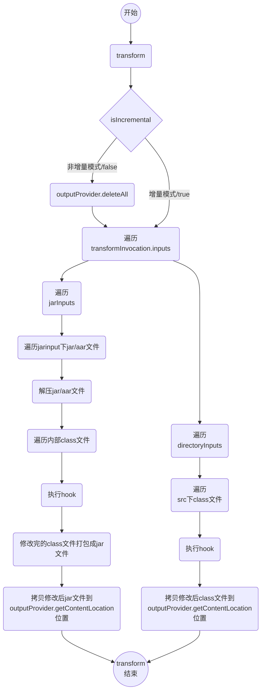
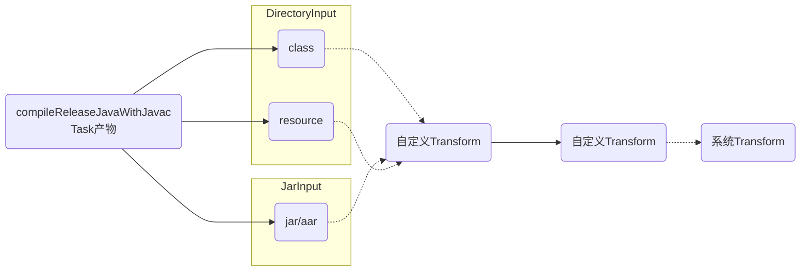
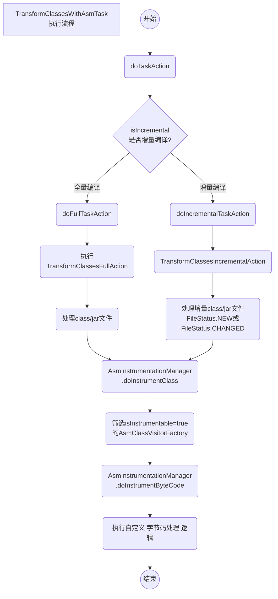

`Transform API`存在于`AGP`中，存在版本为`4.2-7.0+`，后续在8.0时就会被移除。

## Transform

> `AGP 1.5`引入的特性，**主要用于在构建过程中，在`Class->Dex`修改Class字节码，通过Transform可以获得Class文件。**
>
> 再通过`Javassist`或`ASM`对字节码进行修改，插入自定义逻辑。

[AGP插件版本说明](https://developer.android.com/studio/releases/gradle-plugin?hl=zh-cn#groovy)

后面的分析基于以下版本：

- AGP：[7.2.1](https://android.googlesource.com/platform/tools/base/+/studio-master-dev/build-system/README.md) 本次采用依赖 "com.android.tools.build:gradle:7.2.1"来分析
- Gradle：[7.3.3 ](https://github.com/gradle/gradle/tree/v7.3.3)

### 使用场景

- **埋点统计**：在页面展现和退出等生命周期中插入埋点统计代码，以统计页面展现数据
- **耗时监控**：在指定方法的前后插入耗时计算，以观察方法执行时间
- **方法替换**：将方法调用替换为调用另一个方法 
- 信息读取：解析编译产生的.class文件，得到一些有用的数据，做其他操作

### 工作机制

> 使用`Transform`无需关注相关task的生成与执行，主要在于处理输入的`资源文件`

#### 工作时机

工作在Android构建过程中的`.class Files -> Dex`节点

#### 处理对象

- javac 编译后的Class文件
- resource资源
- 本地/远程依赖的jar/aar文件

#### Transform Task

每个Transform都对应一个Task，对应名称为 `transform${inputTypes}With${TransformName}For${Variant}`，例如`transformClassesWithMethodTraceForRelease`

*Transform 内的输入输出实际对应的就是Task 的输入输出。*

最后`Transform`输出的内容都会存储在`${moduleName}/build/intermediates/transforms/${TransformName}/${Variant}`，例如`app/build/intermediates/transforms/MethodTrace/release`

#### Transform链

`TaskManager`将每个`Transform Task`串连起来，前一个的输出会做为下一个的输入信息。


### 相关API

以下为Transform中的核心方法

```kotlin
class TestTransform : Transform() {
    override fun getName(): String {
        TODO("Not yet implemented")
    }

    override fun getInputTypes(): MutableSet<QualifiedContent.ContentType> {
        TODO("Not yet implemented")
    }
 
    override fun getOutputTypes(): MutableSet<QualifiedContent.ContentType> {
        return super.getOutputTypes()
    }

    override fun getScopes(): MutableSet<in QualifiedContent.Scope> {
        TODO("Not yet implemented")
    }

    override fun isIncremental(): Boolean {
        TODO("Not yet implemented")
    }

    override fun transform(transformInvocation: TransformInvocation?) {
        super.transform(transformInvocation)
    }
    
}
```

#### getName

> 指定`Transform`名称，后续也是对应的Task名称
>
> Task命名规则为：**transform${inputTypes}With${TransformName}For${Variant}**

#### getInputTypes/getOutputTypes

> 指定`Transform`输入/输出类型，对象为`ContentType`。
>
> 其中`getOutputTypes`默认与`getInputTypes`一致

##### ContentType——内容类型

> 输入或输出的内容类型。

###### * DefaultContentType(自定义时使用)

```java
enum DefaultContentType implements ContentType {
        /**
         * The content is compiled Java code. This can be in a Jar file or in a folder. If
         * in a folder, it is expected to in sub-folders matching package names.
         */
        CLASSES(0x01),

        /** The content is standard Java resources. */
        RESOURCES(0x02);
}
```

- **CLASSES**：Java字节码，包括Jar文件
- **RESOURCES**：Java资源文件


###### ExtendedContentType(内部Transform使用)

```java
public enum ExtendedContentType implements ContentType {
    /**
     * The content is dex files.
     */
    DEX(0x1000),

    /**
     * Content is a native library.
     */
    NATIVE_LIBS(0x2000),

    /**
     * Instant Run '$override' classes, which contain code of new method bodies.
     *
     * <p>This stream also contains the AbstractPatchesLoaderImpl class for applying HotSwap
     * changes.
     */
    CLASSES_ENHANCED(0x4000),

    /**
     * The content is an artifact exported by the data binding compiler.
     */
    DATA_BINDING(0x10000),


    /** The content is a dex archive. It contains a single DEX file per class. */
    DEX_ARCHIVE(0x40000)
  
}
```

> 通常使用`TransformManager`设置类型

```java
    public static final Set<ContentType> CONTENT_CLASS = ImmutableSet.of(CLASSES);
    public static final Set<ContentType> CONTENT_JARS = ImmutableSet.of(CLASSES, RESOURCES);
    public static final Set<ContentType> CONTENT_RESOURCES = ImmutableSet.of(RESOURCES);
```

##### 示例代码

```kotlin
    override fun getInputTypes(): MutableSet<QualifiedContent.ContentType> {
        return TransformManager.CONTENT_CLASS
    }
```


#### getScopes

> 指定`Transform`处理哪些作用域的输入文件

##### Scope——处理范围

###### * Scope(自定义时使用)

```java
    enum Scope implements ScopeType {
        /** Only the project (module) content */
        PROJECT(0x01),
        /** Only the sub-projects (other modules) */
        SUB_PROJECTS(0x04),
        /** Only the external libraries */
        EXTERNAL_LIBRARIES(0x10),
        /** Code that is being tested by the current variant, including dependencies */
        TESTED_CODE(0x20),
        /** Local or remote dependencies that are provided-only */
        PROVIDED_ONLY(0x40)
    }
```

- **PROJECT**：当前模块

- **SUB_PROJECTS**：子模块

- **EXTERNAL_LIBRARIES**：外部依赖，包括当前和子模块所依赖的Jar/AAR

- **TESTED_CODE**：测试代码

- **PROVIDED_ONLY**：本地和远程依赖的Jar/AAR

**若为子Module注册Transform，则只能使用`Scope.PROJECT`。**

> 通常使用`TransformManager`设置作用域

```java
    public static final Set<ScopeType> PROJECT_ONLY = ImmutableSet.of(Scope.PROJECT); 
    public static final Set<ScopeType> SCOPE_FULL_PROJECT =
            ImmutableSet.of(Scope.PROJECT, Scope.SUB_PROJECTS, Scope.EXTERNAL_LIBRARIES);//通常使用较多，若为子Module就别用这个
```


###### InternalScope(内部Transform使用)

```java
public enum InternalScope implements QualifiedContent.ScopeType {

    /**
     * Scope to package classes.dex files in the main split APK in InstantRun mode. All other
     * classes.dex will be packaged in other split APKs.
     */
    MAIN_SPLIT(0x10000),

    /**
     * Only the project's local dependencies (local jars). This is to be used by the library plugin
     * only (and only when building the AAR).
     */
    LOCAL_DEPS(0x20000),

    /** Only the project's feature or dynamic-feature modules. */
    FEATURES(0x40000),
    ;
}
```


##### 示例代码

```kotlin
    override fun getScopes(): MutableSet<in QualifiedContent.Scope> {
        val set = mutableSetOf<QualifiedContent.Scope>()
        set.add(QualifiedContent.Scope.PROJECT)
        if (isApp) { //是否为app module
            set.add(QualifiedContent.Scope.EXTERNAL_LIBRARIES)
        }
        return set
    }
```


#### isIncremental

> 当前`Transform`是否支持增量编译
>
> 不是每次的编译都是可以增量编译的，通过`isIncremental`check当前是否为增量编译
>
> - `false`：非增量编译 清空output目录，再对每个`class/jar`进行处理
> - `true`：增量编译，需要检查每个`class/jar`的`Status`，分别处理

存在两个标志位：

##### Transform.isIncremental

> `Transform`增量构建的开发

若为`true`，对应的`TransformTask`依然会执行，有可能触发增量构建

##### TransformInvocation.isIncremental

> 当前`Transform`对应的`Task`是否增量执行

若为`true`，对应的`TransformTask`表示增量模式。

在增量模式下，所有的`Input`都是带`Status`的。

```java
public enum Status {
    /**
     * The file was not changed since the last build.
     */
    NOTCHANGED, 
    /**
     * The file was added since the last build.
     */
    ADDED,
    /**
     * The file was modified since the last build.
     */
    CHANGED,
    /**
     * The file was removed since the last build.
     */
    REMOVED;
}
```

`Status`分为以下四种：

- NOTCHANGED：(文件无改变)无操作
- ADDED：(文件新增) 按照正常流程处理 class/jar
- CHANGED：(文件修改) 按照正常流程处理 class/jar
- REMOVED：(文件删除) 清除`outputProvider`对应路径文件

#### * transform

> 在这个方法中获取输入的Class文件，经过中间过程的修改，最后输出修改的Class文件。


##### TransformInvocation - 提供输入&输出相关信息

```java
public interface TransformInvocation {

    /**
     * Returns the context in which the transform is run.
     * @return the context in which the transform is run.
     */
    @NonNull
    Context getContext();

    /**
     * Returns the inputs/outputs of the transform.
     * @return the inputs/outputs of the transform.
     */
    @NonNull
    Collection<TransformInput> getInputs();

    /**
     * Returns the referenced-only inputs which are not consumed by this transformation.
     * @return the referenced-only inputs.
     */
    @NonNull Collection<TransformInput> getReferencedInputs();
    /**
     * Returns the list of secondary file changes since last. Only secondary files that this
     * transform can handle incrementally will be part of this change set.
     * @return the list of changes impacting a {@link SecondaryInput}
     */
    @NonNull Collection<SecondaryInput> getSecondaryInputs();

    /**
     * Returns the output provider allowing to create content.
     * @return he output provider allowing to create content.
     */
    @Nullable
    TransformOutputProvider getOutputProvider();


    /**
     * Indicates whether the transform execution is incremental.
     * @return true for an incremental invocation, false otherwise.
     */
    boolean isIncremental();
}
```

主要包括以下方法：

- **getContext**：返回`Transform`运行相关信息
- **getInputs**：返回`TransformInput`对象，主要是输入内容信息
- **getOutputProvider**：返回`TransformOutputProvider`对象，主要是返回输出文件
- **isIncremental**：当前`Transform`对应Task是否增量构建


###### TransformInput - 输入文件信息

```java
public interface TransformInput {

    /**
     * Returns a collection of {@link JarInput}.
     */
    @NonNull
    Collection<JarInput> getJarInputs();

    /**
     * Returns a collection of {@link DirectoryInput}.
     */
    @NonNull
    Collection<DirectoryInput> getDirectoryInputs();
}

```

主要包括以下两个方法：

- getJarInputs:Collection<JarInput>：以jar和aar的依赖方式参与构建的输入文件，包含本地依赖和远程依赖
- getDirectoryInputs:Collection<DirectoryInput>：以源码方式参与项目编译的所有目录结构及其中的源码文件


###### TransformOutputProvider - 输出信息

```java
public interface TransformOutputProvider {

    /**
     * Delete all content. This is useful when running in non-incremental mode
     *
     * @throws IOException if deleting the output failed.
     */
    void deleteAll() throws IOException;


     /**
     * Returns the location of content for a given set of Scopes, Content Types, and Format.
     *
     * <p>If the format is {@link Format#DIRECTORY} then the result is the file location of the
     * directory.<br>
     * If the format is {@link Format#JAR} then the result is a file representing the jar to create.
     */
    @NonNull
    File getContentLocation(
            @NonNull String name,
            @NonNull Set<QualifiedContent.ContentType> types,
            @NonNull Set<? super QualifiedContent.Scope> scopes,
            @NonNull Format format);
}
```

主要包括以下两个方法：

- **deleteAll**：清空输出目录下所有文件，用于非增量构建的情况下(`TransformInvocation.isIncremental == false `)

- **getContentLocation**：获取指定范围(`Scope`)以及指定类型(`ContentType`)还有文件类型(`Format：目前只有Directory，JAR`)的输出目标路径

  

##### 执行流程

###### 获取输入文件

主要对象为`TransformInput`，对应的文件分为两种：

- 源码文件 / `DirectoryInput`
- 依赖的Jar/aar文件 / `JarInput`

###### 获取输出路径

主要对象为`TransformOutputProvider`，需要采用指定方法获取，输出路径主要是两种：

- 源码文件输出路径 

  ```kotlin
          val dest = outputProvider.getContentLocation(
              dirInput.name,
              dirInput.contentTypes,
              dirInput.scopes,
              Format.DIRECTORY
          )
  ```

  

- 依赖的Jar/aar文件输出路径

  ```kotlin
              val dest = outputProvider.getContentLocation(
                  jarInput.name,
                  jarInput.contentTypes,
                  jarInput.scopes,
                  Format.JAR
              )
  ```

主要区别在设置的`Format`上。

###### 处理输入文件

处理上按照输入文件类型分开处理

```kotlin
    override fun transform(transformInvocation: TransformInvocation) {
      val context = transformInvocation.context
      val inputs = transformInvocation.inputs
      val outputProvider = transformInvocation.outputProvider
      val isIncremental = transformInvocation.isIncremental
      
      
     if (!isIncremental) {
            //删除所有
            outputProvider.deleteAll()
        }
        inputs.forEach { input ->
            //遍历 src下文件
            input.directoryInputs.forEach { directoryInput ->
                foreachDirectory(context, outputProvider, directoryInput, isIncremental)
            }
            //遍历jar/aar内文件
            input.jarInputs.forEach { jarInput ->
                foreachJar(context, outputProvider, jarInput, isIncremental)
            }
        } 
      
    }
```


- 源码文件(src下编译生成的class文件)

  ```kotlin
  private  fun foreachDirectory(context: Context, outputProvider: TransformOutputProvider, input: DirectoryInput, isIncremental: Boolean) {
      //
          val dir = input.file
          val dest = outputProvider.getContentLocation(
              input.name,
              input.contentTypes,
              input.scopes,
              Format.DIRECTORY
          )
          FileUtils.forceMkdir(dest)
          val srcDicPath = dir.absolutePath
          val destDicPath = dest.absolutePath
    
       //增量模式处理
       if (isIncremental) {
              val fileStatus = input.changedFiles
              fileStatus.forEach { file, status ->
                  val destFilePath = file.absolutePath.replace(srcDicPath, destDicPath)
                  val destFile = File(destFilePath)       
                  when (status) {
                      Status.ADDED, Status.CHANGED -> {
                          println("File is Updated name： ${file.name} and path ${file.absolutePath}")
                          transformDir(context,dir,inputFile,destFilePath)
                      }
                      Status.REMOVED               -> {
                          println("File is Removed name： ${file.name}")
                          if (destFile.exists()) {
                              destFile.delete()
                          }
                      }
                      else                         -> {
  
                      }
                  }        
       }else{
              FileUtils.copyDirectory(dir, dest)
              dir.walk().asSequence().filter {//按照指定格式筛选文件
                  it.isFile && checkDicClassFile(it.name)
              }.forEach { file ->
                  transformDir(context, dir, file, file.absolutePath.replace(srcDirPath, destDirPath))
              }
       }
    
       //非增量模式处理
    
  }
    
      private fun transformDir(context: Context, dir: File, inputFile: File, destFilePath: String) {
          val destFile = File(destFilePath)
          if (destFile.exists()) {
              destFile.delete()
          }
        //编辑class文件
          val modifiedFile = modifyClassFile(dir,inputFile,context.temporaryDir)
          if (modifiedFile != null) {
              FileUtils.copyFile(modifiedFile, destFile)
              modifiedFile.delete()
          } else {
              FileUtils.copyFile(inputFile, destFile)
          }
  
      }
    
  ```

  > 注意⚠️：就算不想修改class文件，也需要**原样拷贝过去**。否则该文件就会丢失！

- Jar/aar文件

  > 相比于class文件多了解压缩过程，解压后得到的class文件处理方式与上面一致，最后需要将处理后的class文件重新压缩即可。
  
  ```kotlin
      private fun foreachJar(context: Context, outputProvider: TransformOutputProvider, input: JarInput, isIncremental: Boolean) {
          if (input.file.absolutePath.endsWith("jar")) {
              var jarName = input.file.name
              val md5Name = DigestUtils.md5Hex(input.file.absolutePath)
              if (jarName.endsWith(".jar")) {
                  jarName = jarName.substring(0, jarName.length - 4)
              }
              val dest = outputProvider.getContentLocation(
                  "${jarName}_${md5Name}",
                  input.contentTypes,
                  input.scopes,
                  Format.JAR
              )
              if (isIncremental) {
                  when (input.status) {
                      Status.ADDED, Status.CHANGED -> {
                          println("Jar is Updated name： ${input.file.name}")
                          transformJar(context, dest, input)
                      }
                      Status.REMOVED               -> {
                          println("Jar is Removed and ${input.file.name}")
                          if (dest.exists()) {
                              FileUtils.forceDelete(dest)
                          }
                      }
                      else                         -> {
  
                      }
                  }
              } else {
                  transformJar(context, dest, input)
              }
  
          }
      }
  
      private fun transformJar(context: Context, dest: File, input: JarInput) {
          var modifyJar: File? = null
          modifyJar = modifyJarFile(input.file, context.temporaryDir)
          if (modifyJar == null) {
              modifyJar = input.file
          }
        //操作完成后，最后需要拷贝回去 避免文件丢失
          FileUtils.copyFile(modifyJar, dest)
      }
  ```
  




#### 注册Transform

> 实现一个`Transform`后，需要注册才可以功能生效。

```kotlin
class CustomPlugin : Plugin<Project> {
    override fun apply(project: Project) {
      //处理extension等信息
      ...
       //判定当前为 app module
        val appExtension = project.extensions.findByType(AppExtension::class.java)
        if (appExtension != null) {
            appExtension.registerTransform(MethodTraceTransform(project, true))
        } else {
          //判定当前为 library module
            val libExtension = project.extensions.findByType(LibraryExtension::class.java)
            libExtension?.registerTransform(MethodTraceTransform(project, false))
        }
    }
}
```


### 工作原理

#### 注册Transform

> 主要是将`Transform`注册在`BaseExtension`中。

```kotlin
abstract class BaseExtension protected constructor(
  ...
    private val _transforms: MutableList<Transform> = mutableListOf()
    private val _transformDependencies: MutableList<List<Any>> = mutableListOf()
  ...
  
    fun registerTransform(transform: Transform, vararg dependencies: Any) {
        dslServices.deprecationReporter.reportDeprecatedApi(
            newApiElement = null,
            oldApiElement = "android.registerTransform",
            url = "https://developer.android.com/studio/releases/gradle-plugin-api-updates#transform-api",
            deprecationTarget = DeprecationReporter.DeprecationTarget.TRANSFORM_API
        )
        _transforms.add(transform)
        _transformDependencies.add(listOf(dependencies))
    }
  
    override val transforms: List<Transform>
        get() = ImmutableList.copyOf(_transforms)

    override val transformsDependencies: List<List<Any>>
        get() = ImmutableList.copyOf(_transformDependencies)
  
  }
```

内部的`transforms`由外部调用，`GlobalTaskCreationConfigImpl`使用到了`transforms`

```kotlin
    override val transforms: List<Transform>
        get() = oldExtension.transforms
```

`GlobalTaskCreationConfigImpl`为`GlobalTaskCreationConfig`实现类，所以`GlobalTaskCreationConfig`对应的`transforms`即为`BaseExtension`注册进来的`Transform`。


#### 创建TransformTask

由可知Task的构建流程

都是由`BasePlugin.createAndroidTasks`开始的，其他细节在有详细介绍

##### BasePlugin.createAndroidTasks

```java
    final void createAndroidTasks() {
        GlobalTaskCreationConfig globalConfig = variantManager.getGlobalTaskCreationConfig();
     ...
        TaskManager<VariantBuilderT, VariantT> taskManager =
                createTaskManager(
                        project,
                        variants,
                        variantManager.getTestComponents(),
                        variantManager.getTestFixturesComponents(),
                        globalConfig,
                        taskManagerConfig,
                        extension);

        taskManager.createTasks(variantFactory.getVariantType(), createVariantModel(globalConfig));
    }
```

##### TaskManager.createTasks

```kotlin
    fun createTasks(
            variantType: VariantType, variantModel: VariantModel) {
      ...
        // Create tasks for all variants (main, testFixtures and tests)        
        for (variant in variants) {
            createTasksForVariant(variant)
        }
    }

    private fun createTasksForVariant(
            variant: ComponentInfo<VariantBuilderT, VariantT>,
    ){
      ...
        doCreateTasksForVariant(variant)
    }

    protected abstract fun doCreateTasksForVariant(
            variantInfo: ComponentInfo<VariantBuilderT, VariantT>)
```

##### TaskManager.doCreateTasksForVariant

> `TaskManager`是抽象类，主要实现类为
>
> - `ApplicationTaskManager`：对应 app module
> - `LibraryTaskManager`：对应 library module

以`LibraryTaskManager`为例

```java
    @Override
    protected void doCreateTasksForVariant(
            @NotNull ComponentInfo<LibraryVariantBuilderImpl, LibraryVariantImpl> variantInfo) {
      //创建其他Task
      ...
      TransformManager transformManager = libraryVariant.getTransformManager();
      
      //对应的BaseExtension 注册的Transform
       List<Transform> customTransforms = globalConfig.getTransforms();
       List<List<Object>> customTransformsDependencies = globalConfig.getTransformsDependencies();
      
       for (int i = 0, count = customTransforms.size(); i < count; i++) {
            Transform transform = customTransforms.get(i);
         //library module 只支持 PROJECT_ONLY
            Sets.SetView<? super Scope> difference =
                    Sets.difference(transform.getScopes(), TransformManager.PROJECT_ONLY);
            if (!difference.isEmpty()) {
                String scopes = difference.toString();
                issueReporter.reportError(
                        Type.GENERIC,
                        String.format(
                                "Transforms with scopes '%s' cannot be applied to library projects.",
                                scopes));
            }            
         //创建TransformTask
            transformManager.addTransform(
                    taskFactory,
                    libraryVariant,
                    transform,
                    null,
                    task -> {
                        if (!deps.isEmpty()) {
                            task.dependsOn(deps);
                        }
                    },
                    taskProvider -> {
                        // if the task is a no-op then we make assemble task
                        // depend on it.
                        if (transform.getScopes().isEmpty()) {
                            TaskFactoryUtils.dependsOn(
                                    libraryVariant.getTaskContainer().getAssembleTask(),
                                    taskProvider);//依赖assembleXXTask后执行
                        }
                    });                
       }
    }
```

##### TransformManager.addTransform

```java
    @NonNull
    public <T extends Transform> Optional<TaskProvider<TransformTask>> addTransform(
            @NonNull TaskFactory taskFactory,
            @NonNull VariantCreationConfig creationConfig,
            @NonNull T transform, //the transform to add
            @Nullable PreConfigAction preConfigAction,
            @Nullable TaskConfigAction<TransformTask> configAction,
            @Nullable TaskProviderCallback<TransformTask> providerCallback) {
      //设置Task name   transform[getInputTypes]With[getName]For[creationConfig.name]
      //示例名称 transform[Classes]With[MethodTrace]For[Release]
        String taskName = creationConfig.computeTaskName(getTaskNamePrefix(transform), "");      
      
      //创建TransformTask
        return Optional.of(
                taskFactory.register(//注册创建的TransformTask
                        new TransformTask.CreationAction<>(
                                creationConfig.getName(),
                                taskName,
                                transform,
                                inputStreams,
                                referencedStreams,
                                outputStream),
                        preConfigAction,
                        wrappedConfigAction,
                        providerCallback));      
    }

//最终得到的TaskName格式为 
    static String getTaskNamePrefix(@NonNull Transform transform) {
        StringBuilder sb = new StringBuilder(100);
        sb.append("transform");

        sb.append(
                transform
                        .getInputTypes()
                        .stream()
                        .map(
                                inputType ->
                                        CaseFormat.UPPER_UNDERSCORE.to(
                                                CaseFormat.UPPER_CAMEL, inputType.name()))
                        .sorted() // Keep the order stable.
                        .collect(Collectors.joining("And")));
        sb.append("With");
        StringHelper.appendCapitalized(sb, transform.getName());
        sb.append("For");

        return sb.toString();
    }

```

##### TransformTask.CreationAction

```java
@CacheableTask
public abstract class TransformTask extends StreamBasedTask {
  //TransformTask 输入
    @Input
    @NonNull
    public Set<? super QualifiedContent.Scope> getScopes() {
        return transform.getScopes();
    }
  
    @Input
    @NonNull
    public Set<QualifiedContent.ContentType> getInputTypes() {
        return transform.getInputTypes();
    }  
  
  //TransformTask 输出
    @OutputDirectory
    @Optional
    @NonNull
    public abstract DirectoryProperty getOutputDirectory();

    @OutputFile
    @Optional
    @NonNull
    public abstract RegularFileProperty getOutputFile();
  
 ...
   
    public static class CreationAction<T extends Transform>
            extends TaskCreationAction<TransformTask> {
        @NonNull
        private final String variantName;
        @NonNull
        private final String taskName;
        @NonNull
        private final T transform;
      
      ...
        @Override
        public void configure(@NonNull TransformTask task) {
            task.transform = transform;
            transform.setOutputDirectory(task.getOutputDirectory());
            transform.setOutputFile(task.getOutputFile());
        ...
      }
    }
  
}
```

最后创建一个名为`transform[getInputTypes]With[getName]For[creationConfig.name]`的Task，并注册到当前module中。

#### 执行TransfromTask(执行transform())

执行`Task`实际执行的是`自定义Task`内部实现了`@TaskAction`的方法

```java
//TransformTask.java
    @TaskAction
    void transform(final IncrementalTaskInputs incrementalTaskInputs)
            throws IOException, TransformException, InterruptedException {
      ...
        
                        transform.transform(
                                new TransformInvocationBuilder(context)
                                        .addInputs(consumedInputs.getValue())
                                        .addReferencedInputs(referencedInputs.getValue())
                                        .addSecondaryInputs(changedSecondaryInputs.getValue())
                                        .addOutputProvider(
                                                outputStream != null
                                                        ? outputStream.asOutput()
                                                        : null)
                                        .setIncrementalMode(isIncremental.getValue())
                                        .build());        
      
    }
```

最终执行到了`自定义Transform`的`transform()`。

//todo 流程

#### 增量模式实现

> 若`isIncremental`为true，则返回的文件会携带状态，根据不同的状态执行不同的逻辑。

```java
//TransformTask.java
    private static void gatherChangedFiles(
            @NonNull Logger logger,
            @NonNull IncrementalTaskInputs incrementalTaskInputs,
            @NonNull final Map<File, Status> changedFileMap,
            @NonNull final Set<File> removedFiles) {
        logger.info("Transform inputs calculations based on following changes");
        incrementalTaskInputs.outOfDate(inputFileDetails -> {
            logger.info(inputFileDetails.getFile().getAbsolutePath() + ":"
                    + IntermediateFolderUtils.inputFileDetailsToStatus(inputFileDetails));
            if (inputFileDetails.isAdded()) {
                changedFileMap.put(inputFileDetails.getFile(), Status.ADDED);
            } else if (inputFileDetails.isModified()) {
                changedFileMap.put(inputFileDetails.getFile(), Status.CHANGED);
            }
        });

        incrementalTaskInputs.removed(
                inputFileDetails -> {
                        logger.info(inputFileDetails.getFile().getAbsolutePath() + ":REMOVED");
                        removedFiles.add(inputFileDetails.getFile());
                });
    }
```

由`Gradle`中的`TaskExecution.execute()`处理对应的文件。

会在详细分析。



基于上面分析，每个`Transform`都对应一个`TransformTask`，Android编译器中的`TaskManager`将每个`Transform`串连起来。

第一个`自定义Transform`接受来自`compileJavaWithJavac(对应源码 JavaCompileCreationAction)`Task的中间产物

- javac编译得到的class文件
- 远端/本地的第三方依赖
- resource资源

这些产物在`Transform链`上传递，处理完成后再向下一个进行传递。


## Transform模板

> 大部分功能代码是一致的，主要差异在于字节码的处理上，由此可以抽象出一套模板写法，实现方只要处理字节码部分即可。


>  `Transform`API将在`AGP 8.0`中移除，主要为了**提高构建性能，Transform API很难与其他Gradle特性结合使用。**

基于以上原因，`Transform`后续可以使用`AsmClassVisitorFactory`或`TransformAction`进行替代。

## AsmClassVisitorFactory

> 在`AGP 4.2`后提供`AsmClassVisitorFactory`，主要用于处理`class`文件，与`Transform`主要功能大致相同，可以看做同等替换。
>
> *根据官方的说法，`AsmClassVisitoFactory`会带来约18%的性能提升，同时可以减少约5倍代码*

[AsmClassVisitorFactory 文档](https://developer.android.com/reference/tools/gradle-api/7.1/com/android/build/api/instrumentation/AsmClassVisitorFactory)

### 示例代码

#### 新建ClassVisitorFactory对象

```kotlin
abstract class ExampleClassVisitorFactory : AsmClassVisitorFactory<ExampleClassVisitorFactory.ExampleParams> {
    interface ExampleParams : InstrumentationParameters {
        @get:Input
        val writeToStdout: Property<Boolean>
    }

    override fun createClassVisitor(classContext: ClassContext, nextClassVisitor: ClassVisitor): ClassVisitor {
        val className = classContext.currentClassData.className.substringAfterLast(".")
        return ExampleClassNode(className, nextClassVisitor, PrintWriter(System.out))
    }

  //控制哪些类需要扫描
    override fun isInstrumentable(classData: ClassData): Boolean {
        return !classData.className.contains(".R$")
                && !classData.className.endsWith(".R")
                && !classData.className.endsWith(".BuildConfig")
                && classData.className.startsWith("com.example")
    }
}

//ExampleClassNode.kt
class ExampleClassNode(private val className: String, private val nextVisitor: ClassVisitor, private val printWriter: PrintWriter) :
    ClassVisitor(Opcodes.ASM7, nextVisitor) {
    override fun visitMethod(
        access: Int,
        name: String?,
        descriptor: String?,
        signature: String?,
        exceptions: Array<out String>?
    ): MethodVisitor {
        val methodVisitor = super.visitMethod(access, name, descriptor, signature, exceptions)
        return PrintLogInterceptor(className, methodVisitor, access, name, descriptor)
    }
      
          inner class PrintLogInterceptor(
        private val className: String?, private val methodVisitor: MethodVisitor, access: Int, name: String?, descriptor: String?
    ) : AdviceAdapter(ASM7, methodVisitor, access, name, descriptor) {

        override fun onMethodEnter() {
            super.onMethodEnter()
          //在每个方法里添加 Log打印，打印信息为类名和方法名
            methodVisitor.visitLdcInsn(className)
            methodVisitor.visitLdcInsn(name)
            methodVisitor.visitMethodInsn(INVOKESTATIC, "android/util/Log", "d", "(Ljava/lang/String;Ljava/lang/String;)I", false)
        }
    }
      
 }
```

#### 注册ClassVisitorFactory对象

```kotlin
//ExampleClassVisitorFactory.kt

class CustomPlugin : Plugin<Project> {
    override fun apply(project: Project) {
      //
        val androidComponents = project.extensions.findByType(AndroidComponentsExtension::class.java) //获取androidComponent
        if(androidComponents!=null){
            androidComponents.onVariants {variant ->
                variant.instrumentation.transformClassesWith(
                    ExampleClassVisitorFactory::class.java,
                    InstrumentationScope.ALL //扫描范围
                ){
                    it.writeToStdout.set(true)
                }
                variant.instrumentation.setAsmFramesComputationMode(FramesComputationMode.COPY_FRAMES)
            }
        } 
      
    } 
}
```


可使用 `Android Studio Plugin——ASM ByteCode Viewer`，提前把要插入的代码进行解析获取ASM代码。

### 相关API

#### AsmClassVisitorFactory

```kotlin
interface AsmClassVisitorFactory<ParametersT : InstrumentationParameters> : Serializable {
    @get:Nested
    val parameters: Property<ParametersT>
  
    fun createClassVisitor(
        classContext: ClassContext,
        nextClassVisitor: ClassVisitor
    ): ClassVisitor
  
    fun isInstrumentable(classData: ClassData): Boolean
}
```

- parameters

> 外部可配置`ClassVisitorFactory`的属性

- isInstrumentable

> 设置哪些类需要被扫描，可以提升执行效率

- ClassData

> 对应类的部分数据

```kotlin
interface ClassData {
    /**
     * Fully qualified name of the class.
     */
    val className: String

    /**
     * List of the annotations the class has.
     */
    val classAnnotations: List<String>

    /**
     * List of all the interfaces that this class or a superclass of this class implements.
     */
    val interfaces: List<String>

    /**
     * List of all the super classes that this class or a super class of this class extends.
     */
    val superClasses: List<String>
}

```


- createClassVisitor

> 创建`ClassVisitor`对象

#### AndroidComponentsExtension

transformClassesWith

> 注册自定义`ClassVisitorFactory`

### 工作原理

与`Transform`类似，实际`AsmClassVisitorFactory`最终也是通过Task执行，使用的就是`TransformClassesWithAsm`Task。

初始也是从`BasePlugin.createAndroidTasks`开始，再执行到`TaskManager.doCreateTasksForVariant`。

#### TaskManager.doCreateTasksForVariant

`TaskManager`是抽象类，主要实现类为

- `ApplicationTaskManager`：对应 app module
- `LibraryTaskManager`：对应 library module

以`ApplicationTaskManager`为例

#### ApplicationTaskManager.doCreateTasksForVariant

```kotlin
//    ApplicationTaskManager.kt
override fun doCreateTasksForVariant(
        variantInfo: ComponentInfo<ApplicationVariantBuilderImpl, ApplicationVariantImpl>
    ) {
      createCommonTasks(variantInfo)
      ...
      
    }

//AbstractAppTaskManager.kt
protected void createCommonTasks(@NonNull ComponentInfo<VariantBuilderT, VariantT> variant) {
     ...
        // Add a compile task class相关处理都需要在compile执行后
        createCompileTask(appVariantProperties);
    }

    private void createCompileTask(@NonNull VariantImpl variant) {
        ApkCreationConfig apkCreationConfig = (ApkCreationConfig) variant;

        TaskProvider<? extends JavaCompile> javacTask = createJavacTask(variant);
        addJavacClassesStream(variant);
      //执行compile task
        setJavaCompilerTask(javacTask, variant);
        createPostCompilationTasks(apkCreationConfig);
    }

//TaskManager.kt
    fun createPostCompilationTasks(creationConfig: ApkCreationConfig) {
      ...
        maybeCreateTransformClassesWithAsmTask(
            creationConfig as ComponentImpl,
            isTestCoverageEnabled
        )
      
    }
```

#### TaskManager.maybeCreateTransformClassesWithAsmTask

```kotlin
    protected fun maybeCreateTransformClassesWithAsmTask(
        creationConfig: ComponentImpl,
        isTestCoverageEnabled: Boolean
    ) {
     ...
            creationConfig
                    .transformManager
                    .consumeStreams(
                            mutableSetOf(com.android.build.api.transform.QualifiedContent.Scope.PROJECT),
                            setOf(com.android.build.api.transform.QualifiedContent.DefaultContentType.CLASSES))
            taskFactory.register(
                    TransformClassesWithAsmTask.CreationAction(
                        creationConfig,
                        isTestCoverageEnabled
                    )
            )
      
    }
```

在此处注册`TransformClassesWithAsmTask`

#### * TransformClassesWithAsmTask

> 实际执行 字节码处理的 任务

```kotlin
abstract class TransformClassesWithAsmTask : NewIncrementalTask() {
 ...
  //输入信息
    @get:Input
    abstract val excludes: SetProperty<String>

    @get:Nested
    abstract val visitorsList: ListProperty<AsmClassVisitorFactory<*>> //AsmClassVisitorFactory列表

    @get:Incremental
    @get:Classpath
    abstract val inputClassesDir: ConfigurableFileCollection //输入的classes文件路径

    // This is used when jacoco instrumented jars are used as inputs
    @get:Incremental
    @get:Classpath
    @get:Optional
    abstract val inputJarsDir: DirectoryProperty //输入的jar包路径
  
  
  //输出目录
    @get:OutputDirectory
    abstract val classesOutputDir: DirectoryProperty //输出的classes文件路径

    @get:OutputDirectory
    abstract val jarsOutputDir: DirectoryProperty //输出的jar包路径
  
  ...
  
   override fun doTaskAction(inputChanges: InputChanges) {
        if (inputChanges.isIncremental) {
          //增量执行
            doIncrementalTaskAction(inputChanges)
        } else {
          //全量执行
            doFullTaskAction(inputChanges)
        }
    }
}
```


##### doFullTaskAction/doIncrementalTaskAction

> 全量执行和增量执行任务，根据`isIncremental`判断是否增量编译。

```kotlin
    private fun doFullTaskAction(inputChanges: InputChanges) {
        incrementalFolder.mkdirs()
        FileUtils.deleteDirectoryContents(classesOutputDir.get().asFile)
        FileUtils.deleteDirectoryContents(incrementalFolder)

        workerExecutor.noIsolation().submit(TransformClassesFullAction::class.java) {
            configureParams(it, inputChanges)
            it.inputClassesDir.from(inputClassesDir)
            it.inputJarsDir.set(inputJarsDir)
        }
    }

    private fun doIncrementalTaskAction(inputChanges: InputChanges) {
      ...
        workerExecutor.noIsolation().submit(TransformClassesIncrementalAction::class.java) {
            configureParams(it, inputChanges)
            it.inputClassesDirChanges.set(
                inputChanges.getFileChanges(inputClassesDir).toSerializable()
            )
            if (inputJarsDir.isPresent) {
                it.inputJarsChanges.set(inputChanges.getFileChanges(inputJarsDir).toSerializable())
            }
        }
      
    }

```

最终执行对应的Action

##### TransformClassesFullAction/TransformClassesIncrementalAction

```kotlin
    abstract class TransformClassesFullAction:
        TransformClassesWorkerAction<FullActionWorkerParams>() {

        override fun run() {
            val classesHierarchyResolver = getClassesHierarchyResolver()
            getInstrumentationManager(classesHierarchyResolver).use { instrumentationManager ->
                parameters.inputClassesDir.files.filter(File::exists).forEach {
                  //处理class
                    instrumentationManager.instrumentClassesFromDirectoryToDirectory(
                        it,
                        parameters.classesOutputDir.get().asFile
                    )
                }
               //处理jar
                processJars(instrumentationManager)
            }

            updateIncrementalState(emptySet(), classesHierarchyResolver)
        }
          ... 
        }

//增量
    abstract class TransformClassesIncrementalAction:
        TransformClassesWorkerAction<IncrementalWorkerParams>() {
        override fun run() {
          //处理增量文件 状态为added & modified
                classesChanges.addedFiles.plus(classesChanges.modifiedFiles).forEach {
                    val outputFile =
                        parameters.classesOutputDir.get().asFile.resolve(it.normalizedPath)
                    instrumentationManager.instrumentModifiedFile(
                        inputFile = it.file,
                        outputFile = outputFile,
                        relativePath = it.normalizedPath
                    )
                }
           //处理jar
                processJars(instrumentationManager)          
        }
          
     }

//处理jar包
        fun processJars(instrumentationManager: AsmInstrumentationManager) {
         ...
                mappingState.jarsInfo.forEach { (file, info) ->
                    if (info.hasChanged) {
                        val instrumentedJar =
                            File(parameters.jarsOutputDir.get().asFile, info.identity + DOT_JAR)
                        FileUtils.deleteIfExists(instrumentedJar)
                        instrumentationManager.instrumentClassesFromJarToJar(file, instrumentedJar)
                    }
                }          
        }
```

以上`instrumentXX()`最终都指向`doInstrumentClass()`


##### AsmInstrumentationManager.doInstrumentClass

```kotlin
    private fun doInstrumentClass(
        packageName: String,
        className: String,
        classInputStream: () -> InputStream
    ): ByteArray? {
      ...
      //记录class相关信息
        val classData = ClassDataLazyImpl(
            classFullName,
            { classesHierarchyResolver.getAnnotations(classInternalName) },
            { classesHierarchyResolver.getAllInterfaces(classInternalName) },
            { classesHierarchyResolver.getAllSuperClasses(classInternalName) }
        )      
      //根据isInstrumentable 筛选所需classVisitor
        val filteredVisitors = visitors.filter { entry ->
            entry.isInstrumentable(classData)
        }.reversed()
      
      //执行字节码处理
      ...
                                return@use doInstrumentByteCode(
                                    classContext,
                                    byteCode,
                                    filteredVisitors,
                                    containsJsrOrRetInstruction = true
                                )      
    }
```

接下来执行自定义的 字节码处理逻辑

##### AsmInstrumentationManager.doInstrumentByteCode

```kotlin
    private fun doInstrumentByteCode(
        classContext: ClassContext,
        byteCode: ByteArray,
        visitors: List<AsmClassVisitorFactory<*>>,
        containsJsrOrRetInstruction: Boolean
    ): ByteArray {
        val classReader = ClassReader(byteCode)
        val classWriter =
            FixFramesClassWriter(
                classReader,
                getClassWriterFlags(containsJsrOrRetInstruction),
                classesHierarchyResolver
            )
        var nextVisitor: ClassVisitor = classWriter

        if (framesComputationMode == FramesComputationMode.COMPUTE_FRAMES_FOR_INSTRUMENTED_CLASSES) {
            nextVisitor = MaxsInvalidatingClassVisitor(apiVersion, classWriter)
        }

        val originalVisitor = nextVisitor

        visitors.forEach { entry ->
            nextVisitor = entry.createClassVisitor(classContext, nextVisitor)
        }

        // No external visitor will instrument this class
        if (nextVisitor == originalVisitor) {
            return byteCode
        }

        classReader.accept(nextVisitor, getClassReaderFlags(containsJsrOrRetInstruction))
        return classWriter.toByteArray()
    }
```

在`doInstrumentByteCode`执行自定义处理逻辑




#### transformClassesWith

> 通过`AndroidComponentsExtension`注册自定义的`AsmClassVisitorFactory`对象

```kotlin
//注册AsmClassVisitorFactory

        val androidComponents = project.extensions.findByType(AndroidComponentsExtension::class.java)
        if(androidComponents!=null){
            androidComponents.onVariants {variant ->
                println("variant.name == ${variant.name}")
                variant.instrumentation.transformClassesWith(
                    ExampleClassVisitorFactory::class.java,
                    InstrumentationScope.ALL
                ){
                    it.writeToStdout.set(true)
                }
                variant.instrumentation.setAsmFramesComputationMode(FramesComputationMode.COPY_FRAMES)
            }
        }
```

AndroidComponentsExtension结构如下

```kotlin
//AndroidComponentsExtension.kt
interface AndroidComponentsExtension<
        DslExtensionT: CommonExtension<*, *, *, *>,
        VariantBuilderT: VariantBuilder,
        VariantT: Variant>
    : DslLifecycle<DslExtensionT>{...}

//Variant.kt
interface Variant : Component, HasAndroidResources {...}

//Component.kt
interface Component: ComponentIdentity {
  ...
   val instrumentation: Instrumentation
}

//Instrumentation.kt
interface Instrumentation {
 ...
    fun <ParamT : InstrumentationParameters> transformClassesWith(
        classVisitorFactoryImplClass: Class<out AsmClassVisitorFactory<ParamT>>,
        scope: InstrumentationScope,
        instrumentationParamsConfig: (ParamT) -> Unit
    )  
}

//实现类 InstrumentationImpl.kt
class InstrumentationImpl(
    services: TaskCreationServices,
    variantPropertiesApiServices: VariantPropertiesApiServices,
    private val isLibraryVariant: Boolean
) : Instrumentation {
   private val asmClassVisitorsRegistry = AsmClassVisitorsFactoryRegistry(services.issueReporter) 
  
    override fun <ParamT : InstrumentationParameters> transformClassesWith(
        classVisitorFactoryImplClass: Class<out AsmClassVisitorFactory<ParamT>>,
        scope: InstrumentationScope,
        instrumentationParamsConfig: (ParamT) -> Unit
    ) {
        if (isLibraryVariant && scope == InstrumentationScope.ALL) {
            throw RuntimeException(
                "Can't register ${classVisitorFactoryImplClass.name} to " +
                        "instrument library dependencies.\n" +
                        "Instrumenting library dependencies will have no effect on library " +
                        "consumers, move the dependencies instrumentation to be done in the " +
                        "consuming app or test component."
            )
        }
        asmClassVisitorsRegistry.register(
            classVisitorFactoryImplClass,
            scope,
            instrumentationParamsConfig
        )
    }  
  
}
```

##### AsmClassVisitorsFactoryRegistry.register

```kotlin
class AsmClassVisitorsFactoryRegistry(private val issueReporter: IssueReporter) {
  //class 
    val projectClassesVisitors =
        ArrayList<AsmClassVisitorFactoryEntry<out InstrumentationParameters>>()
  //jar
    val dependenciesClassesVisitors =
        ArrayList<AsmClassVisitorFactoryEntry<out InstrumentationParameters>>()
  
    fun <ParamT : InstrumentationParameters> register(
        classVisitorFactoryImplClass: Class<out AsmClassVisitorFactory<ParamT>>,
        scope: InstrumentationScope,
        instrumentationParamsConfig: (ParamT) -> Unit
    ) {
        val visitorEntry = AsmClassVisitorFactoryEntry(
            classVisitorFactoryImplClass,
            instrumentationParamsConfig
        )
        if (scope == InstrumentationScope.ALL) {
          //对依赖的aar/jar进行处理
            dependenciesClassesVisitors.add(visitorEntry)
        }
      //对依赖的module中class进行处理
        projectClassesVisitors.add(visitorEntry)
    }
}
```

通过`transformClassesWith`注册的`ClassVisitorFactory`最终记录在`projectClassesVisitors`中。

`AsmClassVisitorsFactoryRegistry.projectClassesVisitors`-->`InstrumentationImpl.registeredProjectClassesVisitors`-->`ComponentImpl.registeredProjectClassesVisitors`

##### TransformClassesWithAsmTask.CreationAction.configure

```kotlin
//TransformClassesWithAsmTask.kt
        protected fun getInstrumentationManager(
            classesHierarchyResolver: ClassesHierarchyResolver
        ): AsmInstrumentationManager {
            return AsmInstrumentationManager(
                visitors = parameters.visitorsList.get(),//外部注册的ClassVisitorFactory
                apiVersion = parameters.asmApiVersion.get(),
                classesHierarchyResolver = classesHierarchyResolver,
                framesComputationMode = parameters.framesComputationMode.get(),
                excludes = parameters.excludes.get(),
                profilingTransforms = parameters.profilingTransforms.getOrElse(emptyList())
            )
        }


class CreationAction(
        component: ComponentImpl,
        val isTestCoverageEnabled: Boolean
    ) : VariantTaskCreationAction<TransformClassesWithAsmTask, ComponentImpl>(
        component
 ) {
...
    override fun configure(task: TransformClassesWithAsmTask) {
            super.configure(task)
            task.incrementalFolder = creationConfig.paths.getIncrementalDir(task.name)

            task.visitorsList.setDisallowChanges(creationConfig.registeredProjectClassesVisitors)      
      ...
  }
}
```


### 优点&缺点

#### 优点

- 不需要像`Transform`写一堆模版代码，包括全量/增量文件处理，jar包处理，`TransformClassesWithAsmTask`内部已实现相关逻辑
- 可注册多个`AsmClassVisitorFactory`，在一次IO过程中，进行多次处理，提升构建性能。

#### 缺点

- 内部实现与`ASM`绑定，需要有一定的认知了解
- 不像`Transform`那样灵活，可以进行除字节码处理以外的操作（基本也够用）

## TransformAction


## 参考链接

[Transform-API](http://tools.android.com/tech-docs/new-build-system/transform-api)

[Gradle-Transform 分析](https://juejin.cn/post/7098752199575994405#heading-8)

[TransformAction介绍](https://juejin.cn/post/7131889789787176974)

[TransformAction-Gradle文档](https://docs.gradle.org/current/userguide/artifact_transforms.html)
